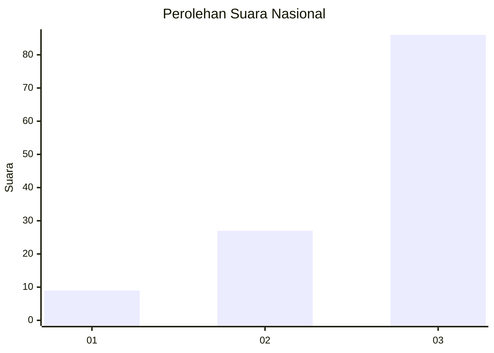
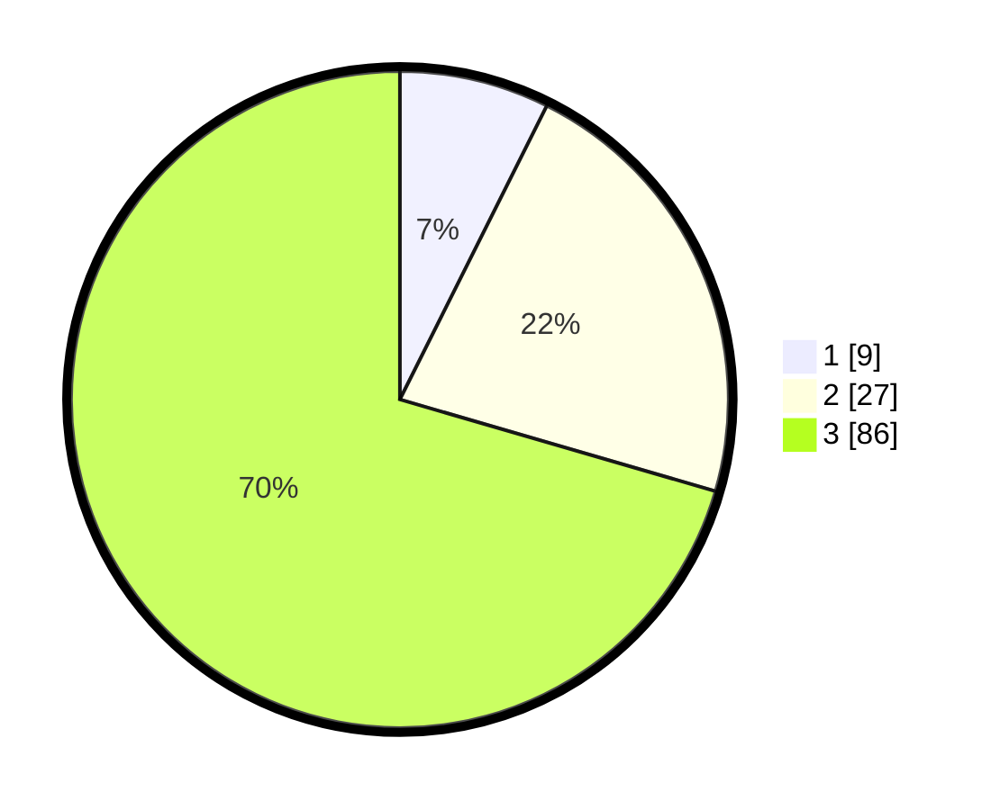

# Hasil

## Grafik

## Tabel

| No. | Nama Paslon    | Suara | Suara (raw) | Persentase |
|:--- |:-------------- | -----:| -----------:| ----------:|
| 1   | ANIES MUHAIMIN | 9     | [9][p-1]    | 7,38       |
| 2   | PRABOWO GIBRAN | 27    | [27][p-2]   | 22,13      |
| 3   | GANJAR MAHFUD  | 86    | [86][p-3]   | 70,49      |

[p-1]: https://github.com/gigit-pemilu/pemilu-2024/blob/main/pilpres/hitung-suara/sub/91-papua/sub/05-kepulauan-yapen/sub/03-yapen-timur/sub/2031-wabompi/sub/001-tps/sub/paslon-1.txt
[p-2]: https://github.com/gigit-pemilu/pemilu-2024/blob/main/pilpres/hitung-suara/sub/91-papua/sub/05-kepulauan-yapen/sub/03-yapen-timur/sub/2031-wabompi/sub/001-tps/sub/paslon-2.txt
[p-3]: https://github.com/gigit-pemilu/pemilu-2024/blob/main/pilpres/hitung-suara/sub/91-papua/sub/05-kepulauan-yapen/sub/03-yapen-timur/sub/2031-wabompi/sub/001-tps/sub/paslon-3.txt

## Foto C Plano

https://sirekap-obj-formc.kpu.go.id/40e7/pemilu/ppwp/91/05/03/20/31/9105032031001-20240215-092441--dba74552-cdea-4860-b6e7-ebbe84d9b500.jpg

https://sirekap-obj-formc.kpu.go.id/40e7/pemilu/ppwp/91/05/03/20/31/9105032031001-20240215-092705--ca37ea9d-12d1-4218-9090-9089eef3c275.jpg

https://sirekap-obj-formc.kpu.go.id/40e7/pemilu/ppwp/91/05/03/20/31/9105032031001-20240215-092943--c2e5ef51-745f-4410-ad56-02e4a149ed61.jpg

## Metadata

| Key        | Value               |
| ---------- | ------------------- |
| Time Stamp | 2024-02-19 06:16:00 |

