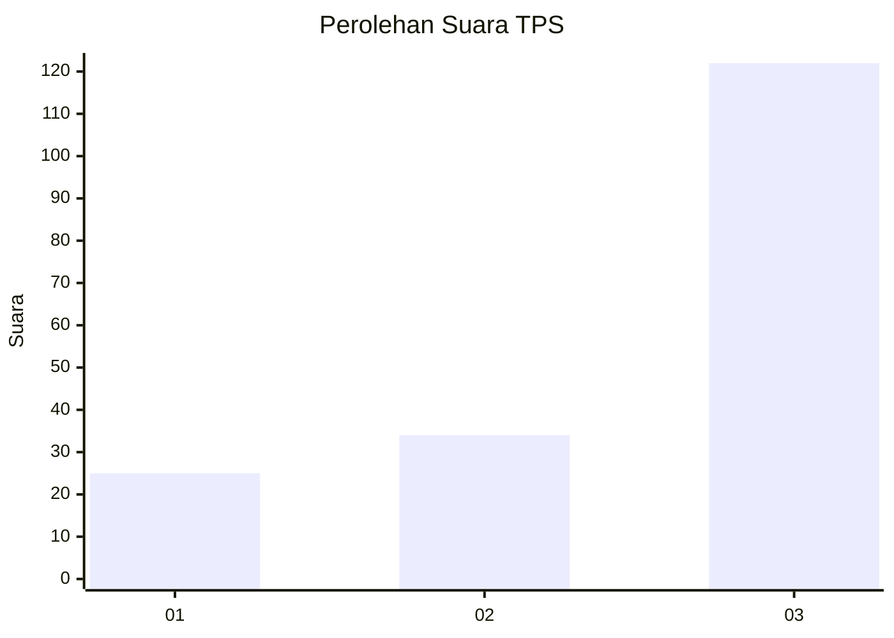
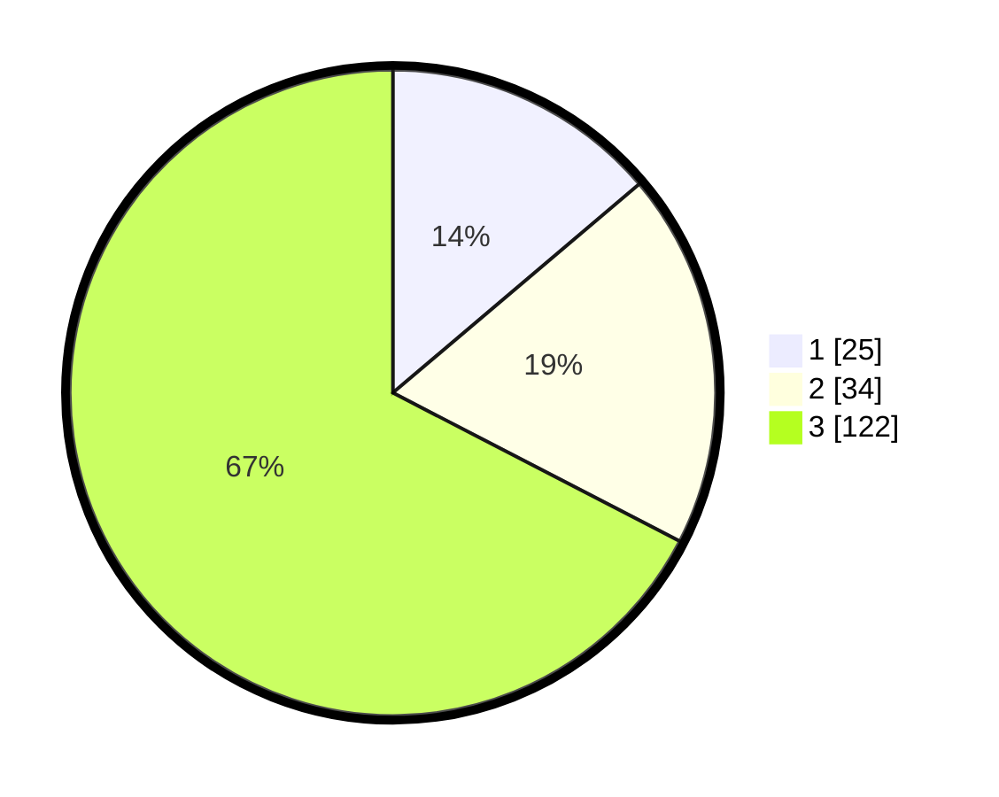

# Hasil

## Grafik

## Tabel

| No. | Nama Paslon    | Suara | Suara (raw) | Persentase |
|:--- |:-------------- | -----:| -----------:| ----------:|
| 1   | ANIES MUHAIMIN | 25    | [25][p-1]   | 13,81      |
| 2   | PRABOWO GIBRAN | 34    | [34][p-2]   | 18,78      |
| 3   | GANJAR MAHFUD  | 122   | [122][p-3]  | 67,40      |

[p-1]: https://github.com/gigit-pemilu/pemilu-2024-91-papua/blob/main/pilpres/hitung-suara/sub/91-papua/sub/05-kepulauan-yapen/sub/04-angkaisera/sub/2015-roipi/sub/003-tps/sub/paslon-1.txt
[p-2]: https://github.com/gigit-pemilu/pemilu-2024-91-papua/blob/main/pilpres/hitung-suara/sub/91-papua/sub/05-kepulauan-yapen/sub/04-angkaisera/sub/2015-roipi/sub/003-tps/sub/paslon-2.txt
[p-3]: https://github.com/gigit-pemilu/pemilu-2024-91-papua/blob/main/pilpres/hitung-suara/sub/91-papua/sub/05-kepulauan-yapen/sub/04-angkaisera/sub/2015-roipi/sub/003-tps/sub/paslon-3.txt

## Foto C Plano

https://sirekap-obj-formc.kpu.go.id/0bbb/pemilu/ppwp/91/05/04/20/15/9105042015003-20240219-130032--f0800b6a-c48d-4cba-b54c-54abf44e280a.jpg

https://sirekap-obj-formc.kpu.go.id/0bbb/pemilu/ppwp/91/05/04/20/15/9105042015003-20240219-130304--2dd405c9-5e5e-47ce-9bef-cd1cf1c5274c.jpg

https://sirekap-obj-formc.kpu.go.id/0bbb/pemilu/ppwp/91/05/04/20/15/9105042015003-20240219-130509--c917ba21-fc38-43bd-bb72-2eaca20edeea.jpg

## Metadata

| Key        | Value               |
| ---------- | ------------------- |
| Time Stamp | 2024-02-20 21:00:00 |

