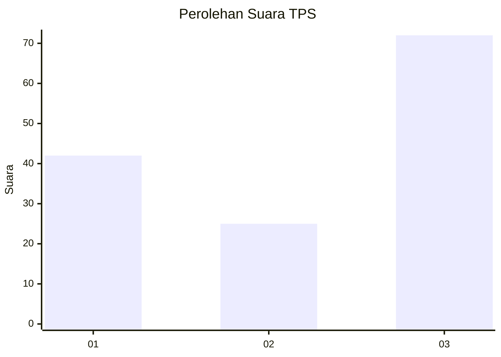
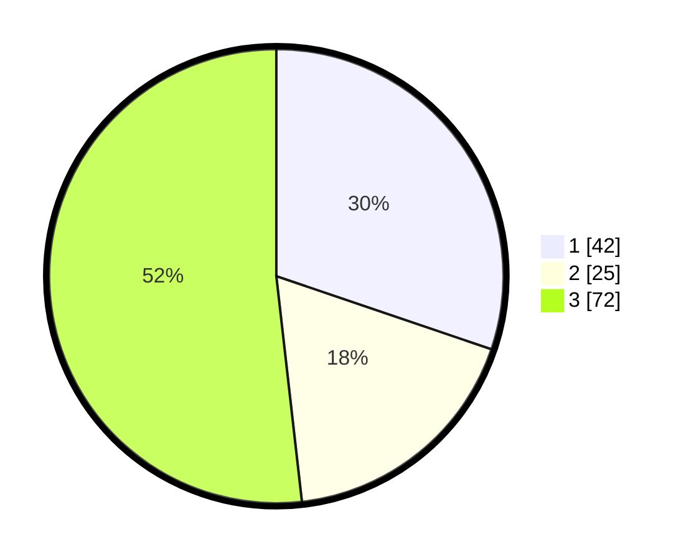

# Hasil

## Grafik

## Tabel

| No. | Nama Paslon    | Suara | Suara (raw) | Persentase |
|:--- |:-------------- | -----:| -----------:| ----------:|
| 1   | ANIES MUHAIMIN | 42    | [42][p-1]   | 30,22      |
| 2   | PRABOWO GIBRAN | 25    | [25][p-2]   | 17,99      |
| 3   | GANJAR MAHFUD  | 72    | [72][p-3]   | 51,80      |

[p-1]: https://github.com/gigit-pemilu/pemilu-2024-91-papua/blob/main/pilpres/hitung-suara/sub/91-papua/sub/05-kepulauan-yapen/sub/06-kosiwo/sub/2006-ariepi/sub/002-tps/sub/paslon-1.txt
[p-2]: https://github.com/gigit-pemilu/pemilu-2024-91-papua/blob/main/pilpres/hitung-suara/sub/91-papua/sub/05-kepulauan-yapen/sub/06-kosiwo/sub/2006-ariepi/sub/002-tps/sub/paslon-2.txt
[p-3]: https://github.com/gigit-pemilu/pemilu-2024-91-papua/blob/main/pilpres/hitung-suara/sub/91-papua/sub/05-kepulauan-yapen/sub/06-kosiwo/sub/2006-ariepi/sub/002-tps/sub/paslon-3.txt

## Foto C Plano

https://sirekap-obj-formc.kpu.go.id/3609/pemilu/ppwp/91/05/06/20/06/9105062006002-20240216-142235--2abc7611-8ce2-4f82-94c0-318c18151e0a.jpg

https://sirekap-obj-formc.kpu.go.id/3609/pemilu/ppwp/91/05/06/20/06/9105062006002-20240216-142423--5c5382c5-a714-4415-8499-4ae728033c13.jpg

https://sirekap-obj-formc.kpu.go.id/3609/pemilu/ppwp/91/05/06/20/06/9105062006002-20240216-081957--6e3f7403-2539-418f-85a6-38effd05d015.jpg

## Metadata

| Key        | Value               |
| ---------- | ------------------- |
| Time Stamp | 2024-02-25 13:00:00 |

