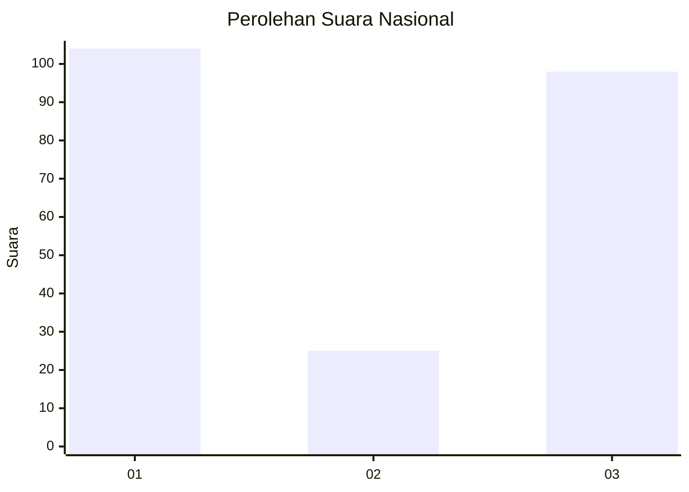
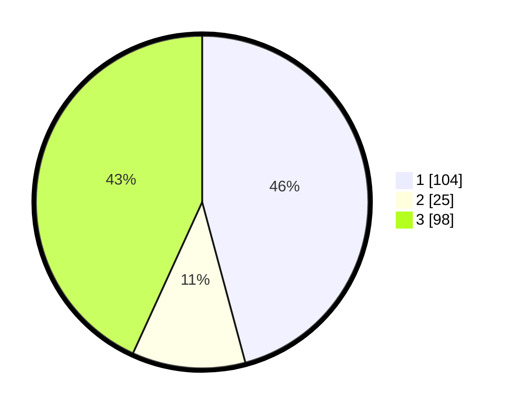

# Hasil

## Grafik

## Tabel

| No. | Nama Paslon    | Suara | Suara (raw) | Persentase |
|:--- |:-------------- | -----:| -----------:| ----------:|
| 1   | ANIES MUHAIMIN | 104   | [104][p-1]  | 45,81      |
| 2   | PRABOWO GIBRAN | 25    | [25][p-2]   | 11,01      |
| 3   | GANJAR MAHFUD  | 98    | [98][p-3]   | 43,17      |

[p-1]: https://github.com/gigit-pemilu/pemilu-2024/blob/main/pilpres/hitung-suara/sub/91-papua/sub/05-kepulauan-yapen/sub/06-kosiwo/sub/2007-sarawandori/sub/001-tps/sub/paslon-1.txt
[p-2]: https://github.com/gigit-pemilu/pemilu-2024/blob/main/pilpres/hitung-suara/sub/91-papua/sub/05-kepulauan-yapen/sub/06-kosiwo/sub/2007-sarawandori/sub/001-tps/sub/paslon-2.txt
[p-3]: https://github.com/gigit-pemilu/pemilu-2024/blob/main/pilpres/hitung-suara/sub/91-papua/sub/05-kepulauan-yapen/sub/06-kosiwo/sub/2007-sarawandori/sub/001-tps/sub/paslon-3.txt

## Foto C Plano

https://sirekap-obj-formc.kpu.go.id/00d3/pemilu/ppwp/91/05/06/20/07/9105062007001-20240215-101355--a53c5fd9-ee8b-4ffe-aca9-f4e66b454a12.jpg

https://sirekap-obj-formc.kpu.go.id/00d3/pemilu/ppwp/91/05/06/20/07/9105062007001-20240215-101531--b016d77b-e44a-4ae9-9473-351f3303bb8a.jpg

## Metadata

| Key        | Value               |
| ---------- | ------------------- |
| Time Stamp | 2024-02-19 06:16:00 |

