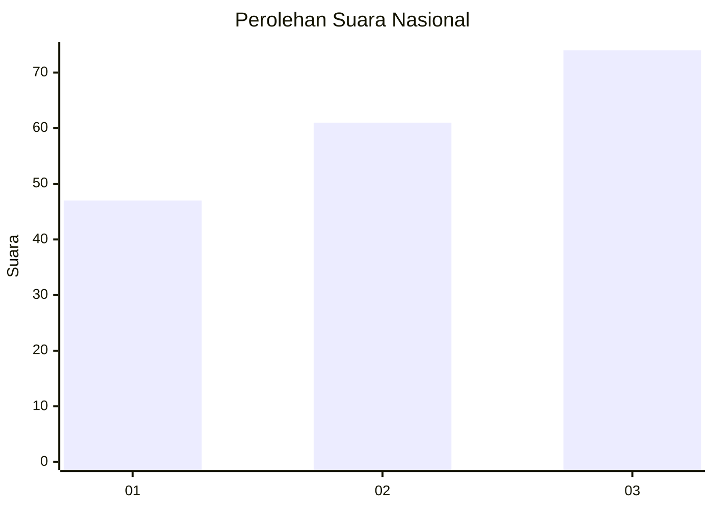
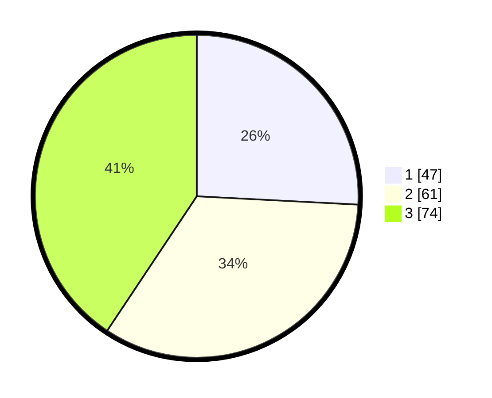

# Hasil

## Grafik

## Tabel

| No. | Nama Paslon    | Suara | Suara (raw) | Persentase |
|:--- |:-------------- | -----:| -----------:| ----------:|
| 1   | ANIES MUHAIMIN | 47    | [47][p-1]   | 25,82      |
| 2   | PRABOWO GIBRAN | 61    | [61][p-2]   | 33,52      |
| 3   | GANJAR MAHFUD  | 74    | [74][p-3]   | 40,66      |

[p-1]: https://github.com/gigit-pemilu/pemilu-2024/blob/main/pilpres/hitung-suara/sub/91-papua/sub/05-kepulauan-yapen/sub/06-kosiwo/sub/2015-panduami/sub/001-tps/sub/paslon-1.txt
[p-2]: https://github.com/gigit-pemilu/pemilu-2024/blob/main/pilpres/hitung-suara/sub/91-papua/sub/05-kepulauan-yapen/sub/06-kosiwo/sub/2015-panduami/sub/001-tps/sub/paslon-2.txt
[p-3]: https://github.com/gigit-pemilu/pemilu-2024/blob/main/pilpres/hitung-suara/sub/91-papua/sub/05-kepulauan-yapen/sub/06-kosiwo/sub/2015-panduami/sub/001-tps/sub/paslon-3.txt

## Foto C Plano

https://sirekap-obj-formc.kpu.go.id/5f62/pemilu/ppwp/91/05/06/20/15/9105062015001-20240215-125119--a2c19d29-b56e-4c13-9671-f79dbaa5462a.jpg

https://sirekap-obj-formc.kpu.go.id/5f62/pemilu/ppwp/91/05/06/20/15/9105062015001-20240215-131435--94fe0a88-b90e-418e-bb08-33a969296cf7.jpg

https://sirekap-obj-formc.kpu.go.id/5f62/pemilu/ppwp/91/05/06/20/15/9105062015001-20240215-124554--db78efb5-4d8e-4715-9270-b20446926bac.jpg

## Metadata

| Key        | Value               |
| ---------- | ------------------- |
| Time Stamp | 2024-02-19 06:16:00 |

