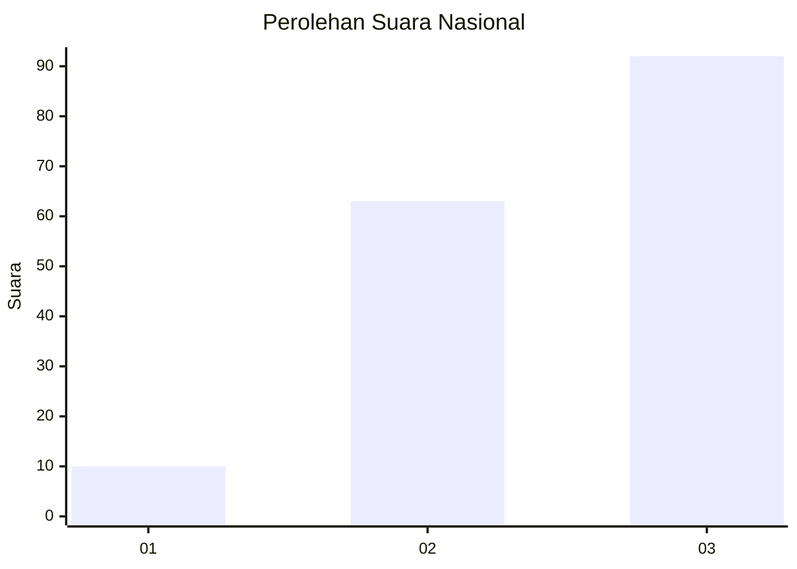
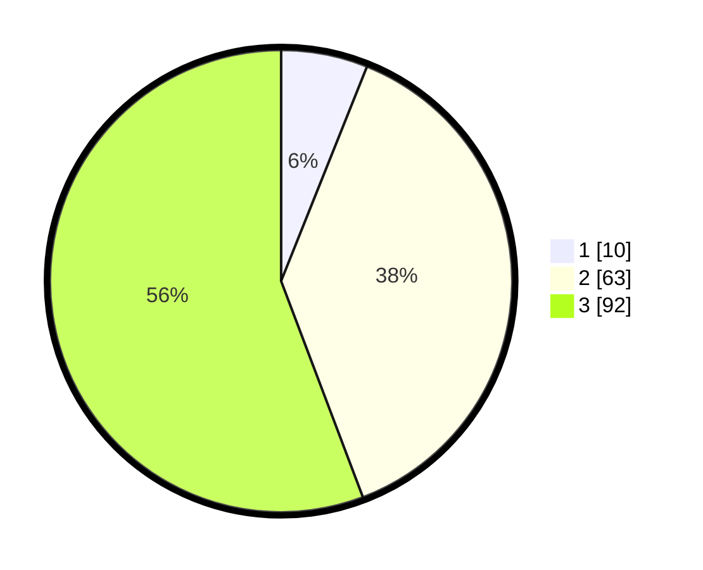

# Hasil

## Grafik

## Tabel

| No. | Nama Paslon    | Suara | Suara (raw) | Persentase |
|:--- |:-------------- | -----:| -----------:| ----------:|
| 1   | ANIES MUHAIMIN | 10    | [10][p-1]   | 6,06       |
| 2   | PRABOWO GIBRAN | 63    | [63][p-2]   | 38,18      |
| 3   | GANJAR MAHFUD  | 92    | [92][p-3]   | 55,76      |

[p-1]: https://github.com/gigit-pemilu/pemilu-2024/blob/main/pilpres/hitung-suara/sub/91-papua/sub/05-kepulauan-yapen/sub/07-yapen-utara/sub/2002-yobi/sub/002-tps/sub/paslon-1.txt
[p-2]: https://github.com/gigit-pemilu/pemilu-2024/blob/main/pilpres/hitung-suara/sub/91-papua/sub/05-kepulauan-yapen/sub/07-yapen-utara/sub/2002-yobi/sub/002-tps/sub/paslon-2.txt
[p-3]: https://github.com/gigit-pemilu/pemilu-2024/blob/main/pilpres/hitung-suara/sub/91-papua/sub/05-kepulauan-yapen/sub/07-yapen-utara/sub/2002-yobi/sub/002-tps/sub/paslon-3.txt

## Foto C Plano

https://sirekap-obj-formc.kpu.go.id/9f2e/pemilu/ppwp/91/05/07/20/02/9105072002002-20240215-213502--c3358e4e-b89c-4f3b-9fd7-6d12db63e7b0.jpg

https://sirekap-obj-formc.kpu.go.id/9f2e/pemilu/ppwp/91/05/07/20/02/9105072002002-20240215-214456--213882ac-7011-4c63-9f29-259c9cce3eea.jpg

https://sirekap-obj-formc.kpu.go.id/9f2e/pemilu/ppwp/91/05/07/20/02/9105072002002-20240215-214102--5e45b632-1b53-4c2d-a833-0c6873074eab.jpg

## Metadata

| Key        | Value               |
| ---------- | ------------------- |
| Time Stamp | 2024-02-19 06:16:00 |

