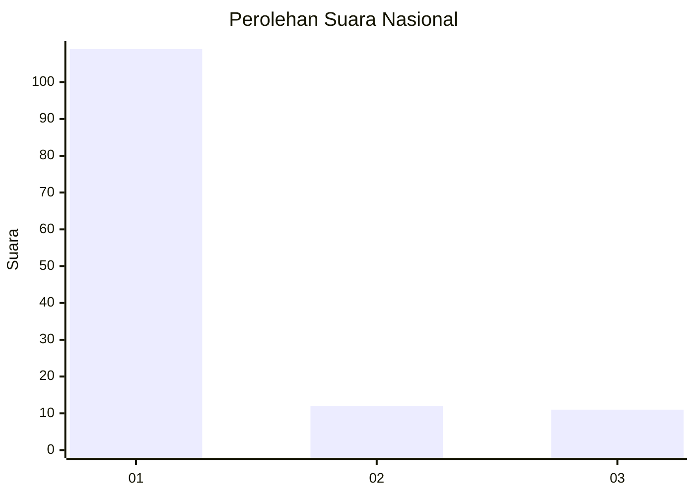
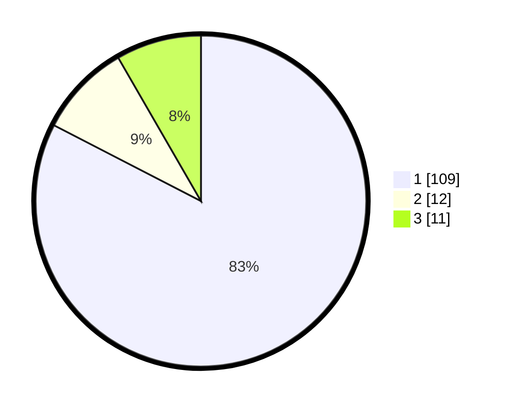

# Hasil

## Grafik

## Tabel

| No. | Nama Paslon    | Suara | Suara (raw) | Persentase |
|:--- |:-------------- | -----:| -----------:| ----------:|
| 1   | ANIES MUHAIMIN | 109   | [109][p-1]  | 82,58      |
| 2   | PRABOWO GIBRAN | 12    | [12][p-2]   | 9,09       |
| 3   | GANJAR MAHFUD  | 11    | [11][p-3]   | 8,33       |

[p-1]: https://github.com/gigit-pemilu/pemilu-2024/blob/main/pilpres/hitung-suara/sub/91-papua/sub/05-kepulauan-yapen/sub/07-yapen-utara/sub/2003-sambrawai/sub/001-tps/sub/paslon-1.txt
[p-2]: https://github.com/gigit-pemilu/pemilu-2024/blob/main/pilpres/hitung-suara/sub/91-papua/sub/05-kepulauan-yapen/sub/07-yapen-utara/sub/2003-sambrawai/sub/001-tps/sub/paslon-2.txt
[p-3]: https://github.com/gigit-pemilu/pemilu-2024/blob/main/pilpres/hitung-suara/sub/91-papua/sub/05-kepulauan-yapen/sub/07-yapen-utara/sub/2003-sambrawai/sub/001-tps/sub/paslon-3.txt

## Foto C Plano

https://sirekap-obj-formc.kpu.go.id/203c/pemilu/ppwp/91/05/07/20/03/9105072003001-20240215-235129--44aca313-c39f-4f8c-9957-79e4a79e7b3e.jpg

https://sirekap-obj-formc.kpu.go.id/203c/pemilu/ppwp/91/05/07/20/03/9105072003001-20240215-235752--d52d990b-2e9b-4f72-80e6-8b48140f3c01.jpg

https://sirekap-obj-formc.kpu.go.id/203c/pemilu/ppwp/91/05/07/20/03/9105072003001-20240215-235913--bb796fb0-1b87-461b-bb8a-1936190bd716.jpg

## Metadata

| Key        | Value               |
| ---------- | ------------------- |
| Time Stamp | 2024-02-16 04:00:27 |

## DATA PEMILIH TETAP

Jumlah pemilih dalam DPT: **170**.
 * L: **85**.
 * P: **85**.

## DATA PENGGUNA HAK PILIH

Jumlah pengguna hak pilih dalam DPT: **119**.
 * L: **66**.
 * P: **53**.

Jumlah pengguna hak pilih dalam DPTb: **13**.
 * L: **5**.
 * P: **8**.

Jumlah pengguna hak pilih dalam DPK: **0**.
 * L: **0**.
 * P: **0**.

Jumlah pengguna hak pilih: **132**.
 * L: **71**.
 * P: **61**.

## JUMLAH SUARA SAH DAN TIDAK SAH

JUMLAH SELURUH SUARA SAH: **132**.

JUMLAH SUARA TIDAK SAH: **42**.

JUMLAH SELURUH SUARA SAH DAN SUARA TIDAK SAH: **174**.

