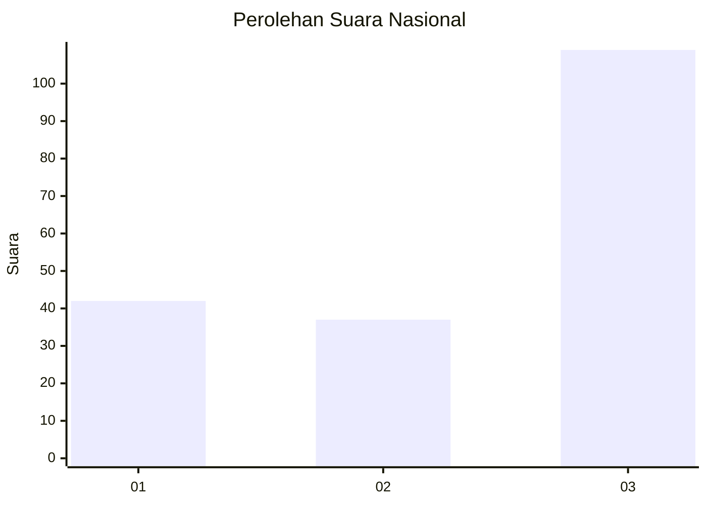
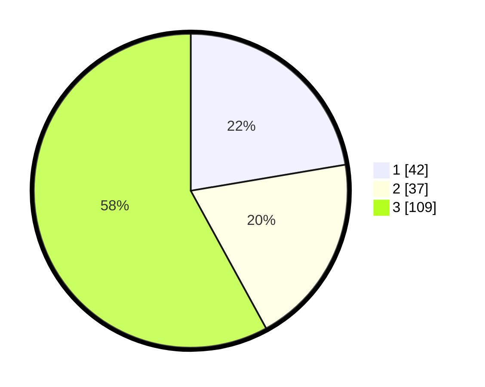

# Hasil

## Grafik

## Tabel

| No. | Nama Paslon    | Suara | Suara (raw) | Persentase |
|:--- |:-------------- | -----:| -----------:| ----------:|
| 1   | ANIES MUHAIMIN | 42    | [42][p-1]   | 22,34      |
| 2   | PRABOWO GIBRAN | 37    | [37][p-2]   | 19,68      |
| 3   | GANJAR MAHFUD  | 109   | [109][p-3]  | 57,98      |

[p-1]: https://github.com/gigit-pemilu/pemilu-2024/blob/main/pilpres/hitung-suara/sub/91-papua/sub/05-kepulauan-yapen/sub/07-yapen-utara/sub/2007-soromasen/sub/001-tps/sub/paslon-1.txt
[p-2]: https://github.com/gigit-pemilu/pemilu-2024/blob/main/pilpres/hitung-suara/sub/91-papua/sub/05-kepulauan-yapen/sub/07-yapen-utara/sub/2007-soromasen/sub/001-tps/sub/paslon-2.txt
[p-3]: https://github.com/gigit-pemilu/pemilu-2024/blob/main/pilpres/hitung-suara/sub/91-papua/sub/05-kepulauan-yapen/sub/07-yapen-utara/sub/2007-soromasen/sub/001-tps/sub/paslon-3.txt

## Foto C Plano

https://sirekap-obj-formc.kpu.go.id/8f92/pemilu/ppwp/91/05/07/20/07/9105072007001-20240216-082200--ea44ffca-d3b7-4e38-beef-36a69a955bdb.jpg

https://sirekap-obj-formc.kpu.go.id/8f92/pemilu/ppwp/91/05/07/20/07/9105072007001-20240216-085712--7a10ad47-b7f0-4b40-ab9b-3551b60f94c6.jpg

https://sirekap-obj-formc.kpu.go.id/8f92/pemilu/ppwp/91/05/07/20/07/9105072007001-20240216-090728--566556cd-2e28-4801-b0ff-5161be46737f.jpg

## Metadata

| Key        | Value               |
| ---------- | ------------------- |
| Time Stamp | 2024-02-19 12:00:00 |

## DATA PEMILIH TETAP

Jumlah pemilih dalam DPT: **252**.
 * L: **134**.
 * P: **118**.

## DATA PENGGUNA HAK PILIH

Jumlah pengguna hak pilih dalam DPT: **190**.
 * L: **98**.
 * P: **92**.

Jumlah pengguna hak pilih dalam DPTb: **0**.
 * L: **0**.
 * P: **0**.

Jumlah pengguna hak pilih dalam DPK: **0**.
 * L: **0**.
 * P: **0**.

Jumlah pengguna hak pilih: **190**.
 * L: **98**.
 * P: **92**.

## JUMLAH SUARA SAH DAN TIDAK SAH

JUMLAH SELURUH SUARA SAH: **188**.

JUMLAH SUARA TIDAK SAH: **64**.

JUMLAH SELURUH SUARA SAH DAN SUARA TIDAK SAH: **252**.

