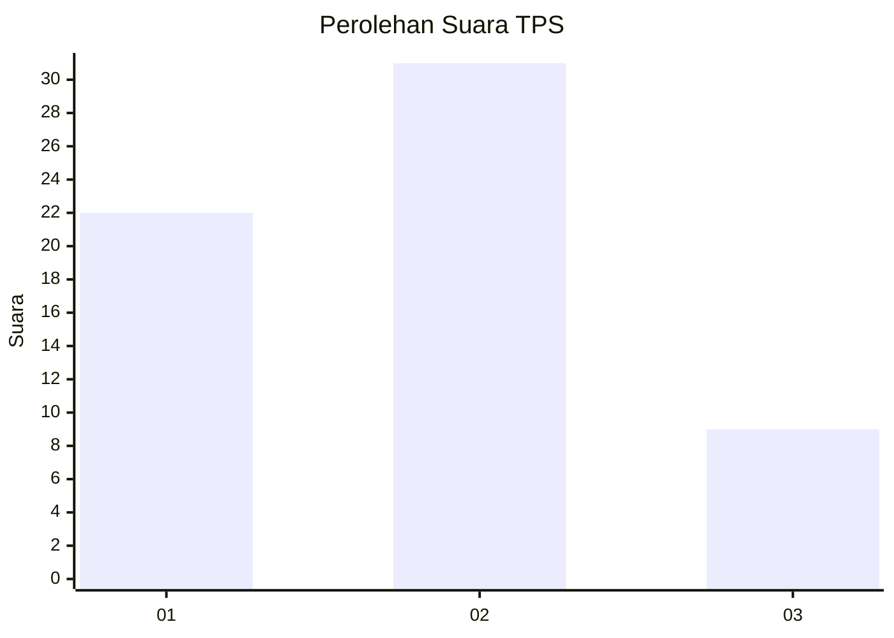
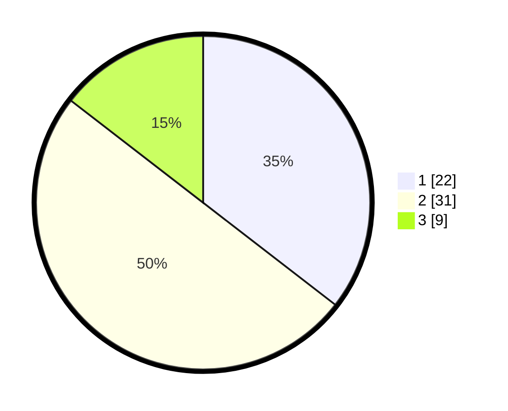

# Hasil

## Grafik

## Tabel

| No. | Nama Paslon    | Suara | Suara (raw) | Persentase |
|:--- |:-------------- | -----:| -----------:| ----------:|
| 1   | ANIES MUHAIMIN | 22    | [22][p-1]   | 35,48      |
| 2   | PRABOWO GIBRAN | 31    | [31][p-2]   | 50,00      |
| 3   | GANJAR MAHFUD  | 9     | [9][p-3]    | 14,52      |

[p-1]: https://github.com/gigit-pemilu/pemilu-2024-91-papua/blob/main/pilpres/hitung-suara/sub/91-papua/sub/05-kepulauan-yapen/sub/09-teluk-ampimoi/sub/2004-waita/sub/001-tps/sub/paslon-1.txt
[p-2]: https://github.com/gigit-pemilu/pemilu-2024-91-papua/blob/main/pilpres/hitung-suara/sub/91-papua/sub/05-kepulauan-yapen/sub/09-teluk-ampimoi/sub/2004-waita/sub/001-tps/sub/paslon-2.txt
[p-3]: https://github.com/gigit-pemilu/pemilu-2024-91-papua/blob/main/pilpres/hitung-suara/sub/91-papua/sub/05-kepulauan-yapen/sub/09-teluk-ampimoi/sub/2004-waita/sub/001-tps/sub/paslon-3.txt

## Foto C Plano

https://sirekap-obj-formc.kpu.go.id/653a/pemilu/ppwp/91/05/09/20/04/9105092004001-20240220-023437--71a1523f-443f-42aa-b306-a8da015b806a.jpg

https://sirekap-obj-formc.kpu.go.id/653a/pemilu/ppwp/91/05/09/20/04/9105092004001-20240220-023701--d182476a-c4e5-42f3-9b10-e0f1f072040b.jpg

https://sirekap-obj-formc.kpu.go.id/653a/pemilu/ppwp/91/05/09/20/04/9105092004001-20240220-023942--ce5391af-6a08-4221-8e9f-6608adab7fe1.jpg

## Metadata

| Key        | Value               |
| ---------- | ------------------- |
| Time Stamp | 2024-02-20 04:00:00 |

## DATA PEMILIH TETAP

Jumlah pemilih dalam DPT: **195**.
 * L: **99**.
 * P: **96**.

## DATA PENGGUNA HAK PILIH

Jumlah pengguna hak pilih dalam DPT: **129**.
 * L: **58**.
 * P: **61**.

Jumlah pengguna hak pilih dalam DPTb: **0**.
 * L: **0**.
 * P: **0**.

Jumlah pengguna hak pilih dalam DPK: **0**.
 * L: **0**.
 * P: **0**.

Jumlah pengguna hak pilih: **124**.
 * L: **0**.
 * P: **0**.

## JUMLAH SUARA SAH DAN TIDAK SAH

JUMLAH SELURUH SUARA SAH: **126**.

JUMLAH SUARA TIDAK SAH: **3**.

JUMLAH SELURUH SUARA SAH DAN SUARA TIDAK SAH: **129**.

