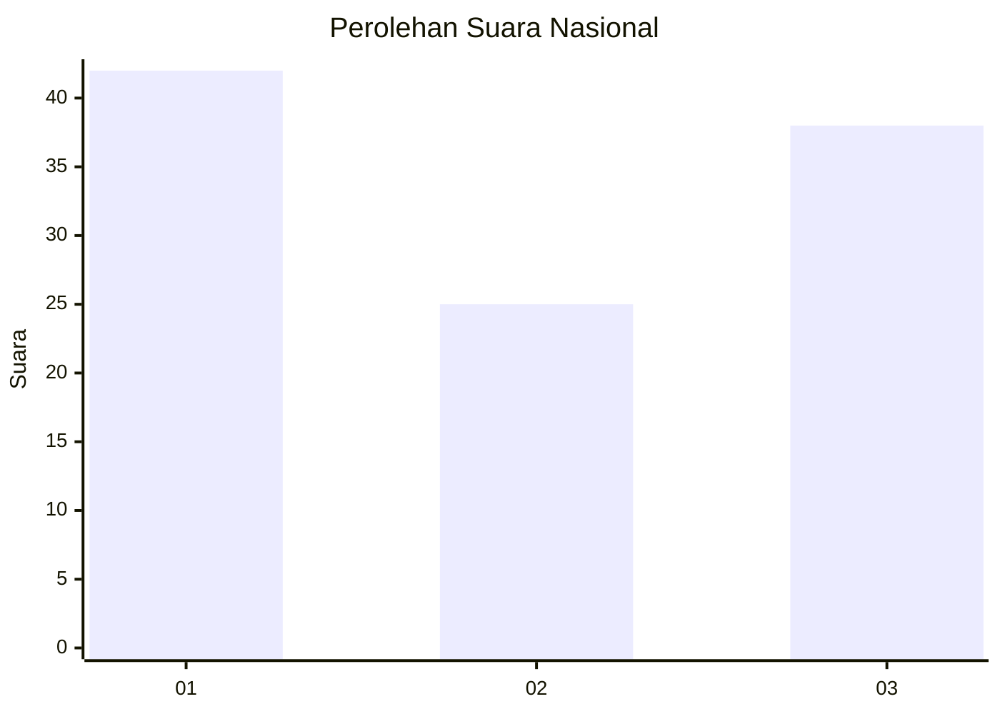
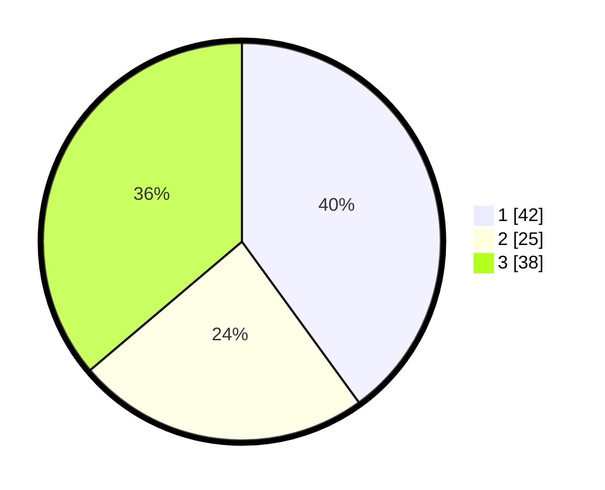

# Hasil

## Grafik

## Tabel

| No. | Nama Paslon    | Suara | Suara (raw) | Persentase |
|:--- |:-------------- | -----:| -----------:| ----------:|
| 1   | ANIES MUHAIMIN | 42    | [42][p-1]   | 40,00      |
| 2   | PRABOWO GIBRAN | 25    | [25][p-2]   | 23,81      |
| 3   | GANJAR MAHFUD  | 38    | [38][p-3]   | 36,19      |

[p-1]: https://github.com/gigit-pemilu/pemilu-2024/blob/main/pilpres/hitung-suara/sub/91-papua/sub/05-kepulauan-yapen/sub/09-teluk-ampimoi/sub/2007-wabuayar/sub/001-tps/sub/paslon-1.txt
[p-2]: https://github.com/gigit-pemilu/pemilu-2024/blob/main/pilpres/hitung-suara/sub/91-papua/sub/05-kepulauan-yapen/sub/09-teluk-ampimoi/sub/2007-wabuayar/sub/001-tps/sub/paslon-2.txt
[p-3]: https://github.com/gigit-pemilu/pemilu-2024/blob/main/pilpres/hitung-suara/sub/91-papua/sub/05-kepulauan-yapen/sub/09-teluk-ampimoi/sub/2007-wabuayar/sub/001-tps/sub/paslon-3.txt

## Foto C Plano

https://sirekap-obj-formc.kpu.go.id/1056/pemilu/ppwp/91/05/09/20/07/9105092007001-20240215-223239--43bdba70-1735-4a70-b658-119e9a2b0841.jpg

https://sirekap-obj-formc.kpu.go.id/1056/pemilu/ppwp/91/05/09/20/07/9105092007001-20240215-223241--b2202643-40f7-466f-bd7d-61a9052de985.jpg

https://sirekap-obj-formc.kpu.go.id/1056/pemilu/ppwp/91/05/09/20/07/9105092007001-20240215-180454--89bfe80a-4583-4650-af8f-f9f8d4f46321.jpg

## Metadata

| Key        | Value               |
| ---------- | ------------------- |
| Time Stamp | 2024-02-21 16:00:00 |

## DATA PEMILIH TETAP

Jumlah pemilih dalam DPT: **104**.
 * L: **55**.
 * P: **49**.

## DATA PENGGUNA HAK PILIH

Jumlah pengguna hak pilih dalam DPT: **102**.
 * L: **53**.
 * P: **49**.

Jumlah pengguna hak pilih dalam DPTb: **0**.
 * L: **0**.
 * P: **0**.

Jumlah pengguna hak pilih dalam DPK: **2**.
 * L: **2**.
 * P: **0**.

Jumlah pengguna hak pilih: **104**.
 * L: **55**.
 * P: **49**.

## JUMLAH SUARA SAH DAN TIDAK SAH

JUMLAH SELURUH SUARA SAH: **106**.

JUMLAH SUARA TIDAK SAH: **1**.

JUMLAH SELURUH SUARA SAH DAN SUARA TIDAK SAH: **107**.

