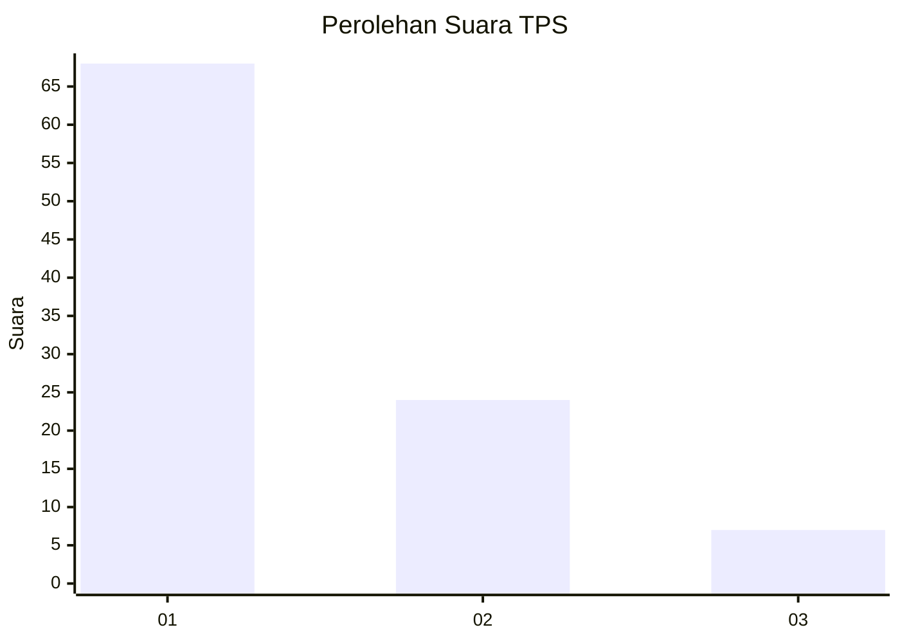
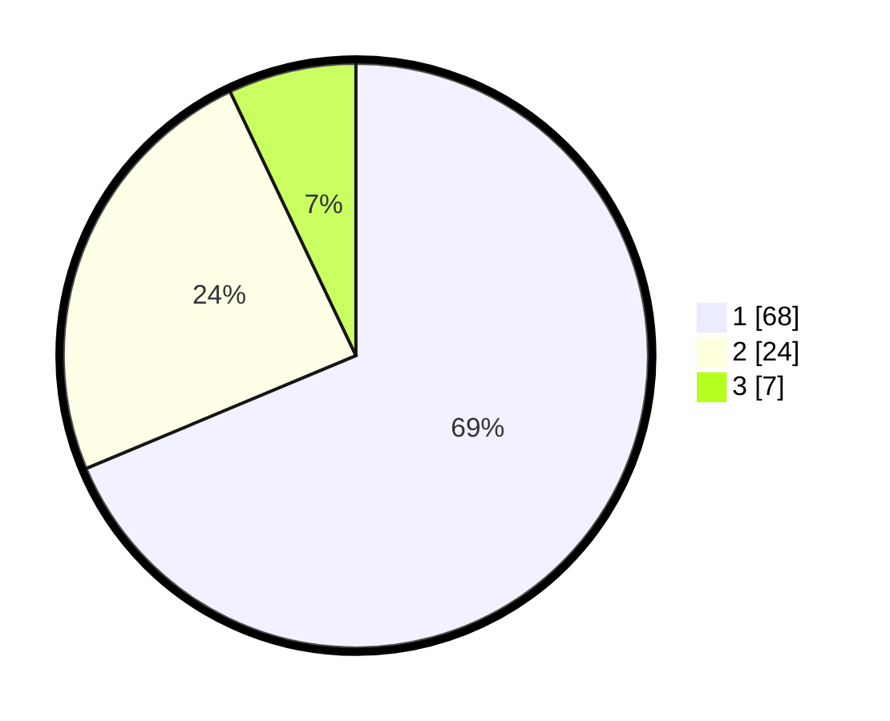

# Hasil

## Grafik

## Tabel

| No. | Nama Paslon    | Suara | Suara (raw) | Persentase |
|:--- |:-------------- | -----:| -----------:| ----------:|
| 1   | ANIES MUHAIMIN | 68    | [68][p-1]   | 68,69      |
| 2   | PRABOWO GIBRAN | 24    | [24][p-2]   | 24,24      |
| 3   | GANJAR MAHFUD  | 7     | [7][p-3]    | 7,07       |

[p-1]: https://github.com/gigit-pemilu/pemilu-2024-91-papua/blob/main/pilpres/hitung-suara/sub/91-papua/sub/05-kepulauan-yapen/sub/09-teluk-ampimoi/sub/2009-bareraif/sub/001-tps/sub/paslon-1.txt
[p-2]: https://github.com/gigit-pemilu/pemilu-2024-91-papua/blob/main/pilpres/hitung-suara/sub/91-papua/sub/05-kepulauan-yapen/sub/09-teluk-ampimoi/sub/2009-bareraif/sub/001-tps/sub/paslon-2.txt
[p-3]: https://github.com/gigit-pemilu/pemilu-2024-91-papua/blob/main/pilpres/hitung-suara/sub/91-papua/sub/05-kepulauan-yapen/sub/09-teluk-ampimoi/sub/2009-bareraif/sub/001-tps/sub/paslon-3.txt

## Foto C Plano

https://sirekap-obj-formc.kpu.go.id/8337/pemilu/ppwp/91/05/09/20/09/9105092009001-20240215-141848--14001ad3-f003-4894-a8d7-5381f45df691.jpg

https://sirekap-obj-formc.kpu.go.id/8337/pemilu/ppwp/91/05/09/20/09/9105092009001-20240215-141500--74660e3e-bb5f-4568-8a83-c2e0e8eead7e.jpg

https://sirekap-obj-formc.kpu.go.id/8337/pemilu/ppwp/91/05/09/20/09/9105092009001-20240215-142135--37629826-f5d2-4473-8f8b-99d74a719495.jpg

## Metadata

| Key        | Value               |
| ---------- | ------------------- |
| Time Stamp | 2024-02-19 06:16:00 |

