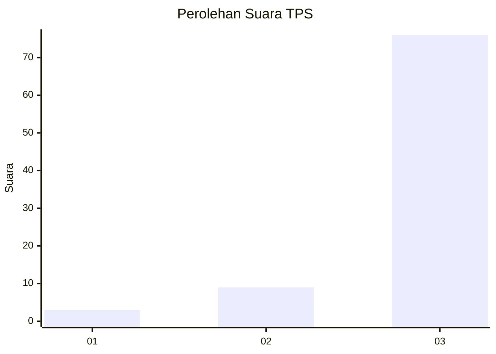
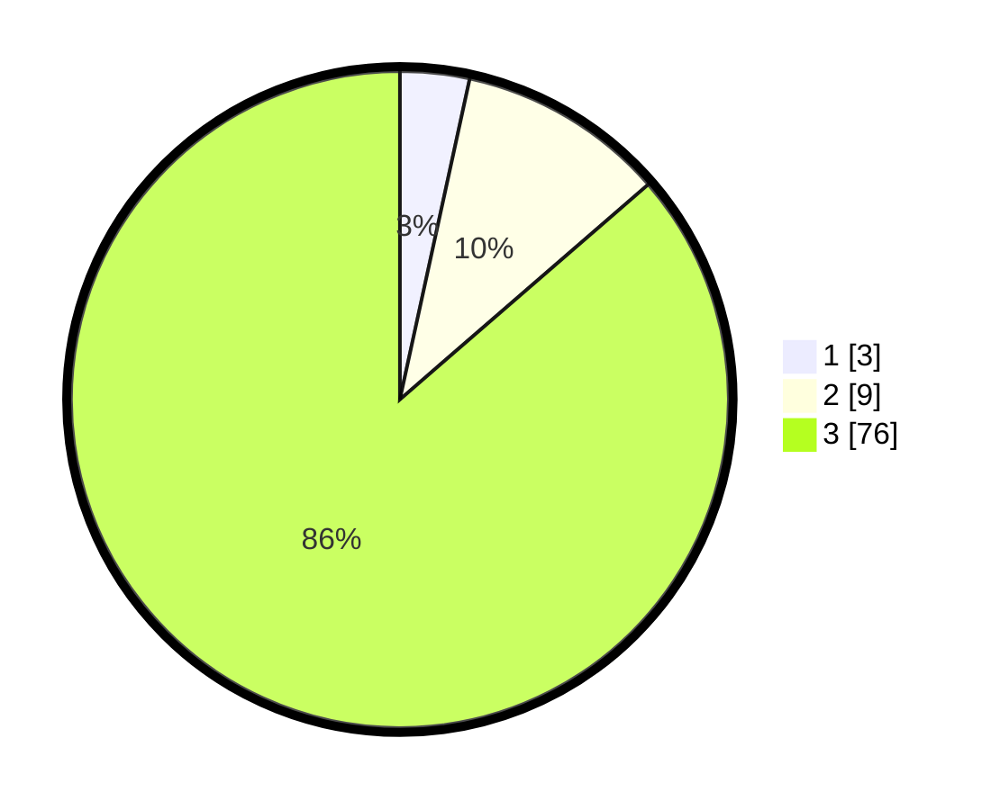

# Hasil

## Grafik

## Tabel

| No. | Nama Paslon    | Suara | Suara (raw) | Persentase |
|:--- |:-------------- | -----:| -----------:| ----------:|
| 1   | ANIES MUHAIMIN | 3     | [3][p-1]    | 3,41       |
| 2   | PRABOWO GIBRAN | 9     | [9][p-2]    | 10,23      |
| 3   | GANJAR MAHFUD  | 76    | [76][p-3]   | 86,36      |

[p-1]: https://github.com/gigit-pemilu/pemilu-2024-91-papua/blob/main/pilpres/hitung-suara/sub/91-papua/sub/05-kepulauan-yapen/sub/09-teluk-ampimoi/sub/2010-arareni/sub/001-tps/sub/paslon-1.txt
[p-2]: https://github.com/gigit-pemilu/pemilu-2024-91-papua/blob/main/pilpres/hitung-suara/sub/91-papua/sub/05-kepulauan-yapen/sub/09-teluk-ampimoi/sub/2010-arareni/sub/001-tps/sub/paslon-2.txt
[p-3]: https://github.com/gigit-pemilu/pemilu-2024-91-papua/blob/main/pilpres/hitung-suara/sub/91-papua/sub/05-kepulauan-yapen/sub/09-teluk-ampimoi/sub/2010-arareni/sub/001-tps/sub/paslon-3.txt

## Foto C Plano

https://sirekap-obj-formc.kpu.go.id/5408/pemilu/ppwp/91/05/09/20/10/9105092010001-20240216-144215--35fdea29-a3fd-4715-9481-acaa934f613c.jpg

https://sirekap-obj-formc.kpu.go.id/5408/pemilu/ppwp/91/05/09/20/10/9105092010001-20240216-144330--d1e1ba58-9718-45e0-a1d3-fb6ef673ad3f.jpg

https://sirekap-obj-formc.kpu.go.id/5408/pemilu/ppwp/91/05/09/20/10/9105092010001-20240216-144421--51f22992-8e87-4999-a397-355b846cb100.jpg

## Metadata

| Key        | Value               |
| ---------- | ------------------- |
| Time Stamp | 2024-02-19 06:16:00 |

## DATA PEMILIH TETAP

Jumlah pemilih dalam DPT: **887**.
 * L: **39**.
 * P: **48**.

## DATA PENGGUNA HAK PILIH

Jumlah pengguna hak pilih dalam DPT: **87**.
 * L: **39**.
 * P: **98**.

Jumlah pengguna hak pilih dalam DPTb: **0**.
 * L: **8**.
 * P: **40**.

Jumlah pengguna hak pilih dalam DPK: **2**.
 * L: **801**.
 * P: **1**.

Jumlah pengguna hak pilih: **29**.
 * L: **40**.
 * P: **49**.

## JUMLAH SUARA SAH DAN TIDAK SAH

JUMLAH SELURUH SUARA SAH: **88**.

JUMLAH SUARA TIDAK SAH: **1**.

JUMLAH SELURUH SUARA SAH DAN SUARA TIDAK SAH: **89**.

