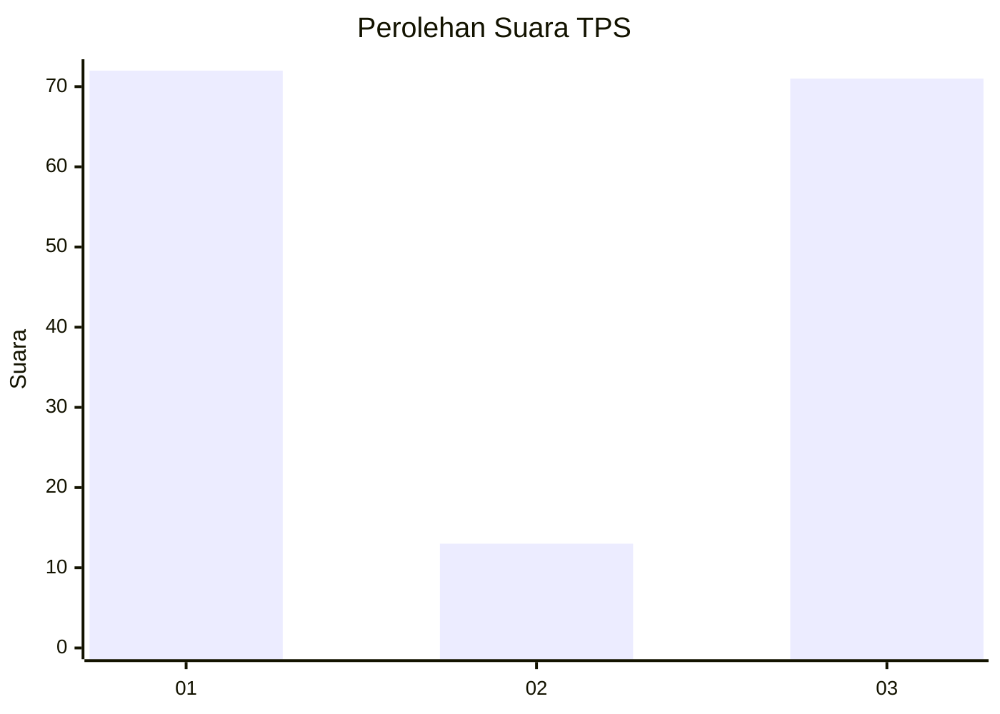
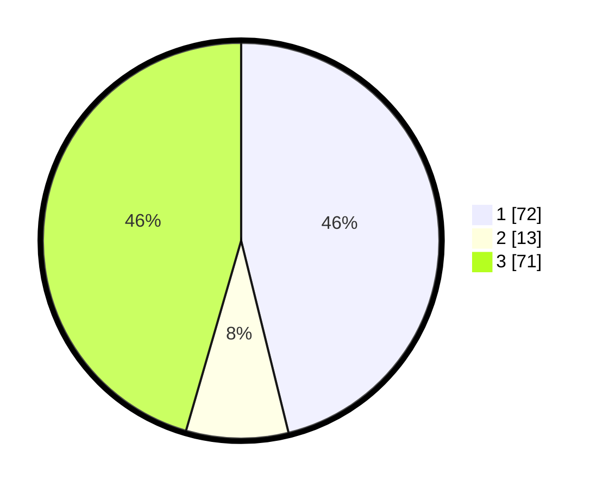

# Hasil

## Grafik

## Tabel

| No. | Nama Paslon    | Suara | Suara (raw) | Persentase |
|:--- |:-------------- | -----:| -----------:| ----------:|
| 1   | ANIES MUHAIMIN | 72    | [72][p-1]   | 46,15      |
| 2   | PRABOWO GIBRAN | 13    | [13][p-2]   | 8,33       |
| 3   | GANJAR MAHFUD  | 71    | [71][p-3]   | 45,51      |

[p-1]: https://github.com/gigit-pemilu/pemilu-2024-91-papua/blob/main/pilpres/hitung-suara/sub/91-papua/sub/05-kepulauan-yapen/sub/09-teluk-ampimoi/sub/2011-siromi/sub/001-tps/sub/paslon-1.txt
[p-2]: https://github.com/gigit-pemilu/pemilu-2024-91-papua/blob/main/pilpres/hitung-suara/sub/91-papua/sub/05-kepulauan-yapen/sub/09-teluk-ampimoi/sub/2011-siromi/sub/001-tps/sub/paslon-2.txt
[p-3]: https://github.com/gigit-pemilu/pemilu-2024-91-papua/blob/main/pilpres/hitung-suara/sub/91-papua/sub/05-kepulauan-yapen/sub/09-teluk-ampimoi/sub/2011-siromi/sub/001-tps/sub/paslon-3.txt

## Foto C Plano

https://sirekap-obj-formc.kpu.go.id/d302/pemilu/ppwp/91/05/09/20/11/9105092011001-20240220-185455--dce4d8f3-9aa4-468c-a461-a36cde986f28.jpg

https://sirekap-obj-formc.kpu.go.id/d302/pemilu/ppwp/91/05/09/20/11/9105092011001-20240220-185456--ddf03871-d50e-4727-8896-d9ecf47558c6.jpg

https://sirekap-obj-formc.kpu.go.id/d302/pemilu/ppwp/91/05/09/20/11/9105092011001-20240220-185456--d2dab312-9cca-44cf-baa1-4706eaef50cc.jpg

## Metadata

| Key        | Value               |
| ---------- | ------------------- |
| Time Stamp | 2024-02-20 21:00:00 |

## DATA PEMILIH TETAP

Jumlah pemilih dalam DPT: **157**.
 * L: **79**.
 * P: **78**.

## DATA PENGGUNA HAK PILIH

Jumlah pengguna hak pilih dalam DPT: **157**.
 * L: **79**.
 * P: **78**.

Jumlah pengguna hak pilih dalam DPTb: **0**.
 * L: **0**.
 * P: **0**.

Jumlah pengguna hak pilih dalam DPK: **4**.
 * L: **2**.
 * P: **2**.

Jumlah pengguna hak pilih: **161**.
 * L: **81**.
 * P: **80**.

## JUMLAH SUARA SAH DAN TIDAK SAH

JUMLAH SELURUH SUARA SAH: **156**.

JUMLAH SUARA TIDAK SAH: **1**.

JUMLAH SELURUH SUARA SAH DAN SUARA TIDAK SAH: **157**.

