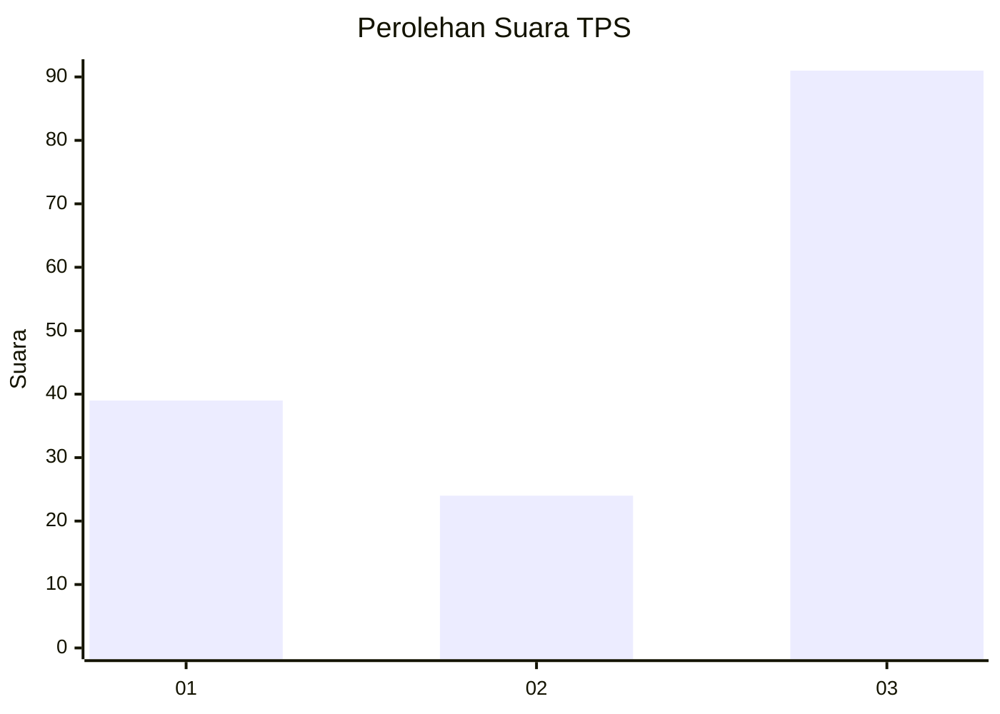
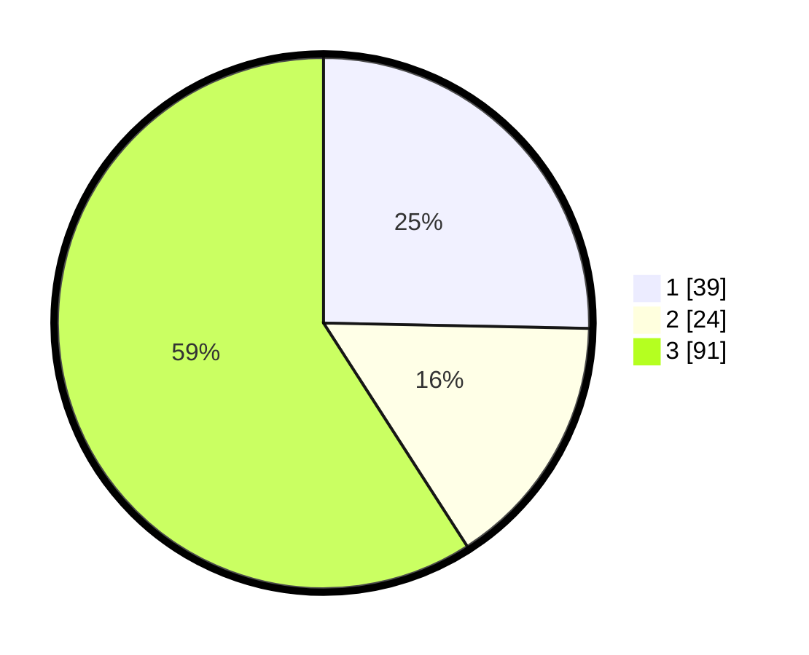

# Hasil

## Grafik

## Tabel

| No. | Nama Paslon    | Suara | Suara (raw) | Persentase |
|:--- |:-------------- | -----:| -----------:| ----------:|
| 1   | ANIES MUHAIMIN | 39    | [39][p-1]   | 25,32      |
| 2   | PRABOWO GIBRAN | 24    | [24][p-2]   | 15,58      |
| 3   | GANJAR MAHFUD  | 91    | [91][p-3]   | 59,09      |

[p-1]: https://github.com/gigit-pemilu/pemilu-2024-91-papua/blob/main/pilpres/hitung-suara/sub/91-papua/sub/05-kepulauan-yapen/sub/10-kepulauan-ambai/sub/2006-adiwipi/sub/001-tps/sub/paslon-1.txt
[p-2]: https://github.com/gigit-pemilu/pemilu-2024-91-papua/blob/main/pilpres/hitung-suara/sub/91-papua/sub/05-kepulauan-yapen/sub/10-kepulauan-ambai/sub/2006-adiwipi/sub/001-tps/sub/paslon-2.txt
[p-3]: https://github.com/gigit-pemilu/pemilu-2024-91-papua/blob/main/pilpres/hitung-suara/sub/91-papua/sub/05-kepulauan-yapen/sub/10-kepulauan-ambai/sub/2006-adiwipi/sub/001-tps/sub/paslon-3.txt

## Foto C Plano

https://sirekap-obj-formc.kpu.go.id/7c3a/pemilu/ppwp/91/05/10/20/06/9105102006001-20240216-074123--a5008d7e-0387-4118-8e45-27d452f9605e.jpg

https://sirekap-obj-formc.kpu.go.id/7c3a/pemilu/ppwp/91/05/10/20/06/9105102006001-20240216-062003--744990ac-2ee4-4315-8e14-f8ced8a1a9f1.jpg

https://sirekap-obj-formc.kpu.go.id/7c3a/pemilu/ppwp/91/05/10/20/06/9105102006001-20240216-074829--d7c408a0-fbf3-43a6-8645-3e74abe9f482.jpg

## Metadata

| Key        | Value               |
| ---------- | ------------------- |
| Time Stamp | 2024-02-17 11:00:02 |

## DATA PEMILIH TETAP

Jumlah pemilih dalam DPT: **154**.
 * L: **81**.
 * P: **73**.

## DATA PENGGUNA HAK PILIH

Jumlah pengguna hak pilih dalam DPT: **154**.
 * L: **81**.
 * P: **73**.

Jumlah pengguna hak pilih dalam DPTb: **0**.
 * L: **0**.
 * P: **0**.

Jumlah pengguna hak pilih dalam DPK: **0**.
 * L: **0**.
 * P: **0**.

Jumlah pengguna hak pilih: **154**.
 * L: **81**.
 * P: **73**.

## JUMLAH SUARA SAH DAN TIDAK SAH

JUMLAH SELURUH SUARA SAH: **154**.

JUMLAH SUARA TIDAK SAH: **0**.

JUMLAH SELURUH SUARA SAH DAN SUARA TIDAK SAH: **154**.

