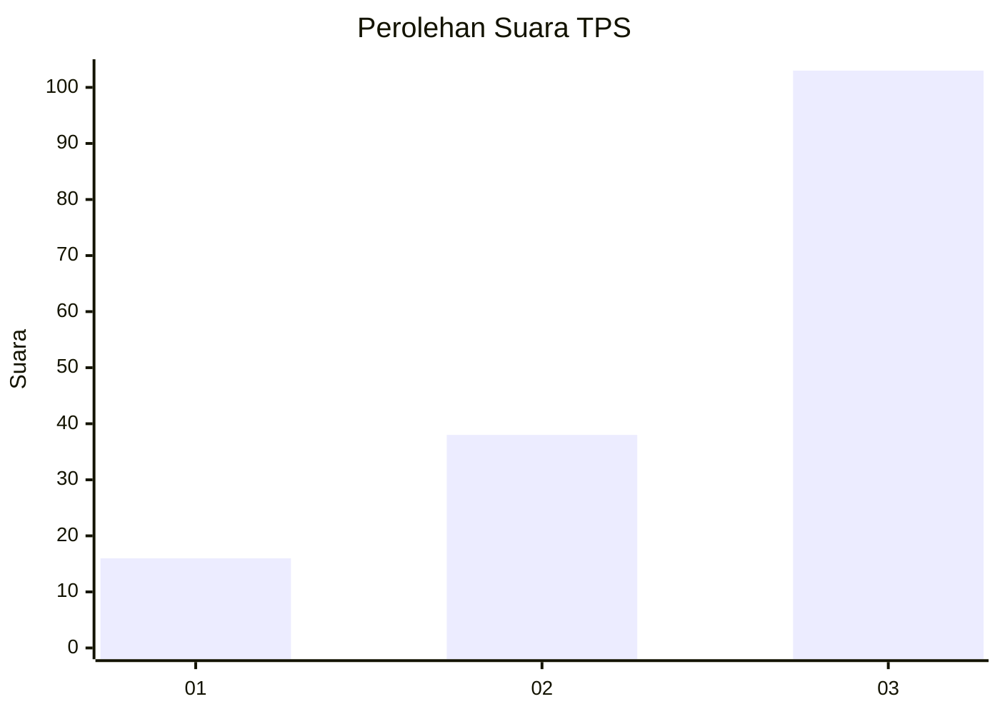
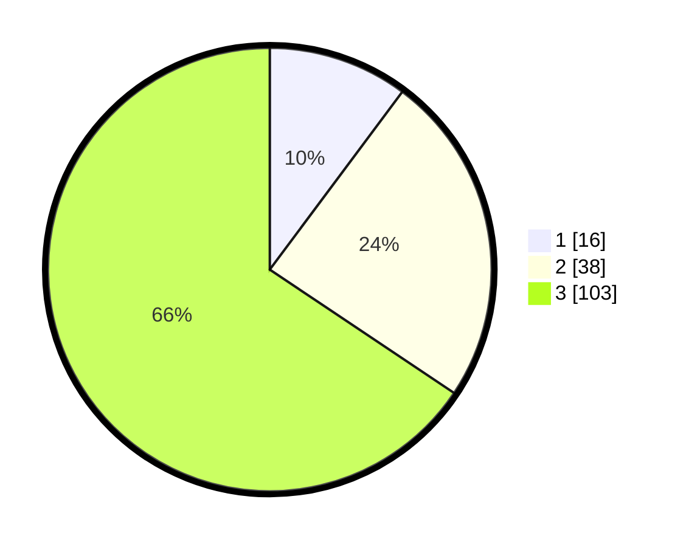

# Hasil

## Grafik

## Tabel

| No. | Nama Paslon    | Suara | Suara (raw) | Persentase |
|:--- |:-------------- | -----:| -----------:| ----------:|
| 1   | ANIES MUHAIMIN | 16    | [16][p-1]   | 10,19      |
| 2   | PRABOWO GIBRAN | 38    | [38][p-2]   | 24,20      |
| 3   | GANJAR MAHFUD  | 103   | [103][p-3]  | 65,61      |

[p-1]: https://github.com/gigit-pemilu/pemilu-2024-91-papua/blob/main/pilpres/hitung-suara/sub/91-papua/sub/05-kepulauan-yapen/sub/10-kepulauan-ambai/sub/2019-marawi/sub/001-tps/sub/paslon-1.txt
[p-2]: https://github.com/gigit-pemilu/pemilu-2024-91-papua/blob/main/pilpres/hitung-suara/sub/91-papua/sub/05-kepulauan-yapen/sub/10-kepulauan-ambai/sub/2019-marawi/sub/001-tps/sub/paslon-2.txt
[p-3]: https://github.com/gigit-pemilu/pemilu-2024-91-papua/blob/main/pilpres/hitung-suara/sub/91-papua/sub/05-kepulauan-yapen/sub/10-kepulauan-ambai/sub/2019-marawi/sub/001-tps/sub/paslon-3.txt

## Foto C Plano

https://sirekap-obj-formc.kpu.go.id/52cb/pemilu/ppwp/91/05/10/20/19/9105102019001-20240215-093454--f8f812bc-6a99-42a4-ba94-40d415c7ba73.jpg

https://sirekap-obj-formc.kpu.go.id/52cb/pemilu/ppwp/91/05/10/20/19/9105102019001-20240215-093634--747386ef-31fe-4add-8191-24200e9e772a.jpg

https://sirekap-obj-formc.kpu.go.id/52cb/pemilu/ppwp/91/05/10/20/19/9105102019001-20240214-225005--7339c371-fc8f-428a-bec6-2fa215815277.jpg

## Metadata

| Key        | Value               |
| ---------- | ------------------- |
| Time Stamp | 2024-02-19 06:16:00 |

