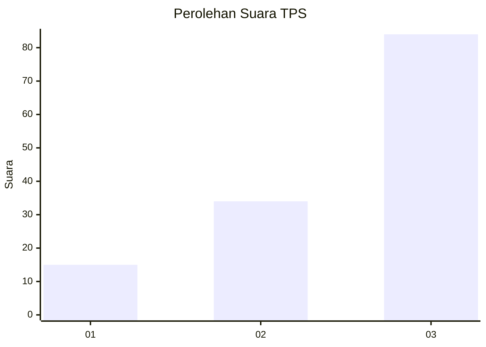
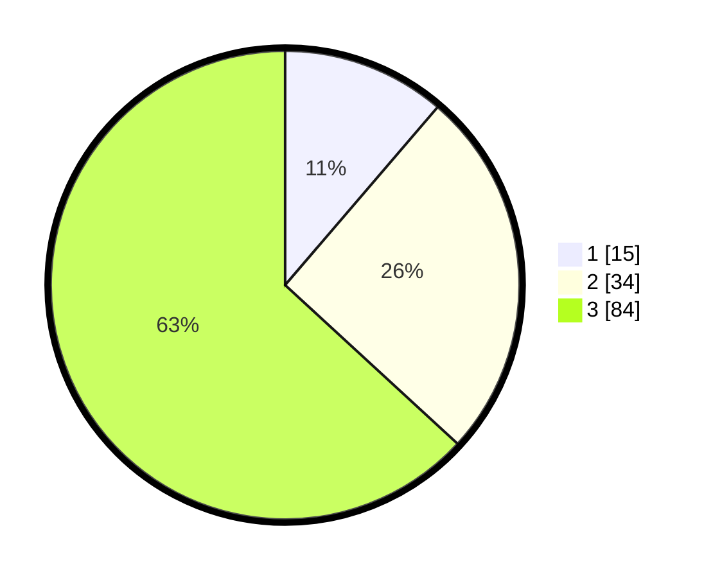

# Hasil

## Grafik

## Tabel

| No. | Nama Paslon    | Suara | Suara (raw) | Persentase |
|:--- |:-------------- | -----:| -----------:| ----------:|
| 1   | ANIES MUHAIMIN | 15    | [15][p-1]   | 11,28      |
| 2   | PRABOWO GIBRAN | 34    | [34][p-2]   | 25,56      |
| 3   | GANJAR MAHFUD  | 84    | [84][p-3]   | 63,16      |

[p-1]: https://github.com/gigit-pemilu/pemilu-2024-91-papua/blob/main/pilpres/hitung-suara/sub/91-papua/sub/05-kepulauan-yapen/sub/13-pulau-kurudu/sub/2001-kaipuri/sub/001-tps/sub/paslon-1.txt
[p-2]: https://github.com/gigit-pemilu/pemilu-2024-91-papua/blob/main/pilpres/hitung-suara/sub/91-papua/sub/05-kepulauan-yapen/sub/13-pulau-kurudu/sub/2001-kaipuri/sub/001-tps/sub/paslon-2.txt
[p-3]: https://github.com/gigit-pemilu/pemilu-2024-91-papua/blob/main/pilpres/hitung-suara/sub/91-papua/sub/05-kepulauan-yapen/sub/13-pulau-kurudu/sub/2001-kaipuri/sub/001-tps/sub/paslon-3.txt

## Foto C Plano

https://sirekap-obj-formc.kpu.go.id/6e1b/pemilu/ppwp/91/05/13/20/01/9105132001001-20240216-073204--9f4e75bf-f94c-455b-8488-eebeea078df2.jpg

https://sirekap-obj-formc.kpu.go.id/6e1b/pemilu/ppwp/91/05/13/20/01/9105132001001-20240216-073341--75b65ef3-6192-4457-9018-6739198d50ec.jpg

https://sirekap-obj-formc.kpu.go.id/6e1b/pemilu/ppwp/91/05/13/20/01/9105132001001-20240216-073534--d934cdcb-4e99-4c01-ad59-53c3ffa3320b.jpg

## Metadata

| Key        | Value               |
| ---------- | ------------------- |
| Time Stamp | 2024-02-19 06:16:00 |

