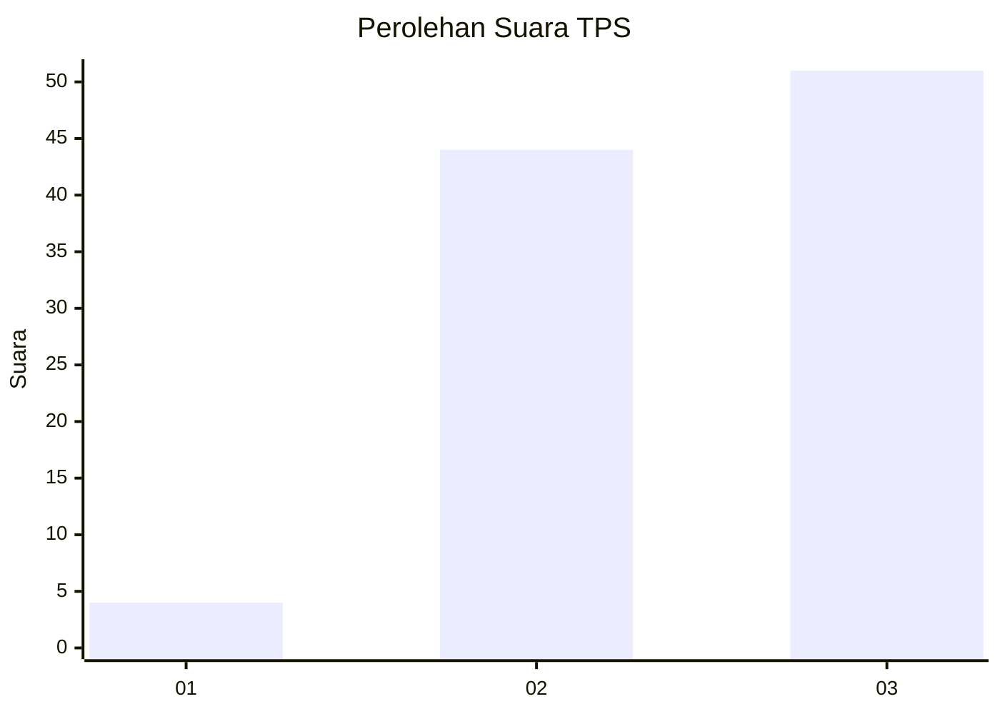
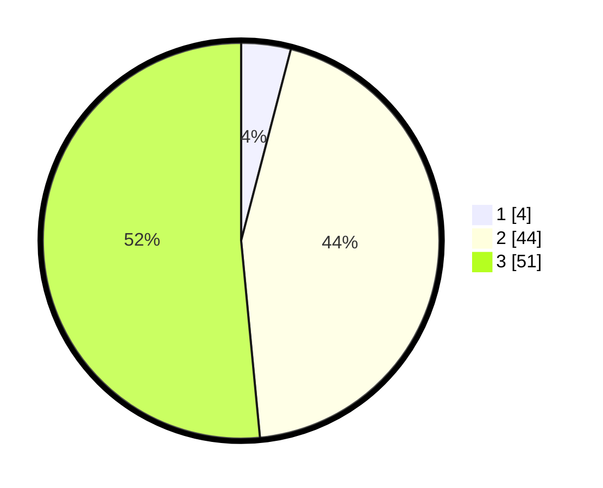

# Hasil

## Grafik

## Tabel

| No. | Nama Paslon    | Suara | Suara (raw) | Persentase |
|:--- |:-------------- | -----:| -----------:| ----------:|
| 1   | ANIES MUHAIMIN | 4     | [4][p-1]    | 4,04       |
| 2   | PRABOWO GIBRAN | 44    | [44][p-2]   | 44,44      |
| 3   | GANJAR MAHFUD  | 51    | [51][p-3]   | 51,52      |

[p-1]: https://github.com/gigit-pemilu/pemilu-2024-91-papua/blob/main/pilpres/hitung-suara/sub/91-papua/sub/05-kepulauan-yapen/sub/13-pulau-kurudu/sub/2007-mnukwar/sub/001-tps/sub/paslon-1.txt
[p-2]: https://github.com/gigit-pemilu/pemilu-2024-91-papua/blob/main/pilpres/hitung-suara/sub/91-papua/sub/05-kepulauan-yapen/sub/13-pulau-kurudu/sub/2007-mnukwar/sub/001-tps/sub/paslon-2.txt
[p-3]: https://github.com/gigit-pemilu/pemilu-2024-91-papua/blob/main/pilpres/hitung-suara/sub/91-papua/sub/05-kepulauan-yapen/sub/13-pulau-kurudu/sub/2007-mnukwar/sub/001-tps/sub/paslon-3.txt

## Foto C Plano

https://sirekap-obj-formc.kpu.go.id/b362/pemilu/ppwp/91/05/13/20/07/9105132007001-20240216-124007--fe185a85-a9c9-409c-b47b-cc88ac65abff.jpg

https://sirekap-obj-formc.kpu.go.id/b362/pemilu/ppwp/91/05/13/20/07/9105132007001-20240216-095031--d69f389e-ae44-4583-9000-e39c7a1945b5.jpg

https://sirekap-obj-formc.kpu.go.id/b362/pemilu/ppwp/91/05/13/20/07/9105132007001-20240216-095245--e63f20dc-158e-43ed-a007-92f1fec935f5.jpg

## Metadata

| Key        | Value               |
| ---------- | ------------------- |
| Time Stamp | 2024-02-16 12:51:22 |

## DATA PEMILIH TETAP

Jumlah pemilih dalam DPT: **104**.
 * L: **50**.
 * P: **54**.

## DATA PENGGUNA HAK PILIH

Jumlah pengguna hak pilih dalam DPT: **99**.
 * L: **50**.
 * P: **49**.

Jumlah pengguna hak pilih dalam DPTb: **0**.
 * L: **0**.
 * P: **0**.

Jumlah pengguna hak pilih dalam DPK: **0**.
 * L: **0**.
 * P: **0**.

Jumlah pengguna hak pilih: **99**.
 * L: **50**.
 * P: **49**.

## JUMLAH SUARA SAH DAN TIDAK SAH

JUMLAH SELURUH SUARA SAH: **99**.

JUMLAH SUARA TIDAK SAH: **0**.

JUMLAH SELURUH SUARA SAH DAN SUARA TIDAK SAH: **99**.

