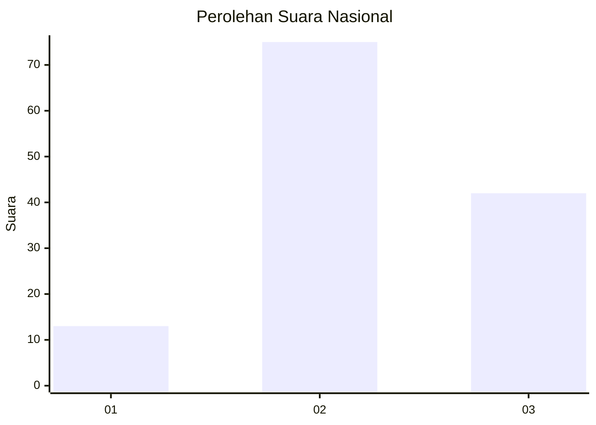
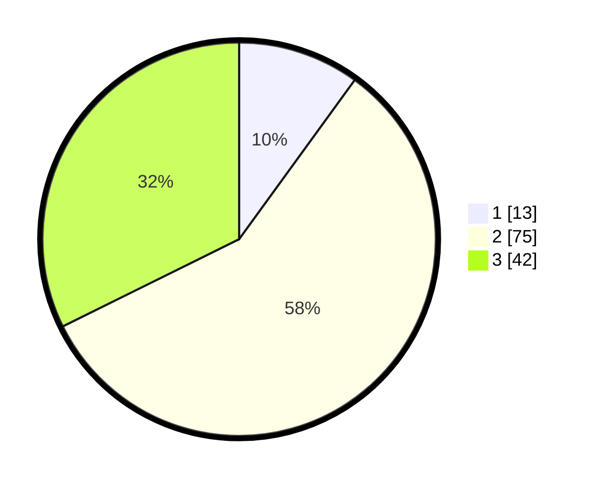

# Hasil

## Grafik

## Tabel

| No. | Nama Paslon    | Suara | Suara (raw) | Persentase |
|:--- |:-------------- | -----:| -----------:| ----------:|
| 1   | ANIES MUHAIMIN | 13    | [13][p-1]   | 10,00      |
| 2   | PRABOWO GIBRAN | 75    | [75][p-2]   | 57,69      |
| 3   | GANJAR MAHFUD  | 42    | [42][p-3]   | 32,31      |

[p-1]: https://github.com/gigit-pemilu/pemilu-2024/blob/main/pilpres/hitung-suara/sub/91-papua/sub/05-kepulauan-yapen/sub/15-anotaurei/sub/1001-anatorei/sub/002-tps/sub/paslon-1.txt
[p-2]: https://github.com/gigit-pemilu/pemilu-2024/blob/main/pilpres/hitung-suara/sub/91-papua/sub/05-kepulauan-yapen/sub/15-anotaurei/sub/1001-anatorei/sub/002-tps/sub/paslon-2.txt
[p-3]: https://github.com/gigit-pemilu/pemilu-2024/blob/main/pilpres/hitung-suara/sub/91-papua/sub/05-kepulauan-yapen/sub/15-anotaurei/sub/1001-anatorei/sub/002-tps/sub/paslon-3.txt

## Foto C Plano

https://sirekap-obj-formc.kpu.go.id/bc41/pemilu/ppwp/91/05/15/10/01/9105151001002-20240215-203443--2b095f48-bdf2-4b08-a27a-2c7069990f85.jpg

https://sirekap-obj-formc.kpu.go.id/bc41/pemilu/ppwp/91/05/15/10/01/9105151001002-20240215-203541--b9bf299d-83f6-4101-a7dd-b80e4ac41474.jpg

https://sirekap-obj-formc.kpu.go.id/bc41/pemilu/ppwp/91/05/15/10/01/9105151001002-20240215-203649--c6afbd0f-cb8d-4277-a3ed-0900d44a8114.jpg

## Metadata

| Key        | Value               |
| ---------- | ------------------- |
| Time Stamp | 2024-02-17 11:00:02 |

