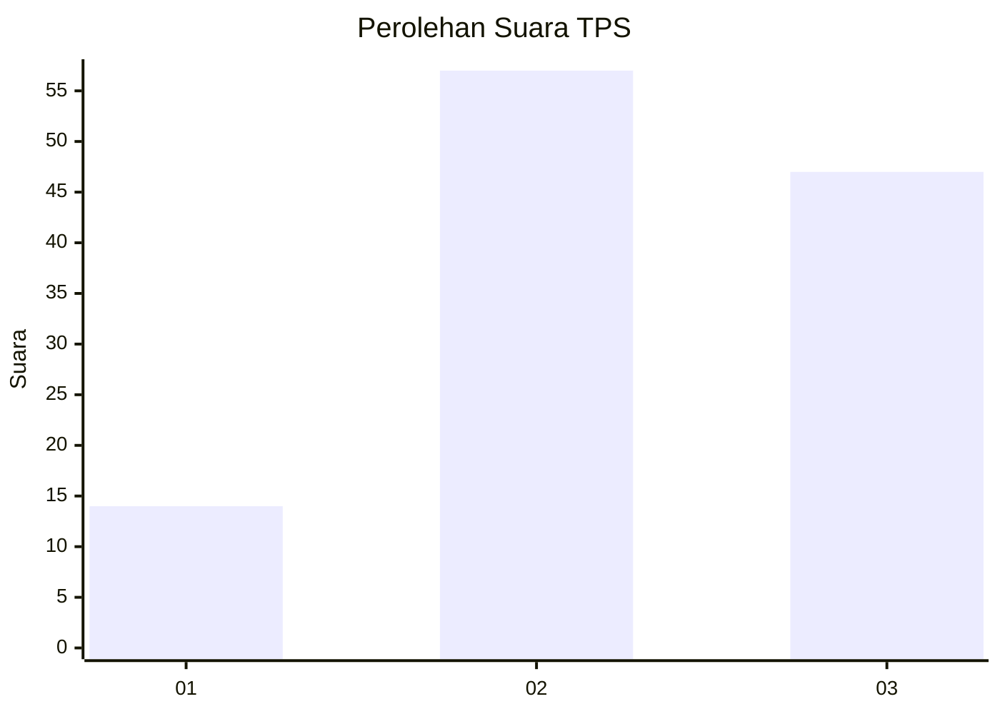
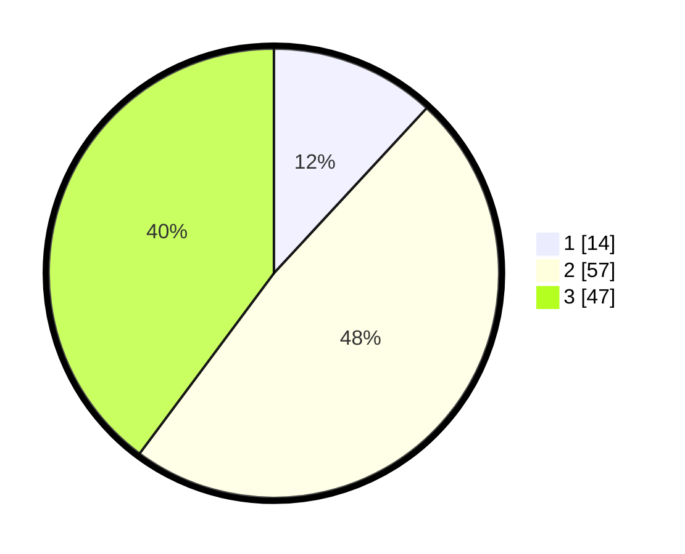

# Hasil

## Grafik

## Tabel

| No. | Nama Paslon    | Suara | Suara (raw) | Persentase |
|:--- |:-------------- | -----:| -----------:| ----------:|
| 1   | ANIES MUHAIMIN | 14    | [14][p-1]   | 11,86      |
| 2   | PRABOWO GIBRAN | 57    | [57][p-2]   | 48,31      |
| 3   | GANJAR MAHFUD  | 47    | [47][p-3]   | 39,83      |

[p-1]: https://github.com/gigit-pemilu/pemilu-2024-91-papua/blob/main/pilpres/hitung-suara/sub/91-papua/sub/05-kepulauan-yapen/sub/15-anotaurei/sub/1001-anatorei/sub/004-tps/sub/paslon-1.txt
[p-2]: https://github.com/gigit-pemilu/pemilu-2024-91-papua/blob/main/pilpres/hitung-suara/sub/91-papua/sub/05-kepulauan-yapen/sub/15-anotaurei/sub/1001-anatorei/sub/004-tps/sub/paslon-2.txt
[p-3]: https://github.com/gigit-pemilu/pemilu-2024-91-papua/blob/main/pilpres/hitung-suara/sub/91-papua/sub/05-kepulauan-yapen/sub/15-anotaurei/sub/1001-anatorei/sub/004-tps/sub/paslon-3.txt

## Foto C Plano

https://sirekap-obj-formc.kpu.go.id/5f7c/pemilu/ppwp/91/05/15/10/01/9105151001004-20240215-181431--42cc43d3-cda6-486c-bc2d-a4f92db21af2.jpg

https://sirekap-obj-formc.kpu.go.id/5f7c/pemilu/ppwp/91/05/15/10/01/9105151001004-20240215-181412--d491a79f-8746-4ecf-85d5-5177d20f49f5.jpg

https://sirekap-obj-formc.kpu.go.id/5f7c/pemilu/ppwp/91/05/15/10/01/9105151001004-20240215-181350--4f3797ca-131c-49dc-8640-713d92065873.jpg

## Metadata

| Key        | Value               |
| ---------- | ------------------- |
| Time Stamp | 2024-02-19 06:16:00 |

