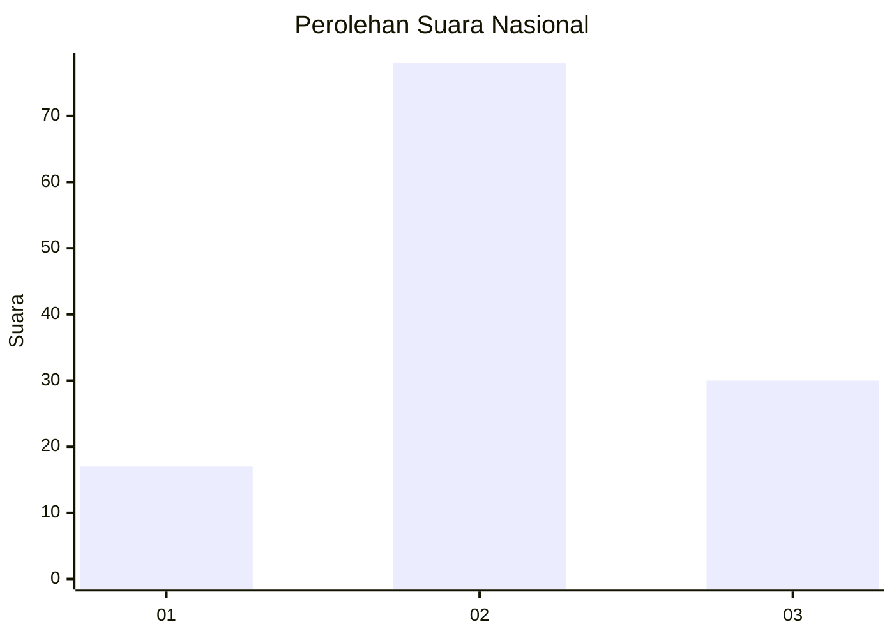
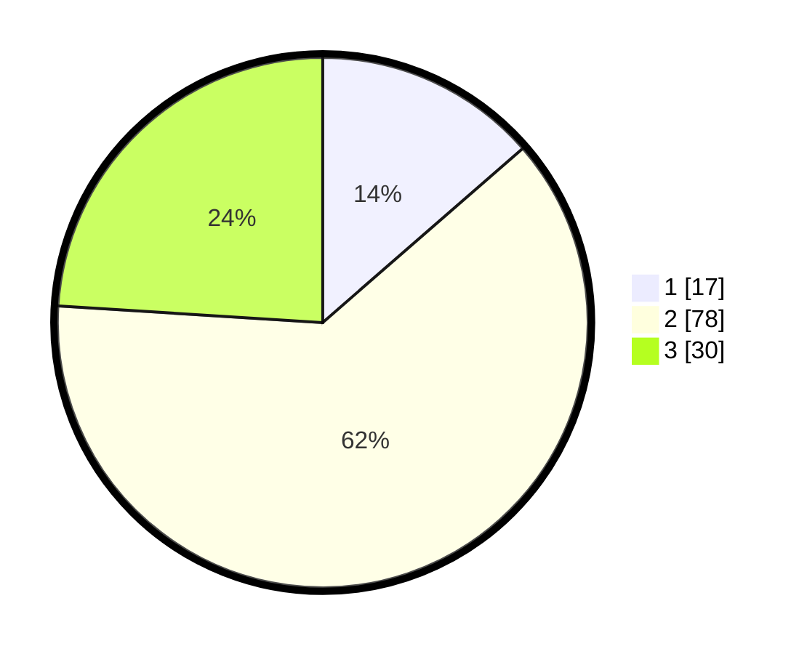

# Hasil

## Grafik

## Tabel

| No. | Nama Paslon    | Suara | Suara (raw) | Persentase |
|:--- |:-------------- | -----:| -----------:| ----------:|
| 1   | ANIES MUHAIMIN | 17    | [17][p-1]   | 13,60      |
| 2   | PRABOWO GIBRAN | 78    | [78][p-2]   | 62,40      |
| 3   | GANJAR MAHFUD  | 30    | [30][p-3]   | 24,00      |

[p-1]: https://github.com/gigit-pemilu/pemilu-2024/blob/main/pilpres/hitung-suara/sub/91-papua/sub/05-kepulauan-yapen/sub/15-anotaurei/sub/1001-anatorei/sub/007-tps/sub/paslon-1.txt
[p-2]: https://github.com/gigit-pemilu/pemilu-2024/blob/main/pilpres/hitung-suara/sub/91-papua/sub/05-kepulauan-yapen/sub/15-anotaurei/sub/1001-anatorei/sub/007-tps/sub/paslon-2.txt
[p-3]: https://github.com/gigit-pemilu/pemilu-2024/blob/main/pilpres/hitung-suara/sub/91-papua/sub/05-kepulauan-yapen/sub/15-anotaurei/sub/1001-anatorei/sub/007-tps/sub/paslon-3.txt

## Foto C Plano

https://sirekap-obj-formc.kpu.go.id/4723/pemilu/ppwp/91/05/15/10/01/9105151001007-20240215-164514--95838360-9300-408b-b3d7-dd3307dbcbf7.jpg

https://sirekap-obj-formc.kpu.go.id/4723/pemilu/ppwp/91/05/15/10/01/9105151001007-20240215-164654--1263efad-3bb3-4616-b8f5-fe298c5bf9b5.jpg

https://sirekap-obj-formc.kpu.go.id/4723/pemilu/ppwp/91/05/15/10/01/9105151001007-20240215-164858--e5481fbb-5b53-46a9-9a30-56cdc2f2f786.jpg

## Metadata

| Key        | Value               |
| ---------- | ------------------- |
| Time Stamp | 2024-02-19 06:16:00 |

