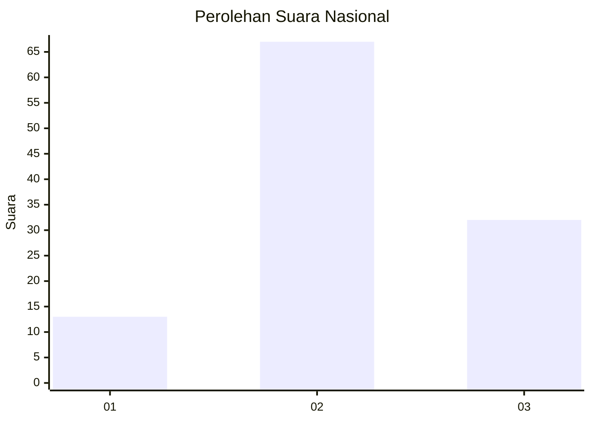
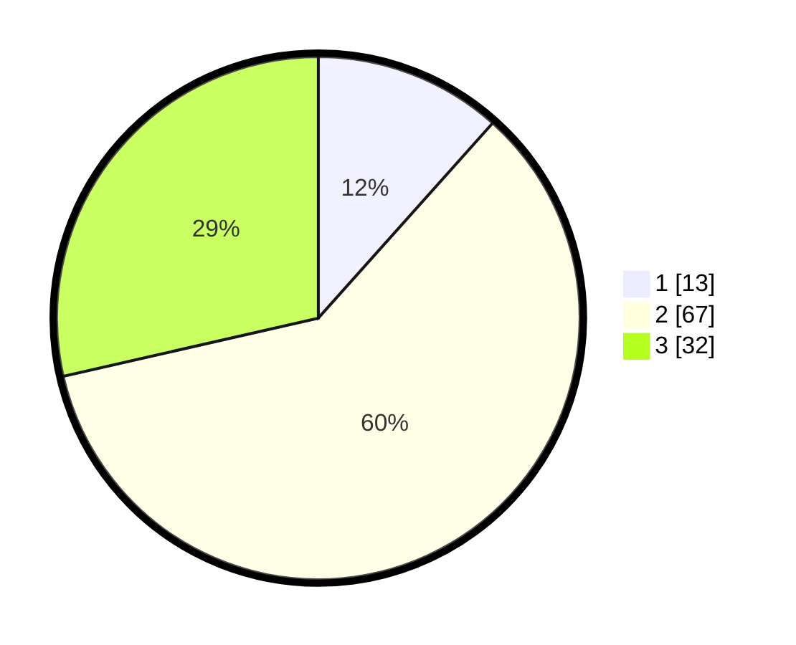

# Hasil

## Grafik

## Tabel

| No. | Nama Paslon    | Suara | Suara (raw) | Persentase |
|:--- |:-------------- | -----:| -----------:| ----------:|
| 1   | ANIES MUHAIMIN | 13    | [13][p-1]   | 11,61      |
| 2   | PRABOWO GIBRAN | 67    | [67][p-2]   | 59,82      |
| 3   | GANJAR MAHFUD  | 32    | [32][p-3]   | 28,57      |

[p-1]: https://github.com/gigit-pemilu/pemilu-2024/blob/main/pilpres/hitung-suara/sub/91-papua/sub/05-kepulauan-yapen/sub/15-anotaurei/sub/1001-anatorei/sub/009-tps/sub/paslon-1.txt
[p-2]: https://github.com/gigit-pemilu/pemilu-2024/blob/main/pilpres/hitung-suara/sub/91-papua/sub/05-kepulauan-yapen/sub/15-anotaurei/sub/1001-anatorei/sub/009-tps/sub/paslon-2.txt
[p-3]: https://github.com/gigit-pemilu/pemilu-2024/blob/main/pilpres/hitung-suara/sub/91-papua/sub/05-kepulauan-yapen/sub/15-anotaurei/sub/1001-anatorei/sub/009-tps/sub/paslon-3.txt

## Foto C Plano

https://sirekap-obj-formc.kpu.go.id/548a/pemilu/ppwp/91/05/15/10/01/9105151001009-20240215-012201--0bb81e2f-6796-48c1-b58b-9d530235b46c.jpg

https://sirekap-obj-formc.kpu.go.id/548a/pemilu/ppwp/91/05/15/10/01/9105151001009-20240215-183317--601ed92f-3ee6-42e8-b3d4-4d70409c39b0.jpg

https://sirekap-obj-formc.kpu.go.id/548a/pemilu/ppwp/91/05/15/10/01/9105151001009-20240215-174806--cc92cfd5-9225-4073-a4dc-fbd3c9fd8bdb.jpg

## Metadata

| Key        | Value               |
| ---------- | ------------------- |
| Time Stamp | 2024-02-19 06:16:00 |

## DATA PEMILIH TETAP

Jumlah pemilih dalam DPT: **282**.
 * L: **140**.
 * P: **142**.

## DATA PENGGUNA HAK PILIH

Jumlah pengguna hak pilih dalam DPT: **99**.
 * L: **47**.
 * P: **52**.

Jumlah pengguna hak pilih dalam DPTb: **16**.
 * L: **13**.
 * P: **3**.

Jumlah pengguna hak pilih dalam DPK: **0**.
 * L: **0**.
 * P: **0**.

Jumlah pengguna hak pilih: **115**.
 * L: **60**.
 * P: **55**.

## JUMLAH SUARA SAH DAN TIDAK SAH

JUMLAH SELURUH SUARA SAH: **112**.

JUMLAH SUARA TIDAK SAH: **3**.

JUMLAH SELURUH SUARA SAH DAN SUARA TIDAK SAH: **115**.

