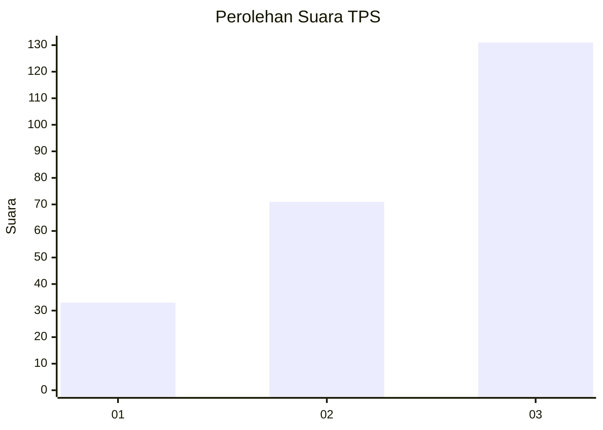
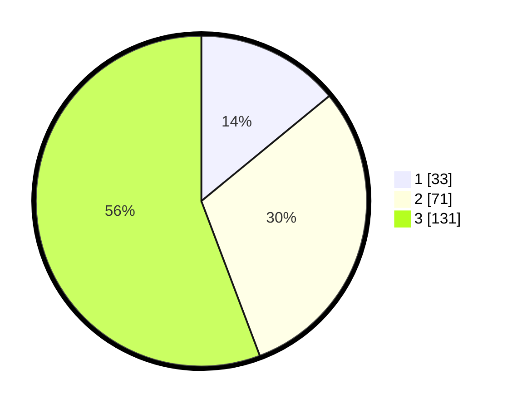

# Hasil

## Grafik

## Tabel

| No. | Nama Paslon    | Suara | Suara (raw) | Persentase |
|:--- |:-------------- | -----:| -----------:| ----------:|
| 1   | ANIES MUHAIMIN | 33    | [33][p-1]   | 14,04      |
| 2   | PRABOWO GIBRAN | 71    | [71][p-2]   | 30,21      |
| 3   | GANJAR MAHFUD  | 131   | [131][p-3]  | 55,74      |

[p-1]: https://github.com/gigit-pemilu/pemilu-2024-91-papua/blob/main/pilpres/hitung-suara/sub/91-papua/sub/05-kepulauan-yapen/sub/15-anotaurei/sub/2003-yapan/sub/001-tps/sub/paslon-1.txt
[p-2]: https://github.com/gigit-pemilu/pemilu-2024-91-papua/blob/main/pilpres/hitung-suara/sub/91-papua/sub/05-kepulauan-yapen/sub/15-anotaurei/sub/2003-yapan/sub/001-tps/sub/paslon-2.txt
[p-3]: https://github.com/gigit-pemilu/pemilu-2024-91-papua/blob/main/pilpres/hitung-suara/sub/91-papua/sub/05-kepulauan-yapen/sub/15-anotaurei/sub/2003-yapan/sub/001-tps/sub/paslon-3.txt

## Foto C Plano

https://sirekap-obj-formc.kpu.go.id/7207/pemilu/ppwp/91/05/15/20/03/9105152003001-20240215-073743--dad4c876-700f-4999-8781-a45383e34d8c.jpg

https://sirekap-obj-formc.kpu.go.id/7207/pemilu/ppwp/91/05/15/20/03/9105152003001-20240215-074519--97dfeb03-cb98-4467-91a2-db401831f1a8.jpg

https://sirekap-obj-formc.kpu.go.id/7207/pemilu/ppwp/91/05/15/20/03/9105152003001-20240215-074732--aa89a4e1-9f5a-43b0-a38c-b2cb8a7926c8.jpg

## Metadata

| Key        | Value               |
| ---------- | ------------------- |
| Time Stamp | 2024-02-19 06:16:00 |

