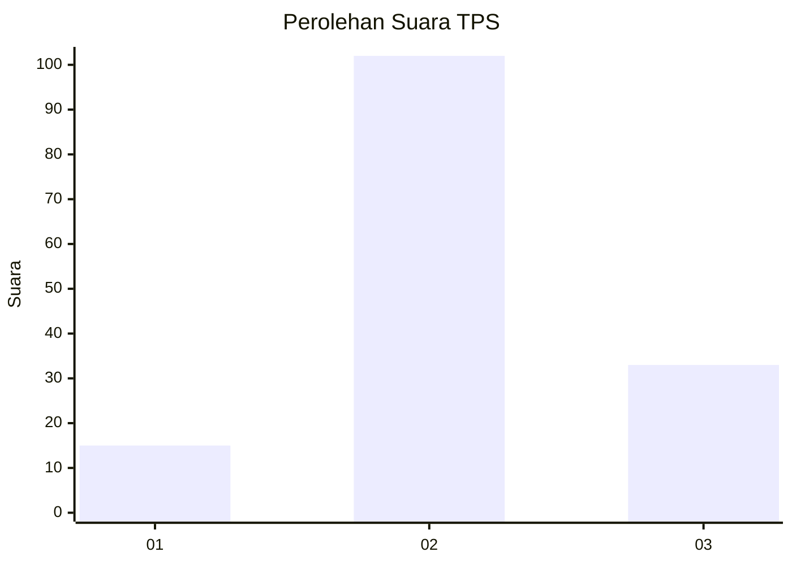
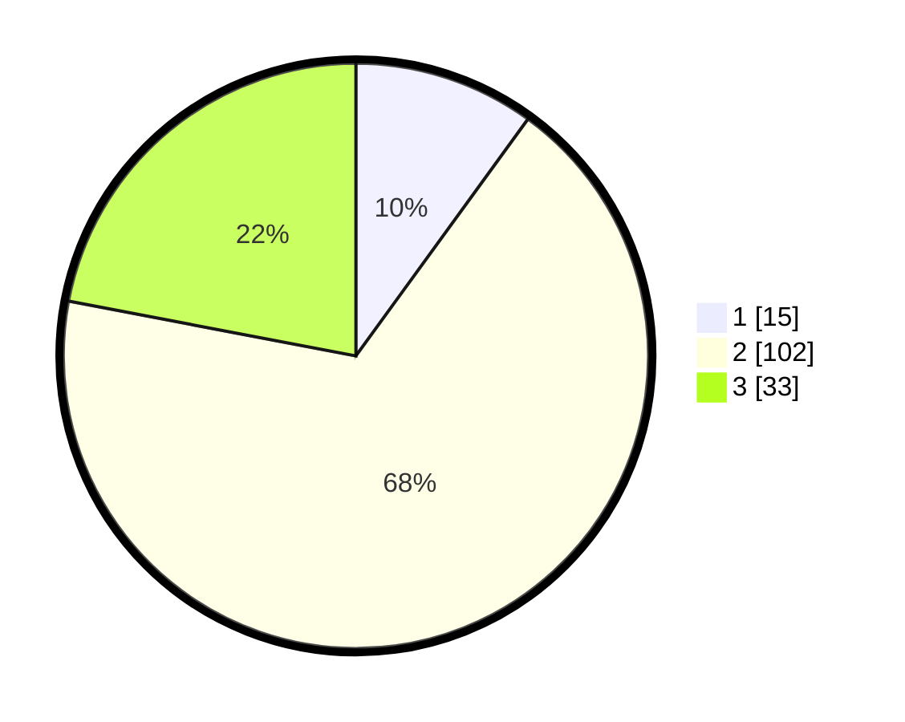

# Hasil

## Grafik

## Tabel

| No. | Nama Paslon    | Suara | Suara (raw) | Persentase |
|:--- |:-------------- | -----:| -----------:| ----------:|
| 1   | ANIES MUHAIMIN | 15    | [15][p-1]   | 10,00      |
| 2   | PRABOWO GIBRAN | 102   | [102][p-2]  | 68,00      |
| 3   | GANJAR MAHFUD  | 33    | [33][p-3]   | 22,00      |

[p-1]: https://github.com/gigit-pemilu/pemilu-2024-91-papua/blob/main/pilpres/hitung-suara/sub/91-papua/sub/05-kepulauan-yapen/sub/15-anotaurei/sub/2005-famboaman/sub/004-tps/sub/paslon-1.txt
[p-2]: https://github.com/gigit-pemilu/pemilu-2024-91-papua/blob/main/pilpres/hitung-suara/sub/91-papua/sub/05-kepulauan-yapen/sub/15-anotaurei/sub/2005-famboaman/sub/004-tps/sub/paslon-2.txt
[p-3]: https://github.com/gigit-pemilu/pemilu-2024-91-papua/blob/main/pilpres/hitung-suara/sub/91-papua/sub/05-kepulauan-yapen/sub/15-anotaurei/sub/2005-famboaman/sub/004-tps/sub/paslon-3.txt

## Foto C Plano

https://sirekap-obj-formc.kpu.go.id/be1e/pemilu/ppwp/91/05/15/20/05/9105152005004-20240215-051615--2be71687-90fc-4cfd-844a-2a64c050d9ff.jpg

https://sirekap-obj-formc.kpu.go.id/be1e/pemilu/ppwp/91/05/15/20/05/9105152005004-20240215-023140--3a620933-30e4-41f6-a50f-8685d50bc8eb.jpg

https://sirekap-obj-formc.kpu.go.id/be1e/pemilu/ppwp/91/05/15/20/05/9105152005004-20240215-023811--87e598cf-6fd3-4242-9261-61d01be673f5.jpg

## Metadata

| Key        | Value               |
| ---------- | ------------------- |
| Time Stamp | 2024-02-19 06:16:00 |

