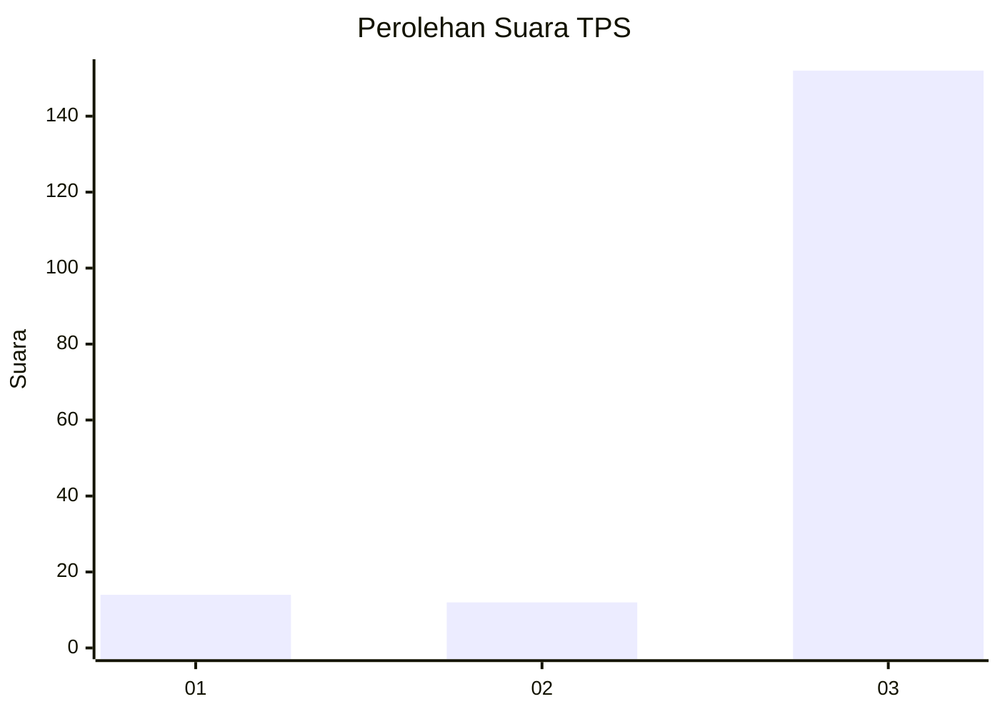
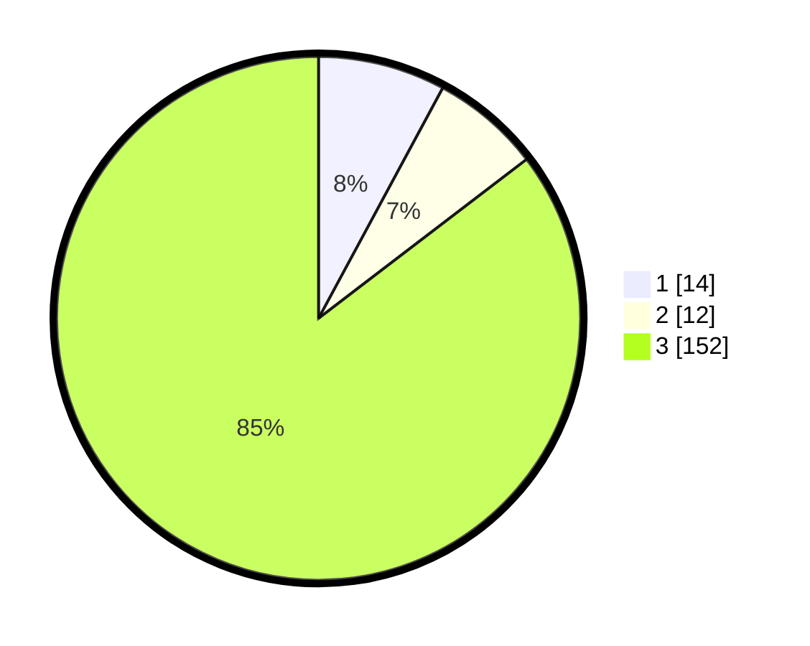

# Hasil

## Grafik

## Tabel

| No. | Nama Paslon    | Suara | Suara (raw) | Persentase |
|:--- |:-------------- | -----:| -----------:| ----------:|
| 1   | ANIES MUHAIMIN | 14    | [14][p-1]   | 7,87       |
| 2   | PRABOWO GIBRAN | 12    | [12][p-2]   | 6,74       |
| 3   | GANJAR MAHFUD  | 152   | [152][p-3]  | 85,39      |

[p-1]: https://github.com/gigit-pemilu/pemilu-2024-91-papua/blob/main/pilpres/hitung-suara/sub/91-papua/sub/05-kepulauan-yapen/sub/16-yawakukat/sub/2003-sanayoka/sub/001-tps/sub/paslon-1.txt
[p-2]: https://github.com/gigit-pemilu/pemilu-2024-91-papua/blob/main/pilpres/hitung-suara/sub/91-papua/sub/05-kepulauan-yapen/sub/16-yawakukat/sub/2003-sanayoka/sub/001-tps/sub/paslon-2.txt
[p-3]: https://github.com/gigit-pemilu/pemilu-2024-91-papua/blob/main/pilpres/hitung-suara/sub/91-papua/sub/05-kepulauan-yapen/sub/16-yawakukat/sub/2003-sanayoka/sub/001-tps/sub/paslon-3.txt

## Foto C Plano

https://sirekap-obj-formc.kpu.go.id/e209/pemilu/ppwp/91/05/16/20/03/9105162003001-20240215-123405--9a5fda6c-7b67-4274-bbf2-8b94c6fdd94e.jpg

https://sirekap-obj-formc.kpu.go.id/e209/pemilu/ppwp/91/05/16/20/03/9105162003001-20240215-111436--b15a6c68-fbee-483c-9d47-69c41f74579c.jpg

https://sirekap-obj-formc.kpu.go.id/e209/pemilu/ppwp/91/05/16/20/03/9105162003001-20240215-111647--0898ad76-e63a-4be7-8966-bdc7055adbac.jpg

## Metadata

| Key        | Value               |
| ---------- | ------------------- |
| Time Stamp | 2024-02-16 04:00:27 |

