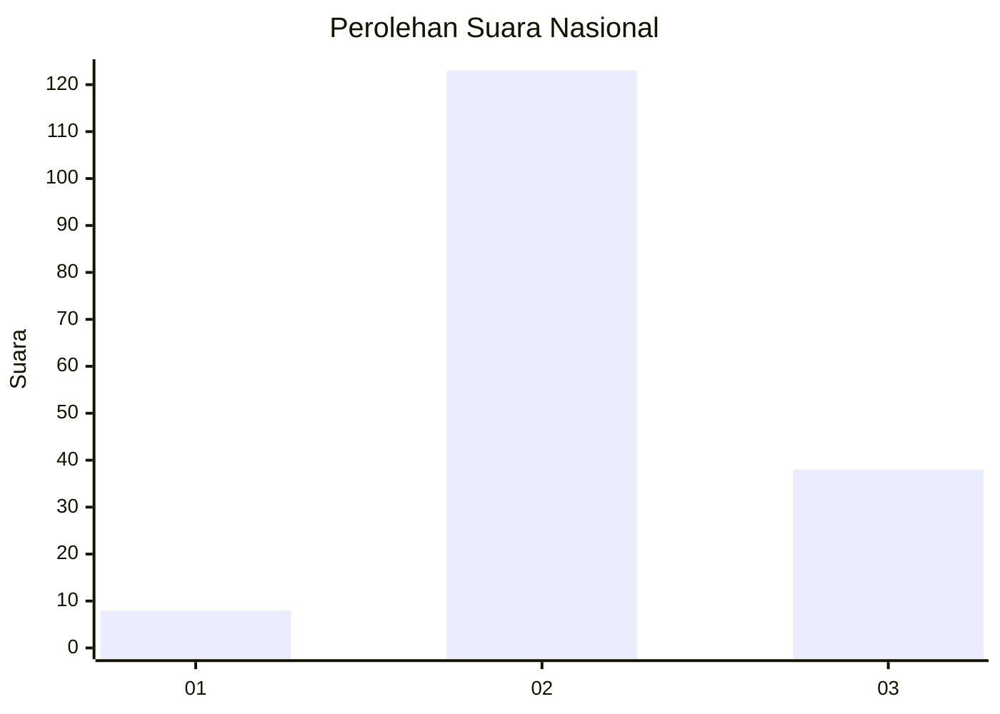
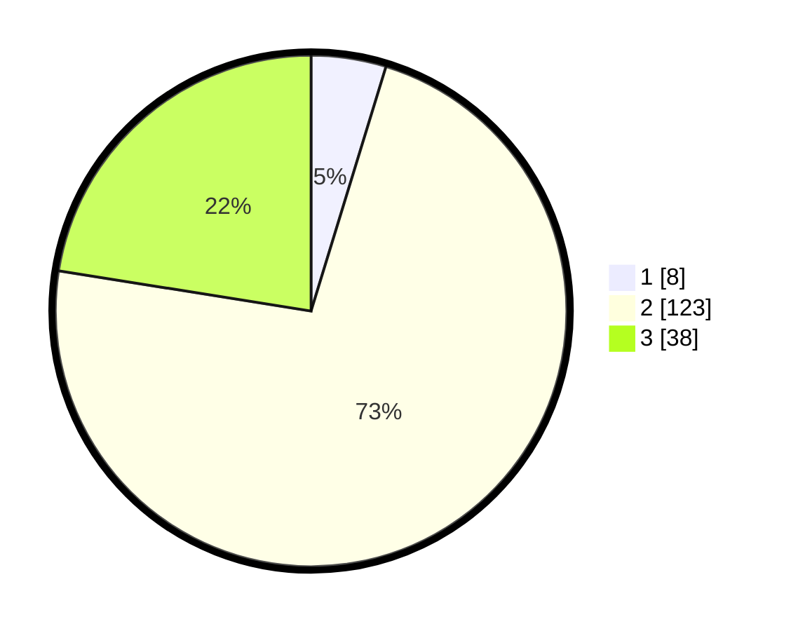

# Hasil

## Grafik

## Tabel

| No. | Nama Paslon    | Suara | Suara (raw) | Persentase |
|:--- |:-------------- | -----:| -----------:| ----------:|
| 1   | ANIES MUHAIMIN | 8     | [8][p-1]    | 4,73       |
| 2   | PRABOWO GIBRAN | 123   | [123][p-2]  | 72,78      |
| 3   | GANJAR MAHFUD  | 38    | [38][p-3]   | 22,49      |

[p-1]: https://github.com/gigit-pemilu/pemilu-2024/blob/main/pilpres/hitung-suara/sub/91-papua/sub/06-biak-numfor/sub/01-biak-kota/sub/1001-sorido/sub/001-tps/sub/paslon-1.txt
[p-2]: https://github.com/gigit-pemilu/pemilu-2024/blob/main/pilpres/hitung-suara/sub/91-papua/sub/06-biak-numfor/sub/01-biak-kota/sub/1001-sorido/sub/001-tps/sub/paslon-2.txt
[p-3]: https://github.com/gigit-pemilu/pemilu-2024/blob/main/pilpres/hitung-suara/sub/91-papua/sub/06-biak-numfor/sub/01-biak-kota/sub/1001-sorido/sub/001-tps/sub/paslon-3.txt

## Foto C Plano

https://sirekap-obj-formc.kpu.go.id/4786/pemilu/ppwp/91/06/01/10/01/9106011001001-20240215-152330--f67999f8-ea86-4940-bfdb-021e6a823fc4.jpg

https://sirekap-obj-formc.kpu.go.id/4786/pemilu/ppwp/91/06/01/10/01/9106011001001-20240215-145440--7eff015e-dead-4398-b9f8-b96ea2c7789c.jpg

https://sirekap-obj-formc.kpu.go.id/4786/pemilu/ppwp/91/06/01/10/01/9106011001001-20240215-145708--5c02266c-c002-45e4-b5b5-d47c90c7bc27.jpg

## Metadata

| Key        | Value               |
| ---------- | ------------------- |
| Time Stamp | 2024-02-19 17:00:00 |

