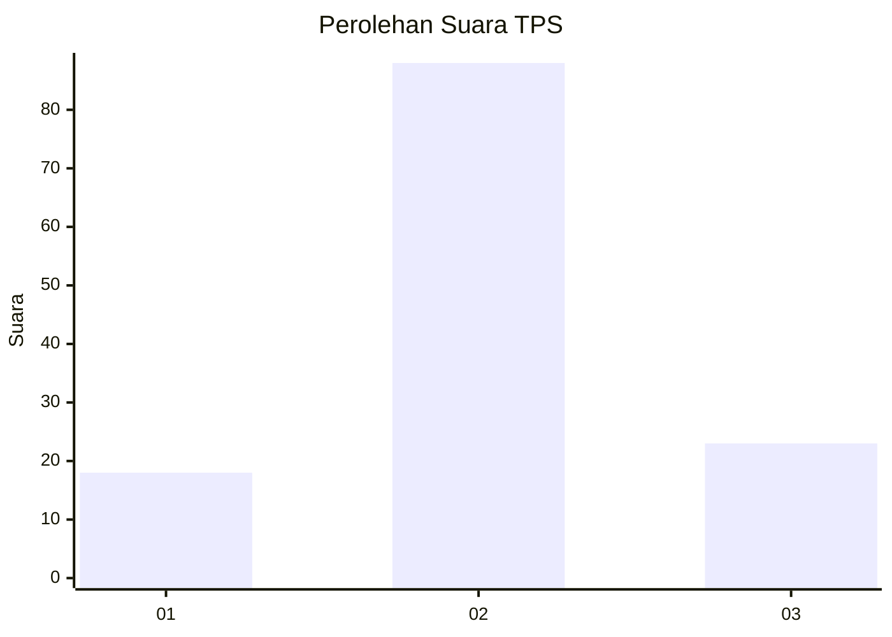
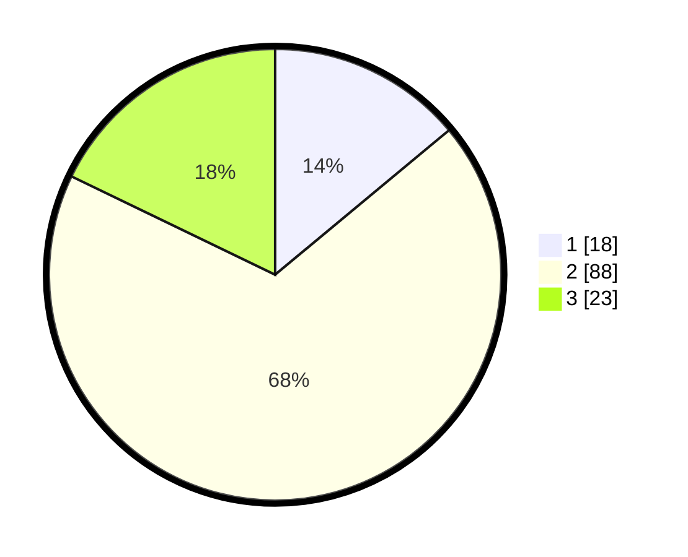

# Hasil

## Grafik

## Tabel

| No. | Nama Paslon    | Suara | Suara (raw) | Persentase |
|:--- |:-------------- | -----:| -----------:| ----------:|
| 1   | ANIES MUHAIMIN | 18    | [18][p-1]   | 13,95      |
| 2   | PRABOWO GIBRAN | 88    | [88][p-2]   | 68,22      |
| 3   | GANJAR MAHFUD  | 23    | [23][p-3]   | 17,83      |

[p-1]: https://github.com/gigit-pemilu/pemilu-2024-91-papua/blob/main/pilpres/hitung-suara/sub/91-papua/sub/06-biak-numfor/sub/01-biak-kota/sub/1001-sorido/sub/012-tps/sub/paslon-1.txt
[p-2]: https://github.com/gigit-pemilu/pemilu-2024-91-papua/blob/main/pilpres/hitung-suara/sub/91-papua/sub/06-biak-numfor/sub/01-biak-kota/sub/1001-sorido/sub/012-tps/sub/paslon-2.txt
[p-3]: https://github.com/gigit-pemilu/pemilu-2024-91-papua/blob/main/pilpres/hitung-suara/sub/91-papua/sub/06-biak-numfor/sub/01-biak-kota/sub/1001-sorido/sub/012-tps/sub/paslon-3.txt

## Foto C Plano

https://sirekap-obj-formc.kpu.go.id/cee4/pemilu/ppwp/91/06/01/10/01/9106011001012-20240214-215727--3d137010-5728-45d6-9bba-182a2beafcf4.jpg

https://sirekap-obj-formc.kpu.go.id/cee4/pemilu/ppwp/91/06/01/10/01/9106011001012-20240214-220844--6bd1b2a0-5764-409a-9c94-4ae559d8aec8.jpg

https://sirekap-obj-formc.kpu.go.id/cee4/pemilu/ppwp/91/06/01/10/01/9106011001012-20240214-221304--ccb2771f-55a0-4aa5-acde-f3d847451fa2.jpg

## Metadata

| Key        | Value               |
| ---------- | ------------------- |
| Time Stamp | 2024-02-15 20:30:46 |

