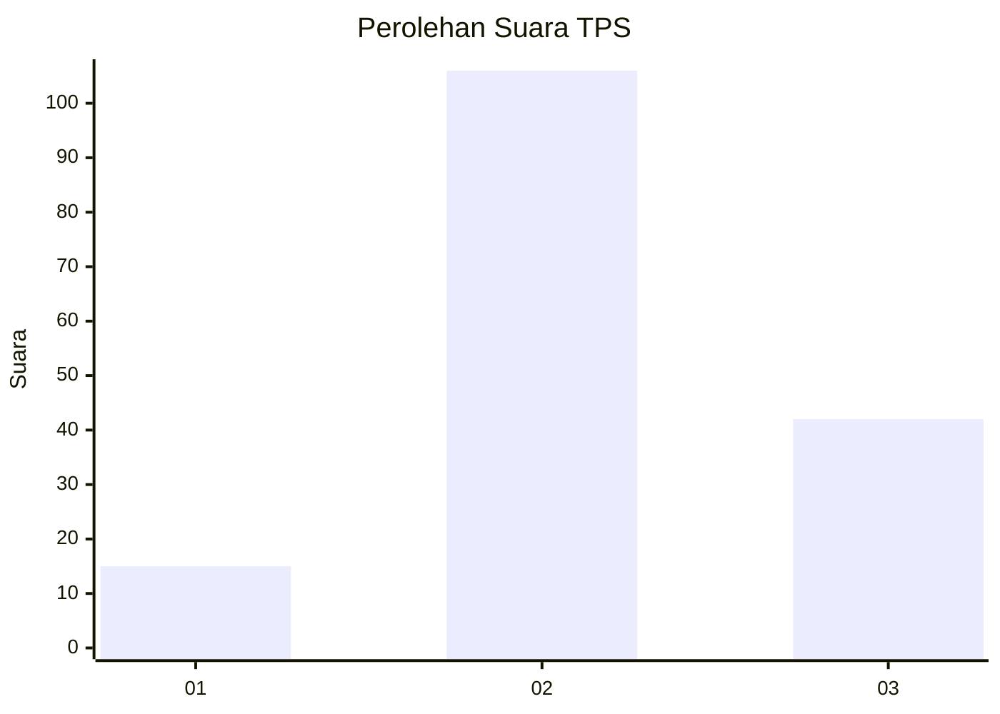
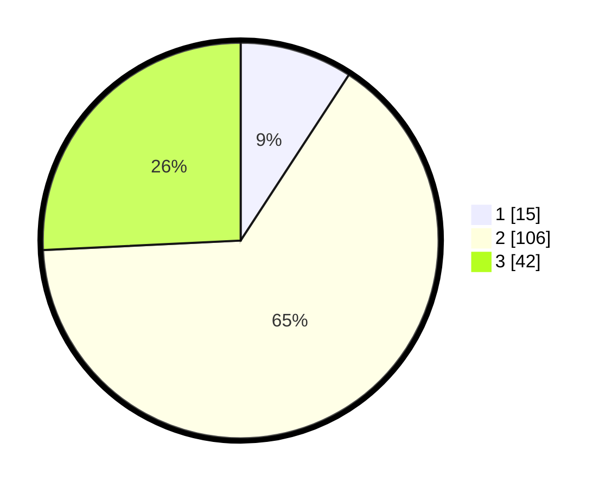

# Hasil

## Grafik

## Tabel

| No. | Nama Paslon    | Suara | Suara (raw) | Persentase |
|:--- |:-------------- | -----:| -----------:| ----------:|
| 1   | ANIES MUHAIMIN | 15    | [15][p-1]   | 9,20       |
| 2   | PRABOWO GIBRAN | 106   | [106][p-2]  | 65,03      |
| 3   | GANJAR MAHFUD  | 42    | [42][p-3]   | 25,77      |

[p-1]: https://github.com/gigit-pemilu/pemilu-2024-91-papua/blob/main/pilpres/hitung-suara/sub/91-papua/sub/06-biak-numfor/sub/01-biak-kota/sub/1001-sorido/sub/013-tps/sub/paslon-1.txt
[p-2]: https://github.com/gigit-pemilu/pemilu-2024-91-papua/blob/main/pilpres/hitung-suara/sub/91-papua/sub/06-biak-numfor/sub/01-biak-kota/sub/1001-sorido/sub/013-tps/sub/paslon-2.txt
[p-3]: https://github.com/gigit-pemilu/pemilu-2024-91-papua/blob/main/pilpres/hitung-suara/sub/91-papua/sub/06-biak-numfor/sub/01-biak-kota/sub/1001-sorido/sub/013-tps/sub/paslon-3.txt

## Foto C Plano

https://sirekap-obj-formc.kpu.go.id/3f86/pemilu/ppwp/91/06/01/10/01/9106011001013-20240214-204714--6c89b183-fe72-487b-9dc5-a52bb807a4f8.jpg

https://sirekap-obj-formc.kpu.go.id/3f86/pemilu/ppwp/91/06/01/10/01/9106011001013-20240214-204912--53ddf8b2-8c10-46ba-90a2-df96eeb67350.jpg

https://sirekap-obj-formc.kpu.go.id/3f86/pemilu/ppwp/91/06/01/10/01/9106011001013-20240214-205103--bdd87d55-1714-4b56-a9a1-d8c578fbe6b0.jpg

## Metadata

| Key        | Value               |
| ---------- | ------------------- |
| Time Stamp | 2024-02-25 00:00:00 |

