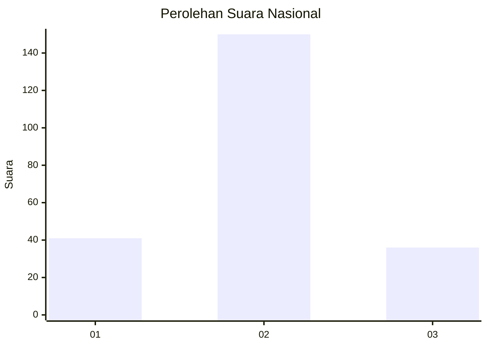
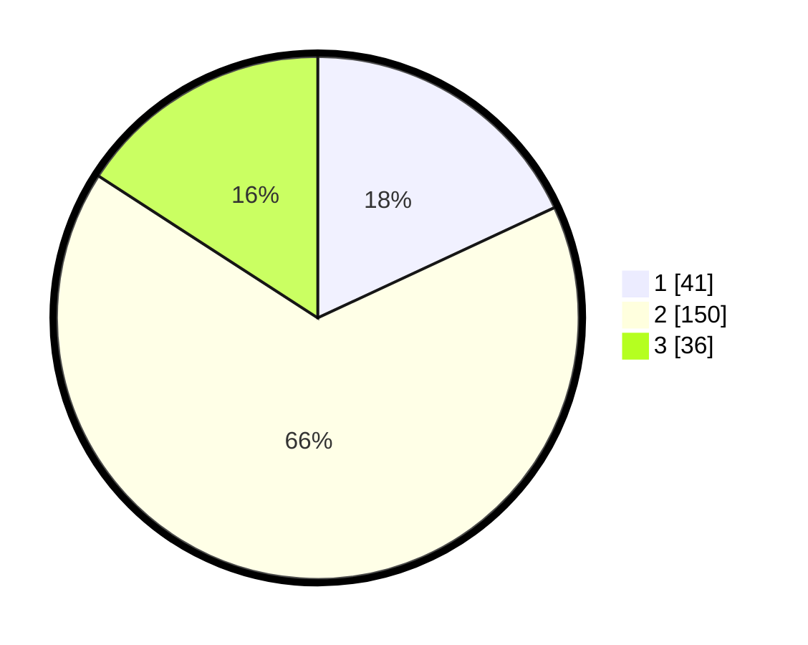

# Hasil

## Grafik

## Tabel

| No. | Nama Paslon    | Suara | Suara (raw) | Persentase |
|:--- |:-------------- | -----:| -----------:| ----------:|
| 1   | ANIES MUHAIMIN | 41    | [41][p-1]   | 18,06      |
| 2   | PRABOWO GIBRAN | 150   | [150][p-2]  | 66,08      |
| 3   | GANJAR MAHFUD  | 36    | [36][p-3]   | 15,86      |

[p-1]: https://github.com/gigit-pemilu/pemilu-2024/blob/main/pilpres/hitung-suara/sub/91-papua/sub/06-biak-numfor/sub/01-biak-kota/sub/1003-saramon/sub/001-tps/sub/paslon-1.txt
[p-2]: https://github.com/gigit-pemilu/pemilu-2024/blob/main/pilpres/hitung-suara/sub/91-papua/sub/06-biak-numfor/sub/01-biak-kota/sub/1003-saramon/sub/001-tps/sub/paslon-2.txt
[p-3]: https://github.com/gigit-pemilu/pemilu-2024/blob/main/pilpres/hitung-suara/sub/91-papua/sub/06-biak-numfor/sub/01-biak-kota/sub/1003-saramon/sub/001-tps/sub/paslon-3.txt

## Foto C Plano

https://sirekap-obj-formc.kpu.go.id/da0d/pemilu/ppwp/91/06/01/10/03/9106011003001-20240214-204234--8de60bfd-5ead-491c-b945-0c6dde358e6a.jpg

https://sirekap-obj-formc.kpu.go.id/da0d/pemilu/ppwp/91/06/01/10/03/9106011003001-20240214-204606--701f9d08-44e8-4bd5-96c7-1310465d745e.jpg

https://sirekap-obj-formc.kpu.go.id/da0d/pemilu/ppwp/91/06/01/10/03/9106011003001-20240214-204405--e87115c6-011f-4c5d-9266-6d03e988e79b.jpg

## Metadata

| Key        | Value               |
| ---------- | ------------------- |
| Time Stamp | 2024-02-21 16:00:00 |

