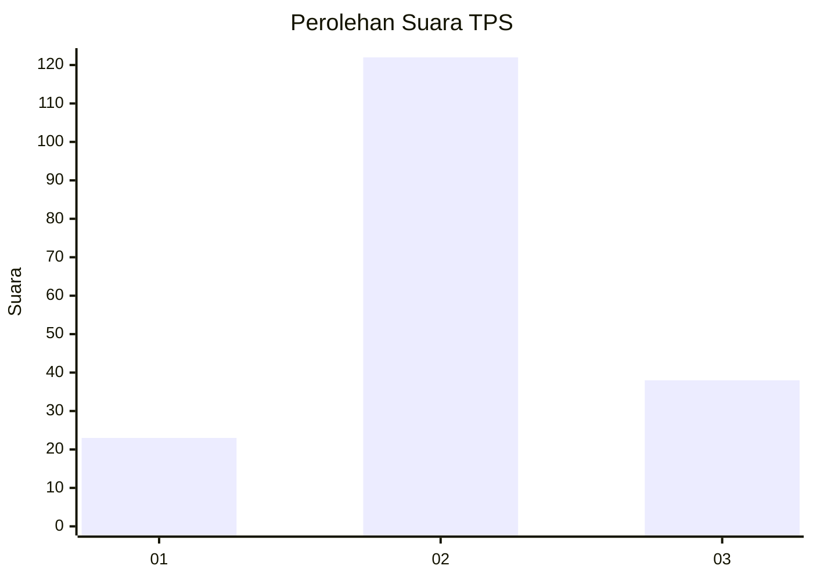
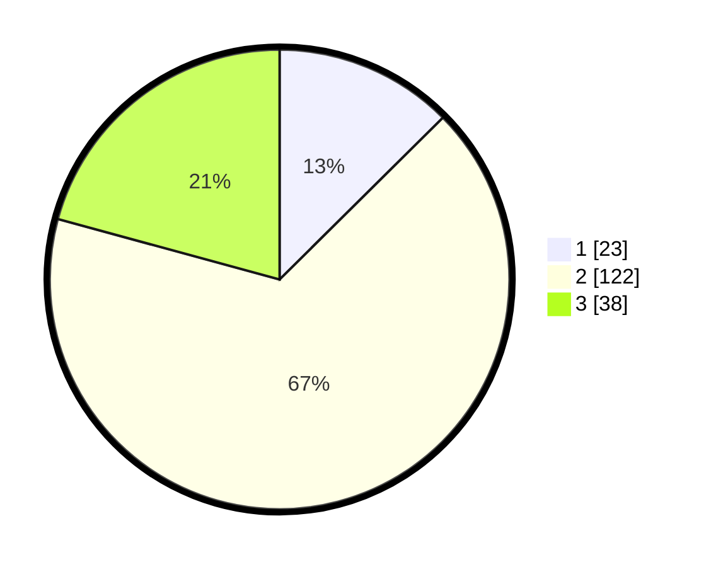

# Hasil

## Grafik

## Tabel

| No. | Nama Paslon    | Suara | Suara (raw) | Persentase |
|:--- |:-------------- | -----:| -----------:| ----------:|
| 1   | ANIES MUHAIMIN | 23    | [23][p-1]   | 12,57      |
| 2   | PRABOWO GIBRAN | 122   | [122][p-2]  | 66,67      |
| 3   | GANJAR MAHFUD  | 38    | [38][p-3]   | 20,77      |

[p-1]: https://github.com/gigit-pemilu/pemilu-2024-91-papua/blob/main/pilpres/hitung-suara/sub/91-papua/sub/06-biak-numfor/sub/01-biak-kota/sub/1003-saramon/sub/002-tps/sub/paslon-1.txt
[p-2]: https://github.com/gigit-pemilu/pemilu-2024-91-papua/blob/main/pilpres/hitung-suara/sub/91-papua/sub/06-biak-numfor/sub/01-biak-kota/sub/1003-saramon/sub/002-tps/sub/paslon-2.txt
[p-3]: https://github.com/gigit-pemilu/pemilu-2024-91-papua/blob/main/pilpres/hitung-suara/sub/91-papua/sub/06-biak-numfor/sub/01-biak-kota/sub/1003-saramon/sub/002-tps/sub/paslon-3.txt

## Foto C Plano

https://sirekap-obj-formc.kpu.go.id/250b/pemilu/ppwp/91/06/01/10/03/9106011003002-20240215-124450--24f7cb30-af25-4b47-8fec-2448f4e4708a.jpg

https://sirekap-obj-formc.kpu.go.id/250b/pemilu/ppwp/91/06/01/10/03/9106011003002-20240214-225738--1f4b9a95-43eb-41d7-a879-906603d7f368.jpg

https://sirekap-obj-formc.kpu.go.id/250b/pemilu/ppwp/91/06/01/10/03/9106011003002-20240214-225806--977db0ed-a154-4bf9-8c83-26303ac324d1.jpg

## Metadata

| Key        | Value               |
| ---------- | ------------------- |
| Time Stamp | 2024-02-25 18:00:00 |

