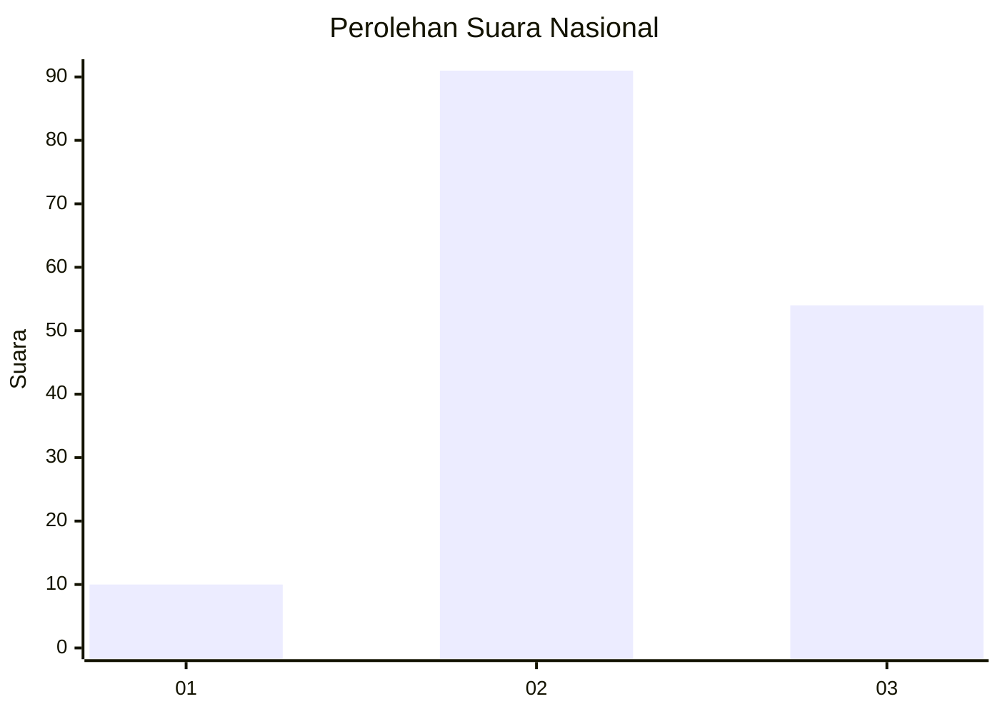
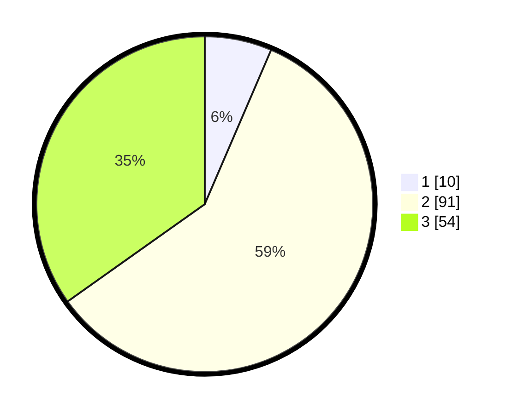

# Hasil

## Grafik

## Tabel

| No. | Nama Paslon    | Suara | Suara (raw) | Persentase |
|:--- |:-------------- | -----:| -----------:| ----------:|
| 1   | ANIES MUHAIMIN | 10    | [10][p-1]   | 6,45       |
| 2   | PRABOWO GIBRAN | 91    | [91][p-2]   | 58,71      |
| 3   | GANJAR MAHFUD  | 54    | [54][p-3]   | 34,84      |

[p-1]: https://github.com/gigit-pemilu/pemilu-2024/blob/main/pilpres/hitung-suara/sub/91-papua/sub/06-biak-numfor/sub/01-biak-kota/sub/1004-burokup/sub/002-tps/sub/paslon-1.txt
[p-2]: https://github.com/gigit-pemilu/pemilu-2024/blob/main/pilpres/hitung-suara/sub/91-papua/sub/06-biak-numfor/sub/01-biak-kota/sub/1004-burokup/sub/002-tps/sub/paslon-2.txt
[p-3]: https://github.com/gigit-pemilu/pemilu-2024/blob/main/pilpres/hitung-suara/sub/91-papua/sub/06-biak-numfor/sub/01-biak-kota/sub/1004-burokup/sub/002-tps/sub/paslon-3.txt

## Foto C Plano

https://sirekap-obj-formc.kpu.go.id/93d1/pemilu/ppwp/91/06/01/10/04/9106011004002-20240215-143431--c4b597d0-e700-4340-b2f6-058a7d62789f.jpg

https://sirekap-obj-formc.kpu.go.id/93d1/pemilu/ppwp/91/06/01/10/04/9106011004002-20240215-143613--b2cbac12-a53e-4786-bd06-3832e100599f.jpg

https://sirekap-obj-formc.kpu.go.id/93d1/pemilu/ppwp/91/06/01/10/04/9106011004002-20240215-143804--6d573760-86a1-4d5c-abf0-8455d2b5df65.jpg

## Metadata

| Key        | Value               |
| ---------- | ------------------- |
| Time Stamp | 2024-02-25 15:00:00 |

