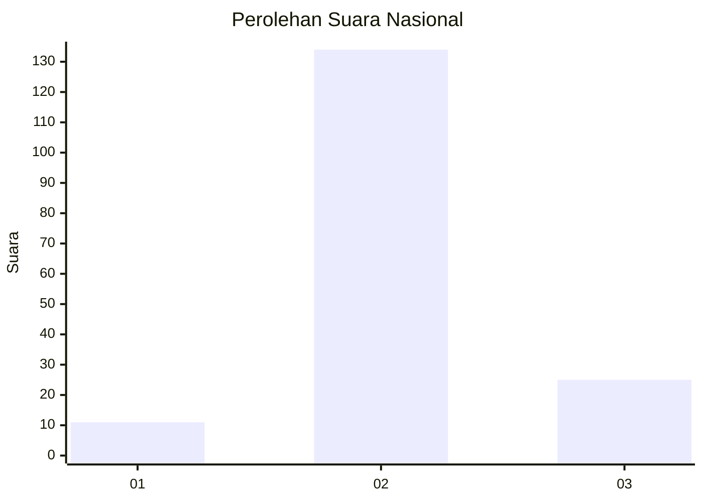

# Hasil

## Grafik

## Tabel

| No. | Nama Paslon    | Suara | Suara (raw) | Persentase |
|:--- |:-------------- | -----:| -----------:| ----------:|
| 1   | ANIES MUHAIMIN | 11    | [11][p-1]   | 6,47       |
| 2   | PRABOWO GIBRAN | 134   | [134][p-2]  | 78,82      |
| 3   | GANJAR MAHFUD  | 25    | [25][p-3]   | 14,71      |

[p-1]: https://github.com/gigit-pemilu/pemilu-2024/blob/main/pilpres/hitung-suara/sub/91-papua/sub/06-biak-numfor/sub/01-biak-kota/sub/1004-burokup/sub/005-tps/sub/paslon-1.txt
[p-2]: https://github.com/gigit-pemilu/pemilu-2024/blob/main/pilpres/hitung-suara/sub/91-papua/sub/06-biak-numfor/sub/01-biak-kota/sub/1004-burokup/sub/005-tps/sub/paslon-2.txt
[p-3]: https://github.com/gigit-pemilu/pemilu-2024/blob/main/pilpres/hitung-suara/sub/91-papua/sub/06-biak-numfor/sub/01-biak-kota/sub/1004-burokup/sub/005-tps/sub/paslon-3.txt

## Foto C Plano

https://sirekap-obj-formc.kpu.go.id/3948/pemilu/ppwp/91/06/01/10/04/9106011004005-20240215-053058--a802b987-d624-450a-aa0c-4d1e3f91260a.jpg

https://sirekap-obj-formc.kpu.go.id/3948/pemilu/ppwp/91/06/01/10/04/9106011004005-20240215-053512--25d4d93b-03ff-4946-a654-02953c451bf6.jpg

https://sirekap-obj-formc.kpu.go.id/3948/pemilu/ppwp/91/06/01/10/04/9106011004005-20240215-053548--48c46f90-83fe-48f9-b95b-daf801f2f4e9.jpg

## Metadata

| Key        | Value               |
| ---------- | ------------------- |
| Time Stamp | 2024-02-28 10:00:00 |

