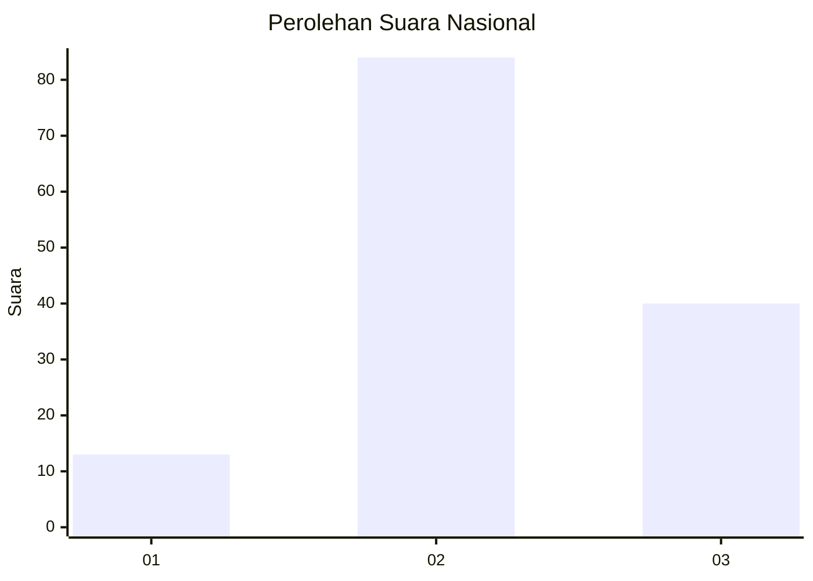
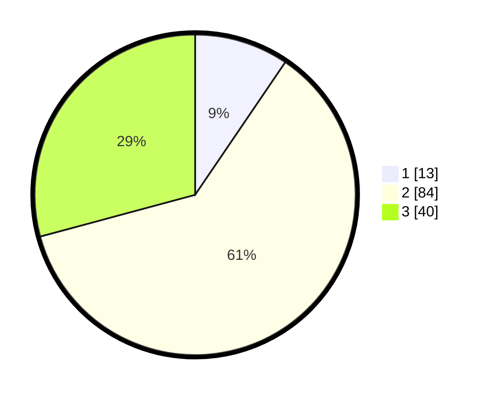

# Hasil

## Grafik

## Tabel

| No. | Nama Paslon    | Suara | Suara (raw) | Persentase |
|:--- |:-------------- | -----:| -----------:| ----------:|
| 1   | ANIES MUHAIMIN | 13    | [13][p-1]   | 9,49       |
| 2   | PRABOWO GIBRAN | 84    | [84][p-2]   | 61,31      |
| 3   | GANJAR MAHFUD  | 40    | [40][p-3]   | 29,20      |

[p-1]: https://github.com/gigit-pemilu/pemilu-2024/blob/main/pilpres/hitung-suara/sub/91-papua/sub/06-biak-numfor/sub/01-biak-kota/sub/2008-swapodibo/sub/003-tps/sub/paslon-1.txt
[p-2]: https://github.com/gigit-pemilu/pemilu-2024/blob/main/pilpres/hitung-suara/sub/91-papua/sub/06-biak-numfor/sub/01-biak-kota/sub/2008-swapodibo/sub/003-tps/sub/paslon-2.txt
[p-3]: https://github.com/gigit-pemilu/pemilu-2024/blob/main/pilpres/hitung-suara/sub/91-papua/sub/06-biak-numfor/sub/01-biak-kota/sub/2008-swapodibo/sub/003-tps/sub/paslon-3.txt

## Foto C Plano

https://sirekap-obj-formc.kpu.go.id/749a/pemilu/ppwp/91/06/01/20/08/9106012008003-20240216-192153--282e3f65-8dd9-458f-bc15-fe265a53ab00.jpg

https://sirekap-obj-formc.kpu.go.id/749a/pemilu/ppwp/91/06/01/20/08/9106012008003-20240216-192813--d381ab69-fb51-4060-8ec1-8971d0db6a9a.jpg

https://sirekap-obj-formc.kpu.go.id/749a/pemilu/ppwp/91/06/01/20/08/9106012008003-20240216-194209--d44a3402-05af-490e-8d59-05e3bc542258.jpg

## Metadata

| Key        | Value               |
| ---------- | ------------------- |
| Time Stamp | 2024-02-25 11:00:00 |

