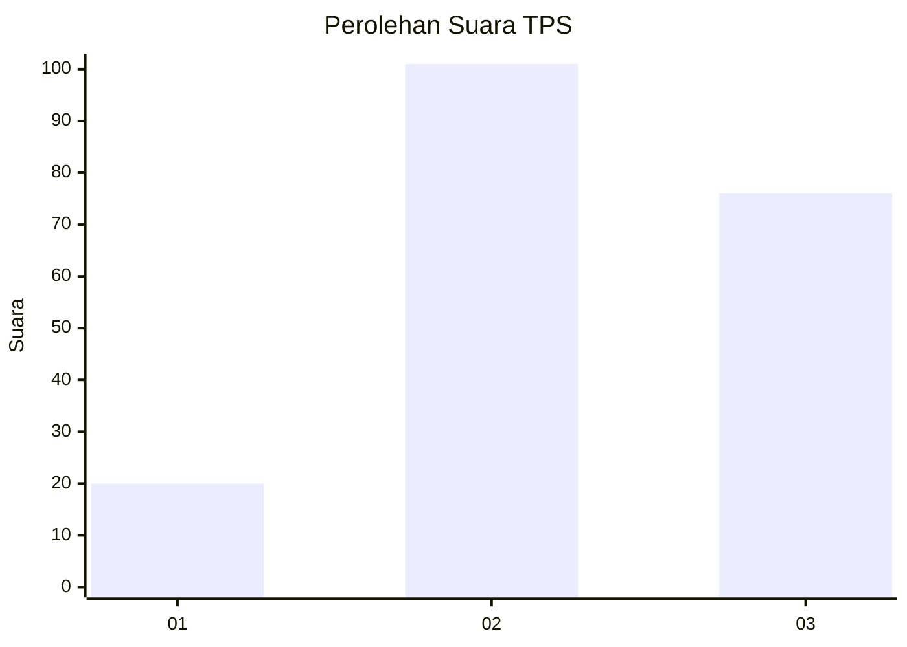
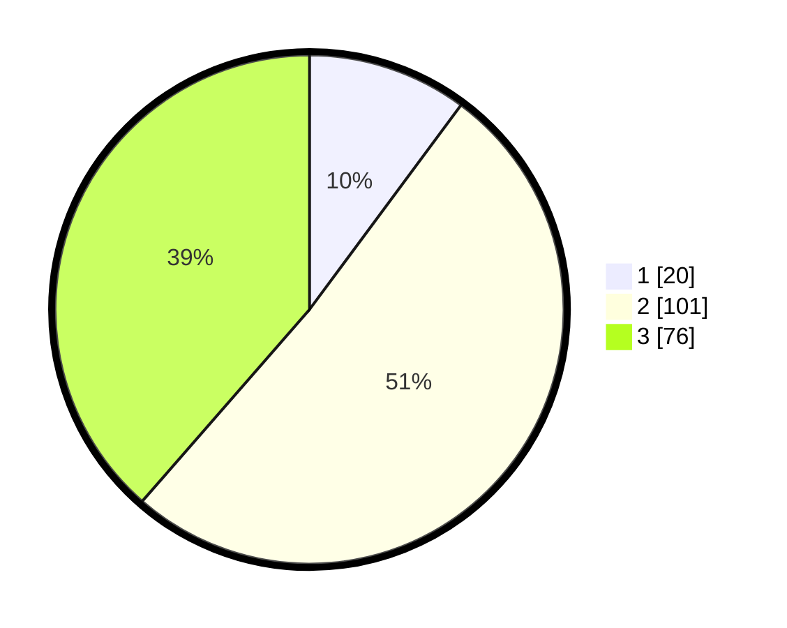

# Hasil

## Grafik

## Tabel

| No. | Nama Paslon    | Suara | Suara (raw) | Persentase |
|:--- |:-------------- | -----:| -----------:| ----------:|
| 1   | ANIES MUHAIMIN | 20    | [20][p-1]   | 10,15      |
| 2   | PRABOWO GIBRAN | 101   | [101][p-2]  | 51,27      |
| 3   | GANJAR MAHFUD  | 76    | [76][p-3]   | 38,58      |

[p-1]: https://github.com/gigit-pemilu/pemilu-2024-91-papua/blob/main/pilpres/hitung-suara/sub/91-papua/sub/06-biak-numfor/sub/01-biak-kota/sub/2011-parai/sub/001-tps/sub/paslon-1.txt
[p-2]: https://github.com/gigit-pemilu/pemilu-2024-91-papua/blob/main/pilpres/hitung-suara/sub/91-papua/sub/06-biak-numfor/sub/01-biak-kota/sub/2011-parai/sub/001-tps/sub/paslon-2.txt
[p-3]: https://github.com/gigit-pemilu/pemilu-2024-91-papua/blob/main/pilpres/hitung-suara/sub/91-papua/sub/06-biak-numfor/sub/01-biak-kota/sub/2011-parai/sub/001-tps/sub/paslon-3.txt

## Foto C Plano

https://sirekap-obj-formc.kpu.go.id/c55f/pemilu/ppwp/91/06/01/20/11/9106012011001-20240215-182324--2100e21e-3b5b-496d-8d75-93e89ad8ebb8.jpg

https://sirekap-obj-formc.kpu.go.id/c55f/pemilu/ppwp/91/06/01/20/11/9106012011001-20240215-182353--85e1d32a-16e0-4651-bc51-a9b5cf23c9af.jpg

https://sirekap-obj-formc.kpu.go.id/c55f/pemilu/ppwp/91/06/01/20/11/9106012011001-20240215-182415--b4e82aac-e48c-4b69-89a3-1f28dcc15f1e.jpg

## Metadata

| Key        | Value               |
| ---------- | ------------------- |
| Time Stamp | 2024-02-16 05:00:26 |

## DATA PEMILIH TETAP

Jumlah pemilih dalam DPT: **285**.
 * L: **137**.
 * P: **348**.

## DATA PENGGUNA HAK PILIH

Jumlah pengguna hak pilih dalam DPT: **796**.
 * L: **89**.
 * P: **107**.

Jumlah pengguna hak pilih dalam DPTb: **5**.
 * L: **0**.
 * P: **5**.

Jumlah pengguna hak pilih dalam DPK: **2**.
 * L: **100**.
 * P: **2**.

Jumlah pengguna hak pilih: **203**.
 * L: **89**.
 * P: **774**.

## JUMLAH SUARA SAH DAN TIDAK SAH

JUMLAH SELURUH SUARA SAH: **197**.

JUMLAH SUARA TIDAK SAH: **1**.

JUMLAH SELURUH SUARA SAH DAN SUARA TIDAK SAH: **198**.

