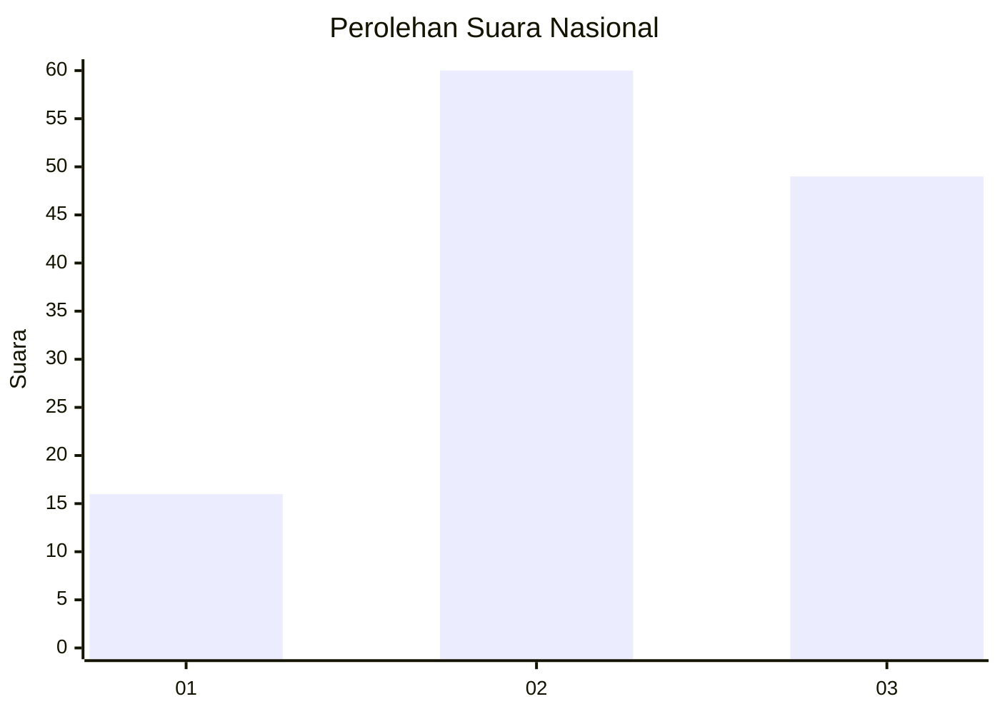
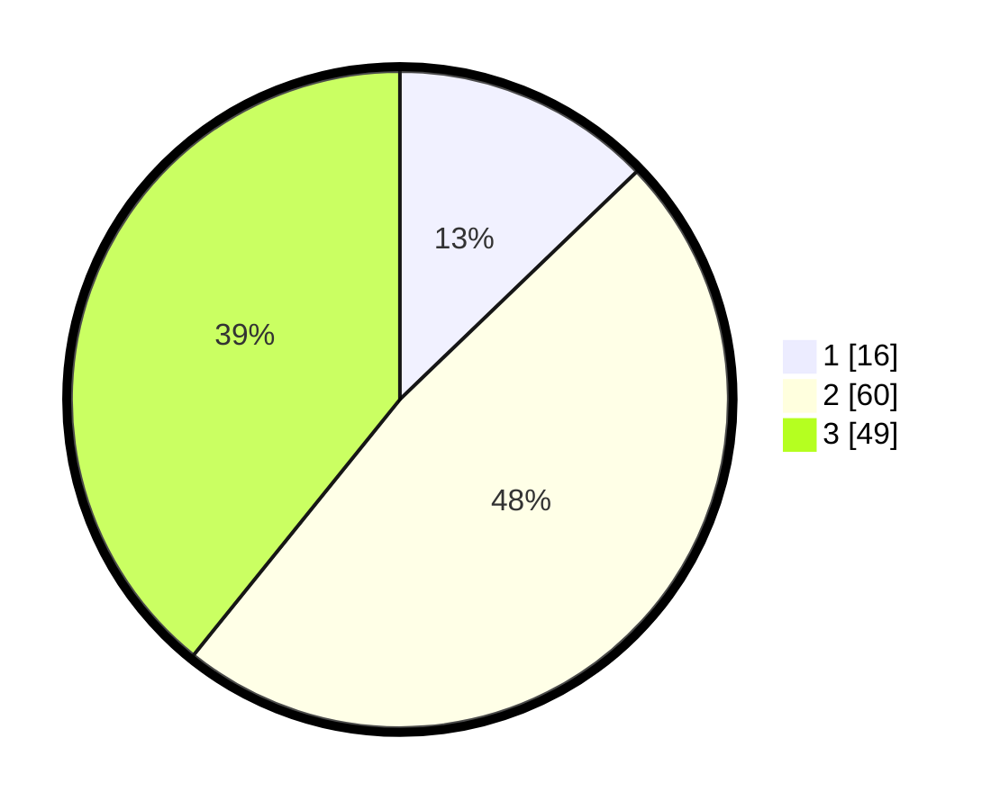

# Hasil

## Grafik

## Tabel

| No. | Nama Paslon    | Suara | Suara (raw) | Persentase |
|:--- |:-------------- | -----:| -----------:| ----------:|
| 1   | ANIES MUHAIMIN | 16    | [16][p-1]   | 12,80      |
| 2   | PRABOWO GIBRAN | 60    | [60][p-2]   | 48,00      |
| 3   | GANJAR MAHFUD  | 49    | [49][p-3]   | 39,20      |

[p-1]: https://github.com/gigit-pemilu/pemilu-2024/blob/main/pilpres/hitung-suara/sub/91-papua/sub/06-biak-numfor/sub/01-biak-kota/sub/2015-manswam/sub/003-tps/sub/paslon-1.txt
[p-2]: https://github.com/gigit-pemilu/pemilu-2024/blob/main/pilpres/hitung-suara/sub/91-papua/sub/06-biak-numfor/sub/01-biak-kota/sub/2015-manswam/sub/003-tps/sub/paslon-2.txt
[p-3]: https://github.com/gigit-pemilu/pemilu-2024/blob/main/pilpres/hitung-suara/sub/91-papua/sub/06-biak-numfor/sub/01-biak-kota/sub/2015-manswam/sub/003-tps/sub/paslon-3.txt

## Foto C Plano

https://sirekap-obj-formc.kpu.go.id/5c5d/pemilu/ppwp/91/06/01/20/15/9106012015003-20240215-082143--93fbeab4-e9fa-40a0-bd0c-d2580dc1dc5e.jpg

https://sirekap-obj-formc.kpu.go.id/5c5d/pemilu/ppwp/91/06/01/20/15/9106012015003-20240215-082245--e826996d-a7ff-4e48-8c7d-2391189c2fe2.jpg

## Metadata

| Key        | Value               |
| ---------- | ------------------- |
| Time Stamp | 2024-02-24 22:31:28 |

