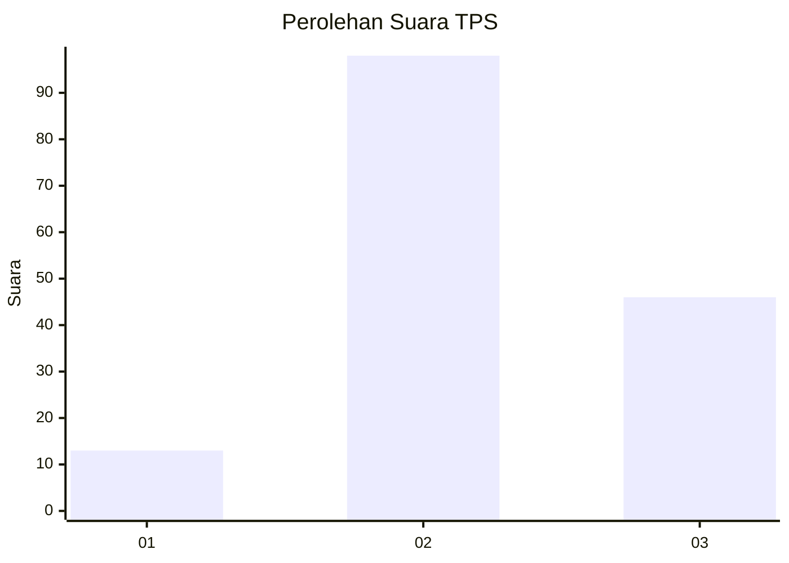
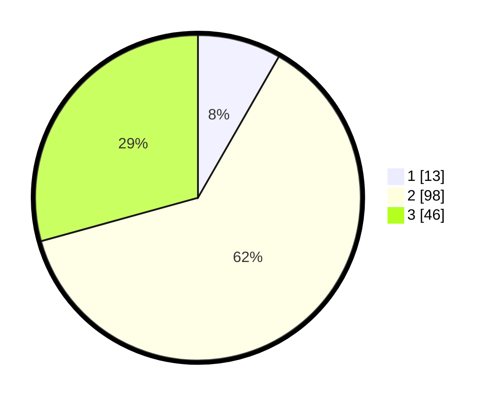

# Hasil

## Grafik

## Tabel

| No. | Nama Paslon    | Suara | Suara (raw) | Persentase |
|:--- |:-------------- | -----:| -----------:| ----------:|
| 1   | ANIES MUHAIMIN | 13    | [13][p-1]   | 8,28       |
| 2   | PRABOWO GIBRAN | 98    | [98][p-2]   | 62,42      |
| 3   | GANJAR MAHFUD  | 46    | [46][p-3]   | 29,30      |

[p-1]: https://github.com/gigit-pemilu/pemilu-2024-91-papua/blob/main/pilpres/hitung-suara/sub/91-papua/sub/06-biak-numfor/sub/01-biak-kota/sub/2018-manggandisapi/sub/001-tps/sub/paslon-1.txt
[p-2]: https://github.com/gigit-pemilu/pemilu-2024-91-papua/blob/main/pilpres/hitung-suara/sub/91-papua/sub/06-biak-numfor/sub/01-biak-kota/sub/2018-manggandisapi/sub/001-tps/sub/paslon-2.txt
[p-3]: https://github.com/gigit-pemilu/pemilu-2024-91-papua/blob/main/pilpres/hitung-suara/sub/91-papua/sub/06-biak-numfor/sub/01-biak-kota/sub/2018-manggandisapi/sub/001-tps/sub/paslon-3.txt

## Foto C Plano

https://sirekap-obj-formc.kpu.go.id/a396/pemilu/ppwp/91/06/01/20/18/9106012018001-20240215-105155--9d58aac4-d1a3-4c7b-bafb-575d1038cc3d.jpg

https://sirekap-obj-formc.kpu.go.id/a396/pemilu/ppwp/91/06/01/20/18/9106012018001-20240215-105319--87b766b1-444f-4830-bb41-6854367e5408.jpg

https://sirekap-obj-formc.kpu.go.id/a396/pemilu/ppwp/91/06/01/20/18/9106012018001-20240215-181305--5bdfc91d-bf26-4625-83a7-99b4d2a333d0.jpg

## Metadata

| Key        | Value               |
| ---------- | ------------------- |
| Time Stamp | 2024-02-24 22:31:28 |

