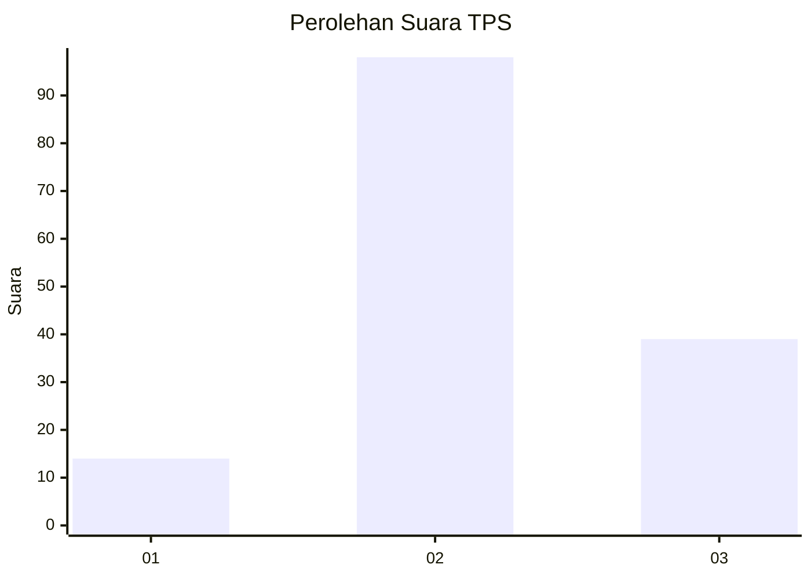
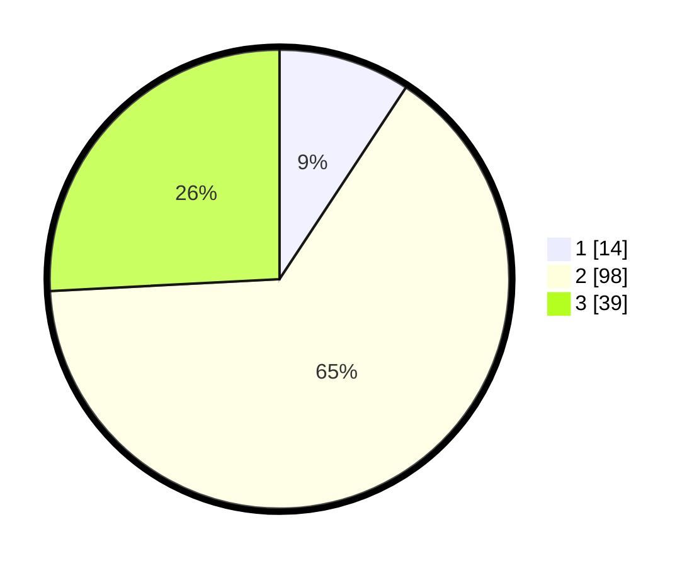

# Hasil

## Grafik

## Tabel

| No. | Nama Paslon    | Suara | Suara (raw) | Persentase |
|:--- |:-------------- | -----:| -----------:| ----------:|
| 1   | ANIES MUHAIMIN | 14    | [14][p-1]   | 9,27       |
| 2   | PRABOWO GIBRAN | 98    | [98][p-2]   | 64,90      |
| 3   | GANJAR MAHFUD  | 39    | [39][p-3]   | 25,83      |

[p-1]: https://github.com/gigit-pemilu/pemilu-2024-91-papua/blob/main/pilpres/hitung-suara/sub/91-papua/sub/06-biak-numfor/sub/01-biak-kota/sub/2022-inggupi/sub/001-tps/sub/paslon-1.txt
[p-2]: https://github.com/gigit-pemilu/pemilu-2024-91-papua/blob/main/pilpres/hitung-suara/sub/91-papua/sub/06-biak-numfor/sub/01-biak-kota/sub/2022-inggupi/sub/001-tps/sub/paslon-2.txt
[p-3]: https://github.com/gigit-pemilu/pemilu-2024-91-papua/blob/main/pilpres/hitung-suara/sub/91-papua/sub/06-biak-numfor/sub/01-biak-kota/sub/2022-inggupi/sub/001-tps/sub/paslon-3.txt

## Foto C Plano

https://sirekap-obj-formc.kpu.go.id/f1ec/pemilu/ppwp/91/06/01/20/22/9106012022001-20240215-084143--9942cb9c-d5f9-43da-a341-ba423ede1ecf.jpg

https://sirekap-obj-formc.kpu.go.id/f1ec/pemilu/ppwp/91/06/01/20/22/9106012022001-20240215-084408--c49a20d6-96e0-4232-aa94-ed442b6c6079.jpg

https://sirekap-obj-formc.kpu.go.id/f1ec/pemilu/ppwp/91/06/01/20/22/9106012022001-20240215-164345--da71bdd6-a772-4350-8f46-8d9f2d9ea763.jpg

## Metadata

| Key        | Value               |
| ---------- | ------------------- |
| Time Stamp | 2024-02-25 12:00:00 |

