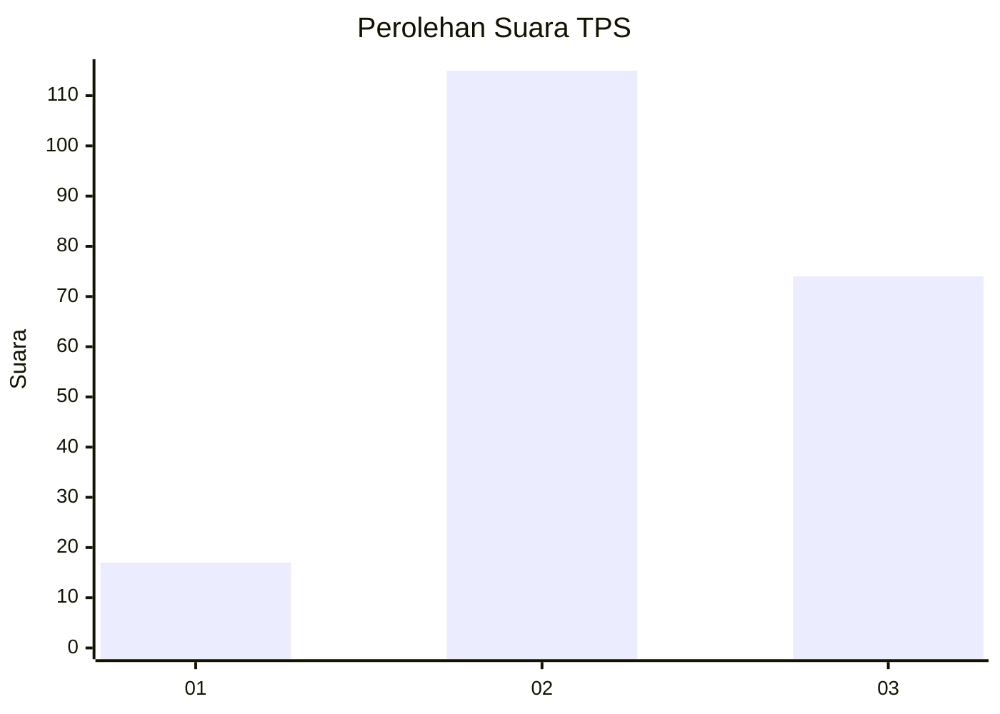
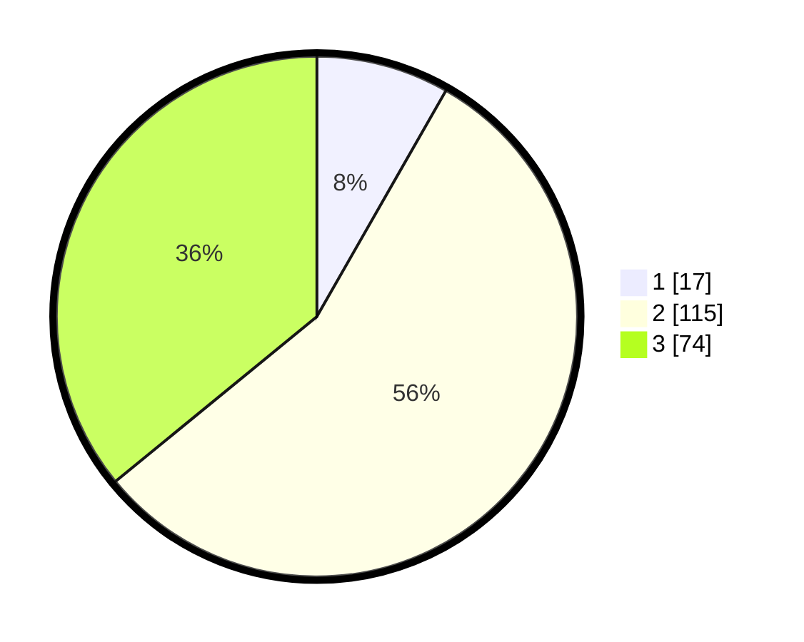

# Hasil

## Grafik

## Tabel

| No. | Nama Paslon    | Suara | Suara (raw) | Persentase |
|:--- |:-------------- | -----:| -----------:| ----------:|
| 1   | ANIES MUHAIMIN | 17    | [17][p-1]   | 8,25       |
| 2   | PRABOWO GIBRAN | 115   | [115][p-2]  | 55,83      |
| 3   | GANJAR MAHFUD  | 74    | [74][p-3]   | 35,92      |

[p-1]: https://github.com/gigit-pemilu/pemilu-2024-91-papua/blob/main/pilpres/hitung-suara/sub/91-papua/sub/06-biak-numfor/sub/02-biak-utara/sub/2001-sarwom/sub/002-tps/sub/paslon-1.txt
[p-2]: https://github.com/gigit-pemilu/pemilu-2024-91-papua/blob/main/pilpres/hitung-suara/sub/91-papua/sub/06-biak-numfor/sub/02-biak-utara/sub/2001-sarwom/sub/002-tps/sub/paslon-2.txt
[p-3]: https://github.com/gigit-pemilu/pemilu-2024-91-papua/blob/main/pilpres/hitung-suara/sub/91-papua/sub/06-biak-numfor/sub/02-biak-utara/sub/2001-sarwom/sub/002-tps/sub/paslon-3.txt

## Foto C Plano

https://sirekap-obj-formc.kpu.go.id/0fc1/pemilu/ppwp/91/06/02/20/01/9106022001002-20240215-180219--d4c2f86f-64be-4cf8-bf5f-85bbe2e68e60.jpg

https://sirekap-obj-formc.kpu.go.id/0fc1/pemilu/ppwp/91/06/02/20/01/9106022001002-20240215-180726--1e3cd55a-91ec-417a-bb61-70ba27b83132.jpg

https://sirekap-obj-formc.kpu.go.id/0fc1/pemilu/ppwp/91/06/02/20/01/9106022001002-20240215-181150--88307b2f-eec1-41c3-9e9b-cec698c6685a.jpg

## Metadata

| Key        | Value               |
| ---------- | ------------------- |
| Time Stamp | 2024-02-24 22:31:28 |

