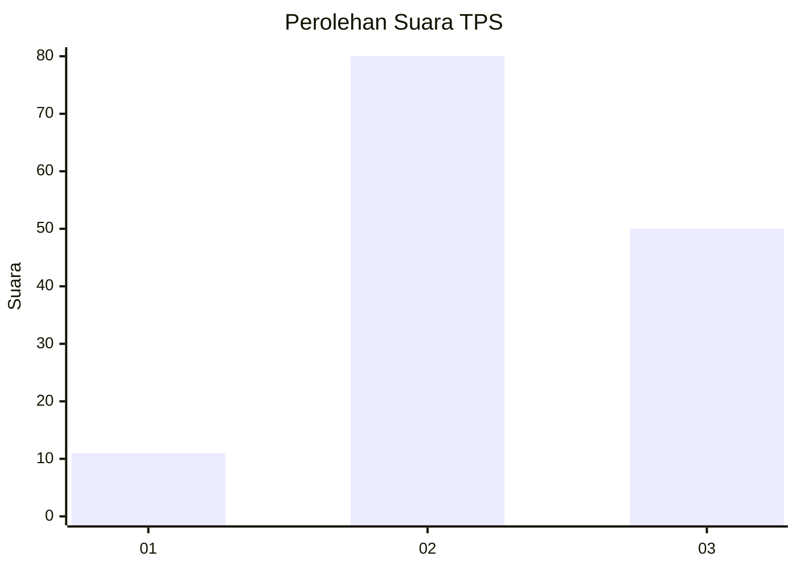
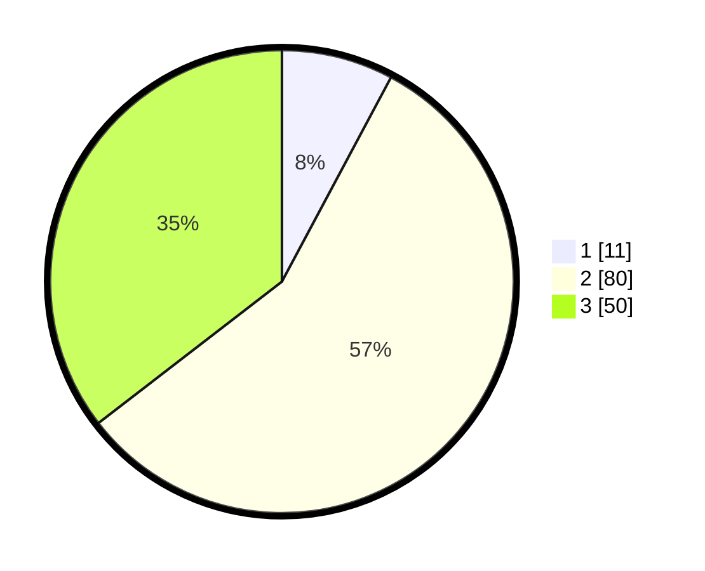

# Hasil

## Grafik

## Tabel

| No. | Nama Paslon    | Suara | Suara (raw) | Persentase |
|:--- |:-------------- | -----:| -----------:| ----------:|
| 1   | ANIES MUHAIMIN | 11    | [11][p-1]   | 7,80       |
| 2   | PRABOWO GIBRAN | 80    | [80][p-2]   | 56,74      |
| 3   | GANJAR MAHFUD  | 50    | [50][p-3]   | 35,46      |

[p-1]: https://github.com/gigit-pemilu/pemilu-2024-91-papua/blob/main/pilpres/hitung-suara/sub/91-papua/sub/06-biak-numfor/sub/02-biak-utara/sub/2002-andei/sub/001-tps/sub/paslon-1.txt
[p-2]: https://github.com/gigit-pemilu/pemilu-2024-91-papua/blob/main/pilpres/hitung-suara/sub/91-papua/sub/06-biak-numfor/sub/02-biak-utara/sub/2002-andei/sub/001-tps/sub/paslon-2.txt
[p-3]: https://github.com/gigit-pemilu/pemilu-2024-91-papua/blob/main/pilpres/hitung-suara/sub/91-papua/sub/06-biak-numfor/sub/02-biak-utara/sub/2002-andei/sub/001-tps/sub/paslon-3.txt

## Foto C Plano

https://sirekap-obj-formc.kpu.go.id/2ae2/pemilu/ppwp/91/06/02/20/02/9106022002001-20240215-172331--c1b2da78-6696-4420-8184-851cd546accc.jpg

https://sirekap-obj-formc.kpu.go.id/2ae2/pemilu/ppwp/91/06/02/20/02/9106022002001-20240215-183901--ebb4a70e-ae24-40ee-9927-79c08572ee78.jpg

https://sirekap-obj-formc.kpu.go.id/2ae2/pemilu/ppwp/91/06/02/20/02/9106022002001-20240215-140243--cc0dcade-b00e-4f10-9697-2c34fcbe5ea8.jpg

## Metadata

| Key        | Value               |
| ---------- | ------------------- |
| Time Stamp | 2024-02-24 22:31:28 |

