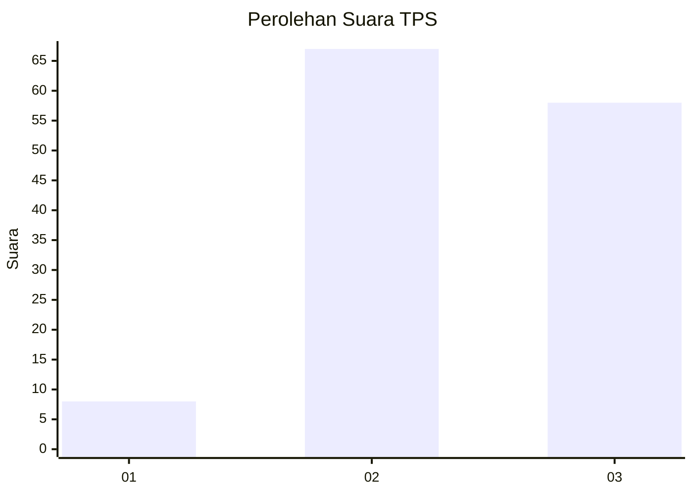
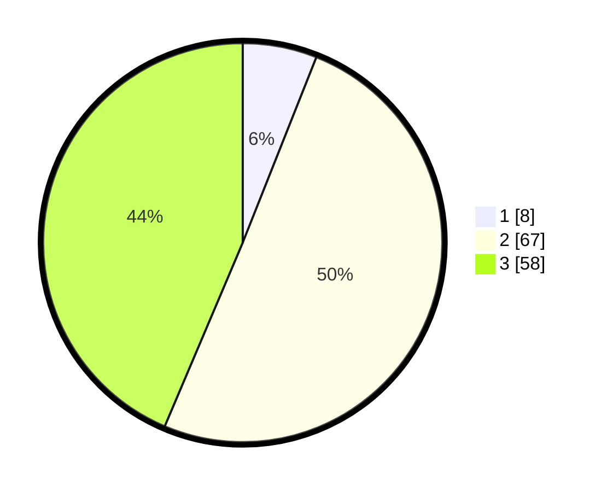

# Hasil

## Grafik

## Tabel

| No. | Nama Paslon    | Suara | Suara (raw) | Persentase |
|:--- |:-------------- | -----:| -----------:| ----------:|
| 1   | ANIES MUHAIMIN | 8     | [8][p-1]    | 6,02       |
| 2   | PRABOWO GIBRAN | 67    | [67][p-2]   | 50,38      |
| 3   | GANJAR MAHFUD  | 58    | [58][p-3]   | 43,61      |

[p-1]: https://github.com/gigit-pemilu/pemilu-2024-91-papua/blob/main/pilpres/hitung-suara/sub/91-papua/sub/06-biak-numfor/sub/02-biak-utara/sub/2002-andei/sub/002-tps/sub/paslon-1.txt
[p-2]: https://github.com/gigit-pemilu/pemilu-2024-91-papua/blob/main/pilpres/hitung-suara/sub/91-papua/sub/06-biak-numfor/sub/02-biak-utara/sub/2002-andei/sub/002-tps/sub/paslon-2.txt
[p-3]: https://github.com/gigit-pemilu/pemilu-2024-91-papua/blob/main/pilpres/hitung-suara/sub/91-papua/sub/06-biak-numfor/sub/02-biak-utara/sub/2002-andei/sub/002-tps/sub/paslon-3.txt

## Foto C Plano

https://sirekap-obj-formc.kpu.go.id/1fc7/pemilu/ppwp/91/06/02/20/02/9106022002002-20240215-175537--a93ee1c3-ce7e-4f78-b552-bea5455901a6.jpg

https://sirekap-obj-formc.kpu.go.id/1fc7/pemilu/ppwp/91/06/02/20/02/9106022002002-20240215-180044--ca17515f-2cfd-4d90-a866-0f2cb0190deb.jpg

https://sirekap-obj-formc.kpu.go.id/1fc7/pemilu/ppwp/91/06/02/20/02/9106022002002-20240215-180205--46f82494-7d44-4fd2-9ac1-6dbb4b3c2d98.jpg

## Metadata

| Key        | Value               |
| ---------- | ------------------- |
| Time Stamp | 2024-02-24 22:31:28 |

