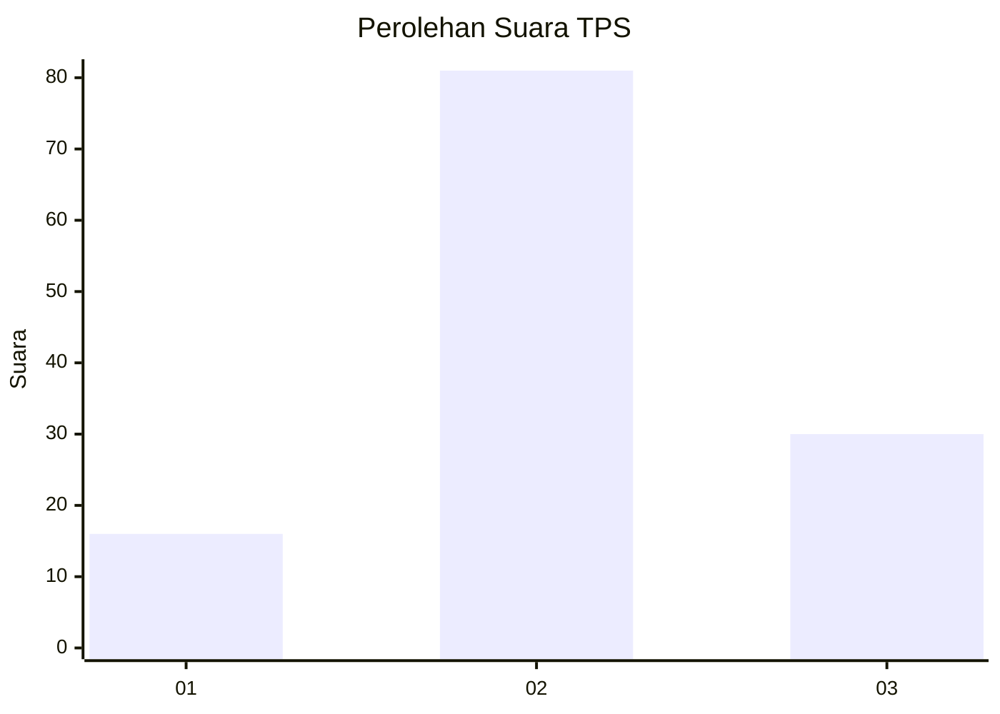
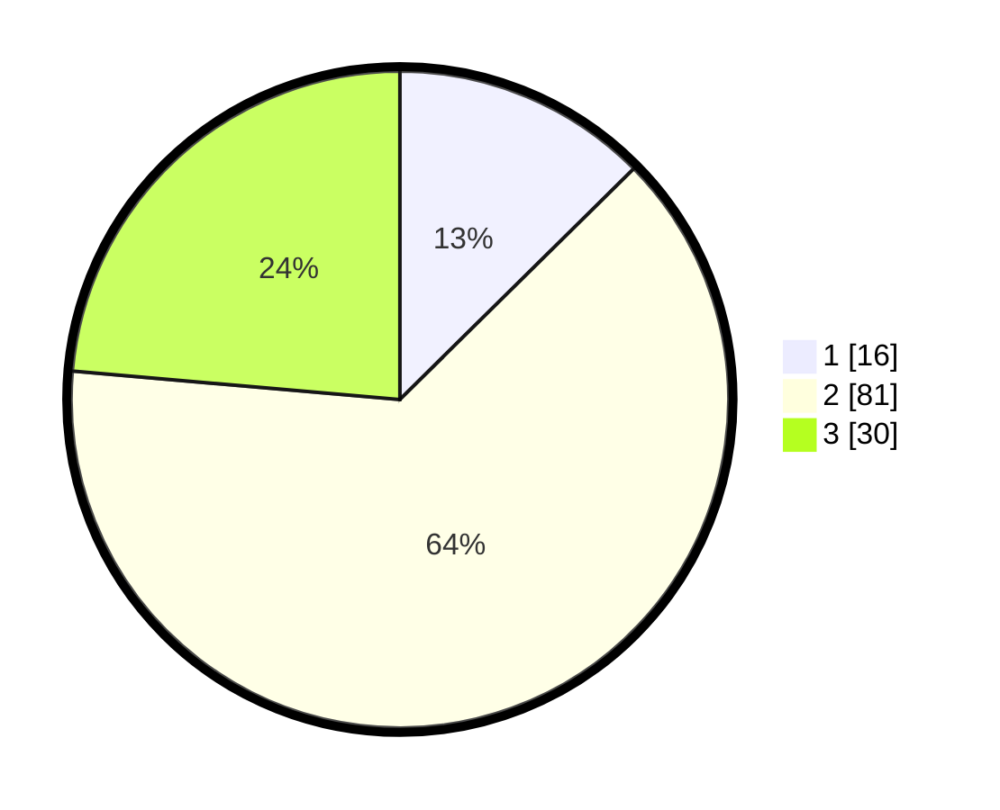

# Hasil

## Grafik

## Tabel

| No. | Nama Paslon    | Suara | Suara (raw) | Persentase |
|:--- |:-------------- | -----:| -----------:| ----------:|
| 1   | ANIES MUHAIMIN | 16    | [16][p-1]   | 12,60      |
| 2   | PRABOWO GIBRAN | 81    | [81][p-2]   | 63,78      |
| 3   | GANJAR MAHFUD  | 30    | [30][p-3]   | 23,62      |

[p-1]: https://github.com/gigit-pemilu/pemilu-2024-91-papua/blob/main/pilpres/hitung-suara/sub/91-papua/sub/06-biak-numfor/sub/02-biak-utara/sub/2008-saukobye/sub/001-tps/sub/paslon-1.txt
[p-2]: https://github.com/gigit-pemilu/pemilu-2024-91-papua/blob/main/pilpres/hitung-suara/sub/91-papua/sub/06-biak-numfor/sub/02-biak-utara/sub/2008-saukobye/sub/001-tps/sub/paslon-2.txt
[p-3]: https://github.com/gigit-pemilu/pemilu-2024-91-papua/blob/main/pilpres/hitung-suara/sub/91-papua/sub/06-biak-numfor/sub/02-biak-utara/sub/2008-saukobye/sub/001-tps/sub/paslon-3.txt

## Foto C Plano

https://sirekap-obj-formc.kpu.go.id/ff07/pemilu/ppwp/91/06/02/20/08/9106022008001-20240214-225558--39b3843a-ebf0-4703-b7bb-b632f1be6775.jpg

https://sirekap-obj-formc.kpu.go.id/ff07/pemilu/ppwp/91/06/02/20/08/9106022008001-20240214-225721--0ebf9c3e-bd89-4531-a345-6f5a6ede3d92.jpg

https://sirekap-obj-formc.kpu.go.id/ff07/pemilu/ppwp/91/06/02/20/08/9106022008001-20240214-225840--65a7492e-4d34-4b98-a519-9b5ee051d733.jpg

## Metadata

| Key        | Value               |
| ---------- | ------------------- |
| Time Stamp | 2024-02-25 14:00:00 |

