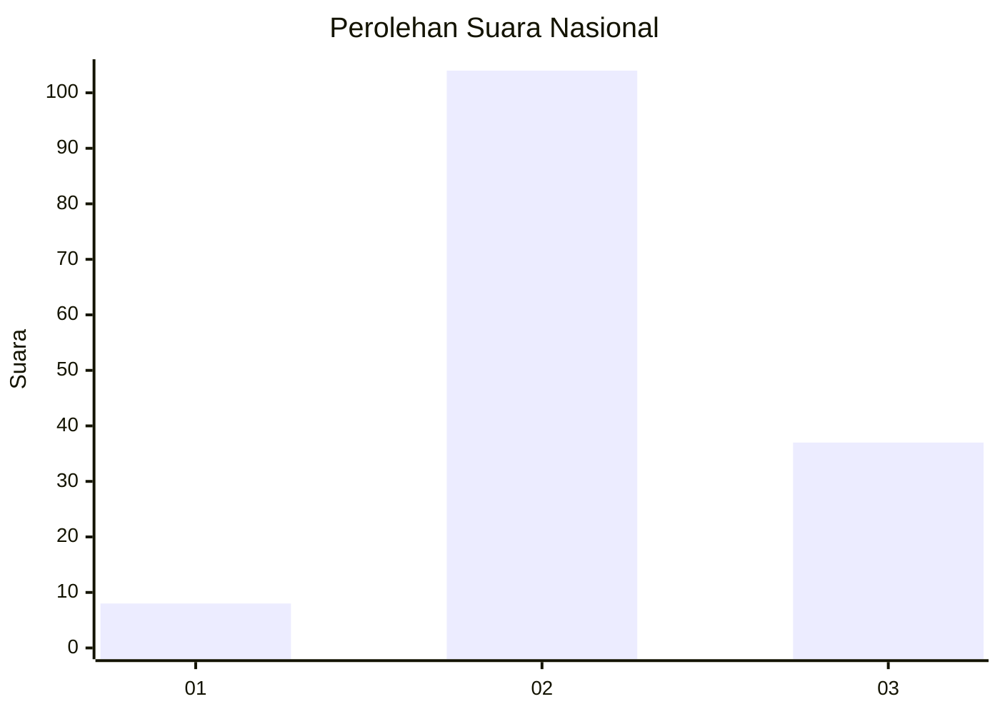
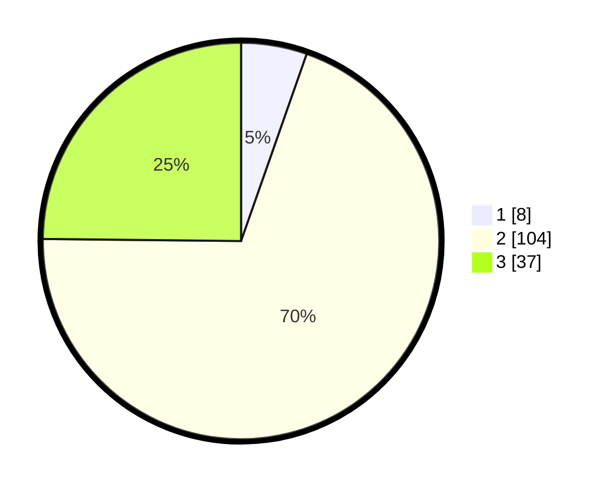

# Hasil

## Grafik

## Tabel

| No. | Nama Paslon    | Suara | Suara (raw) | Persentase |
|:--- |:-------------- | -----:| -----------:| ----------:|
| 1   | ANIES MUHAIMIN | 8     | [8][p-1]    | 5,37       |
| 2   | PRABOWO GIBRAN | 104   | [104][p-2]  | 69,80      |
| 3   | GANJAR MAHFUD  | 37    | [37][p-3]   | 24,83      |

[p-1]: https://github.com/gigit-pemilu/pemilu-2024/blob/main/pilpres/hitung-suara/sub/91-papua/sub/06-biak-numfor/sub/02-biak-utara/sub/2008-saukobye/sub/002-tps/sub/paslon-1.txt
[p-2]: https://github.com/gigit-pemilu/pemilu-2024/blob/main/pilpres/hitung-suara/sub/91-papua/sub/06-biak-numfor/sub/02-biak-utara/sub/2008-saukobye/sub/002-tps/sub/paslon-2.txt
[p-3]: https://github.com/gigit-pemilu/pemilu-2024/blob/main/pilpres/hitung-suara/sub/91-papua/sub/06-biak-numfor/sub/02-biak-utara/sub/2008-saukobye/sub/002-tps/sub/paslon-3.txt

## Foto C Plano

https://sirekap-obj-formc.kpu.go.id/ba76/pemilu/ppwp/91/06/02/20/08/9106022008002-20240215-094807--33640222-fbd4-40a7-a212-3c32d4dab236.jpg

https://sirekap-obj-formc.kpu.go.id/ba76/pemilu/ppwp/91/06/02/20/08/9106022008002-20240215-095142--601fe55e-505f-4431-b260-05fb2751afde.jpg

https://sirekap-obj-formc.kpu.go.id/ba76/pemilu/ppwp/91/06/02/20/08/9106022008002-20240215-105042--5e677401-5456-4fb0-aa31-101fac848256.jpg

## Metadata

| Key        | Value               |
| ---------- | ------------------- |
| Time Stamp | 2024-02-16 12:51:22 |

## DATA PEMILIH TETAP

Jumlah pemilih dalam DPT: **794**.
 * L: **92**.
 * P: **702**.

## DATA PENGGUNA HAK PILIH

Jumlah pengguna hak pilih dalam DPT: **447**.
 * L: **72**.
 * P: **75**.

Jumlah pengguna hak pilih dalam DPTb: **7**.
 * L: **7**.
 * P: **0**.

Jumlah pengguna hak pilih dalam DPK: **3**.
 * L: **3**.
 * P: **0**.

Jumlah pengguna hak pilih: **757**.
 * L: **76**.
 * P: **75**.

## JUMLAH SUARA SAH DAN TIDAK SAH

JUMLAH SELURUH SUARA SAH: **949**.

JUMLAH SUARA TIDAK SAH: **2**.

JUMLAH SELURUH SUARA SAH DAN SUARA TIDAK SAH: **157**.

