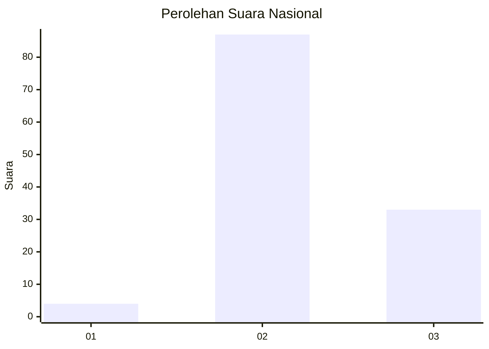
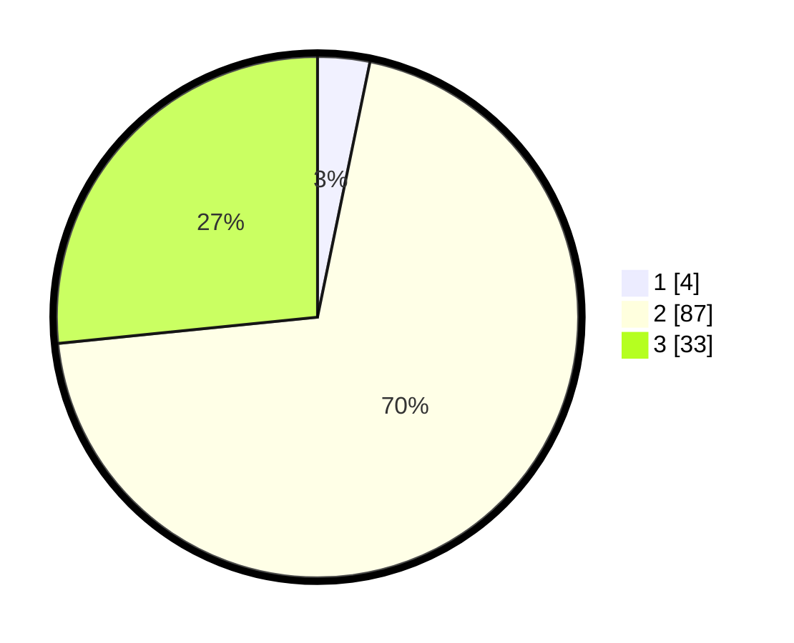

# Hasil

## Grafik

## Tabel

| No. | Nama Paslon    | Suara | Suara (raw) | Persentase |
|:--- |:-------------- | -----:| -----------:| ----------:|
| 1   | ANIES MUHAIMIN | 4     | [4][p-1]    | 3,23       |
| 2   | PRABOWO GIBRAN | 87    | [87][p-2]   | 70,16      |
| 3   | GANJAR MAHFUD  | 33    | [33][p-3]   | 26,61      |

[p-1]: https://github.com/gigit-pemilu/pemilu-2024/blob/main/pilpres/hitung-suara/sub/91-papua/sub/06-biak-numfor/sub/02-biak-utara/sub/2018-korem/sub/002-tps/sub/paslon-1.txt
[p-2]: https://github.com/gigit-pemilu/pemilu-2024/blob/main/pilpres/hitung-suara/sub/91-papua/sub/06-biak-numfor/sub/02-biak-utara/sub/2018-korem/sub/002-tps/sub/paslon-2.txt
[p-3]: https://github.com/gigit-pemilu/pemilu-2024/blob/main/pilpres/hitung-suara/sub/91-papua/sub/06-biak-numfor/sub/02-biak-utara/sub/2018-korem/sub/002-tps/sub/paslon-3.txt

## Foto C Plano

https://sirekap-obj-formc.kpu.go.id/55d9/pemilu/ppwp/91/06/02/20/18/9106022018002-20240214-204318--b6ea648f-cc72-46dc-9e79-ce0c7f5118b8.jpg

https://sirekap-obj-formc.kpu.go.id/55d9/pemilu/ppwp/91/06/02/20/18/9106022018002-20240214-204508--39cd2201-b0a8-443f-a0cf-1d0c7a511647.jpg

https://sirekap-obj-formc.kpu.go.id/55d9/pemilu/ppwp/91/06/02/20/18/9106022018002-20240214-204024--368c277a-634b-4941-b743-0db584e56b06.jpg

## Metadata

| Key        | Value               |
| ---------- | ------------------- |
| Time Stamp | 2024-02-25 15:00:00 |

