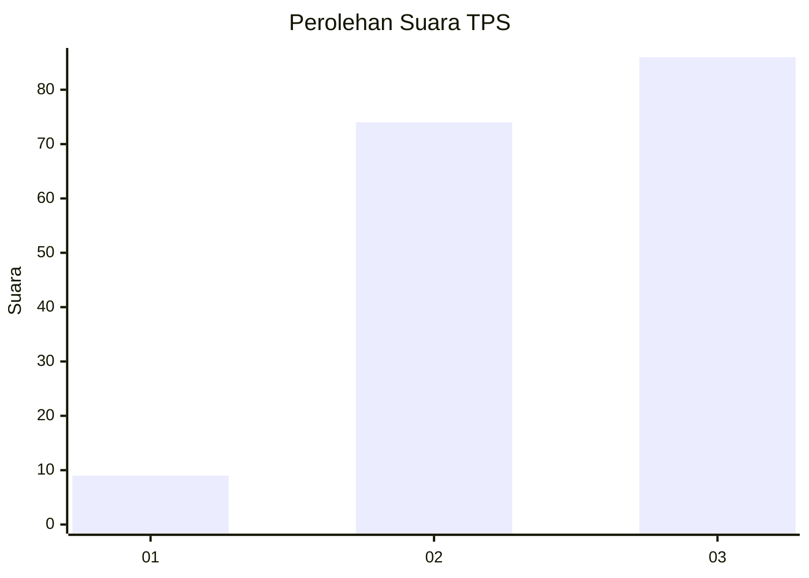
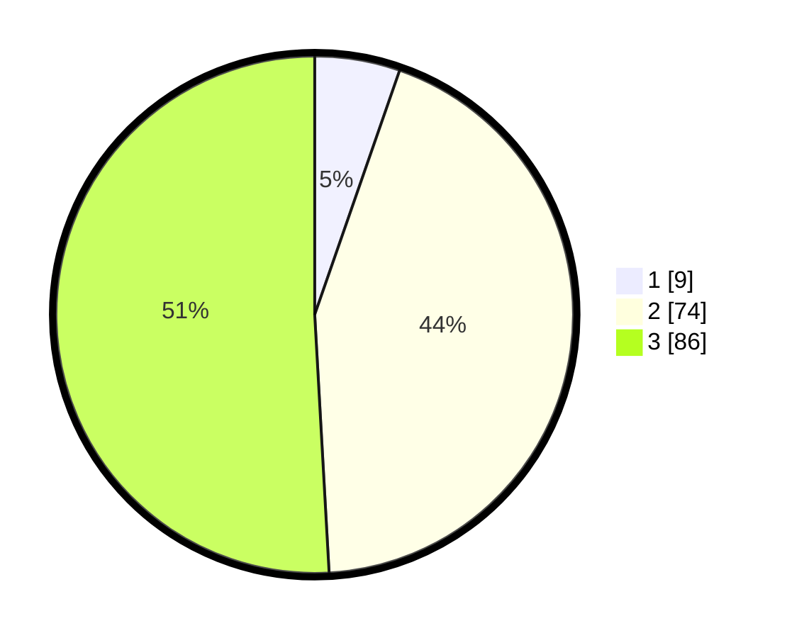

# Hasil

## Grafik

## Tabel

| No. | Nama Paslon    | Suara | Suara (raw) | Persentase |
|:--- |:-------------- | -----:| -----------:| ----------:|
| 1   | ANIES MUHAIMIN | 9     | [9][p-1]    | 5,33       |
| 2   | PRABOWO GIBRAN | 74    | [74][p-2]   | 43,79      |
| 3   | GANJAR MAHFUD  | 86    | [86][p-3]   | 50,89      |

[p-1]: https://github.com/gigit-pemilu/pemilu-2024-91-papua/blob/main/pilpres/hitung-suara/sub/91-papua/sub/06-biak-numfor/sub/02-biak-utara/sub/2019-mnuswor/sub/001-tps/sub/paslon-1.txt
[p-2]: https://github.com/gigit-pemilu/pemilu-2024-91-papua/blob/main/pilpres/hitung-suara/sub/91-papua/sub/06-biak-numfor/sub/02-biak-utara/sub/2019-mnuswor/sub/001-tps/sub/paslon-2.txt
[p-3]: https://github.com/gigit-pemilu/pemilu-2024-91-papua/blob/main/pilpres/hitung-suara/sub/91-papua/sub/06-biak-numfor/sub/02-biak-utara/sub/2019-mnuswor/sub/001-tps/sub/paslon-3.txt

## Foto C Plano

https://sirekap-obj-formc.kpu.go.id/f845/pemilu/ppwp/91/06/02/20/19/9106022019001-20240215-160503--64b548ff-a4f4-4648-8991-a149f79a1bf5.jpg

https://sirekap-obj-formc.kpu.go.id/f845/pemilu/ppwp/91/06/02/20/19/9106022019001-20240215-160549--6fd0c35a-f4b8-4248-acb9-94feaa3e6867.jpg

https://sirekap-obj-formc.kpu.go.id/f845/pemilu/ppwp/91/06/02/20/19/9106022019001-20240215-160706--31c21819-fea6-493a-a2f2-45a77476aeeb.jpg

## Metadata

| Key        | Value               |
| ---------- | ------------------- |
| Time Stamp | 2024-02-25 12:00:00 |

