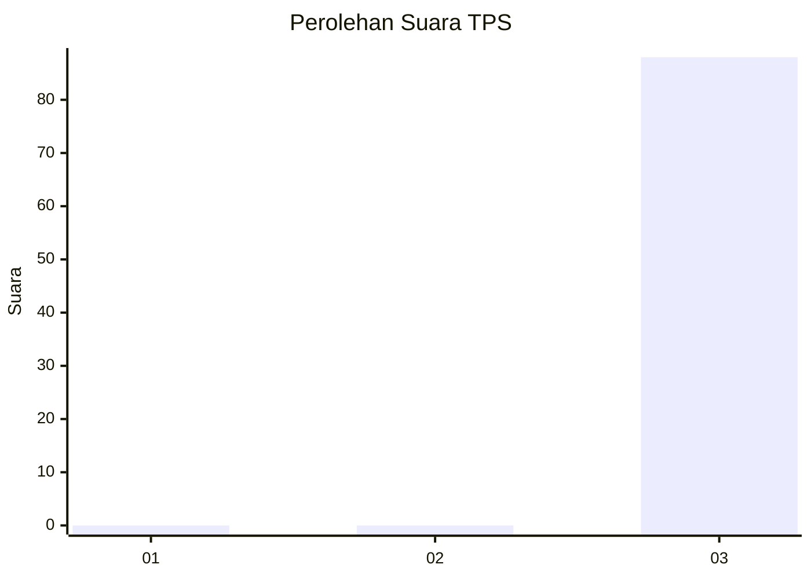
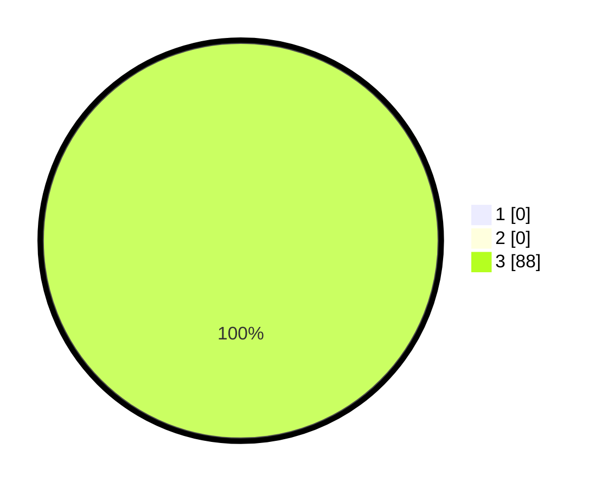

# Hasil

## Grafik

## Tabel

| No. | Nama Paslon    | Suara | Suara (raw) | Persentase |
|:--- |:-------------- | -----:| -----------:| ----------:|
| 1   | ANIES MUHAIMIN | 0     | [0][p-1]    | 0,00       |
| 2   | PRABOWO GIBRAN | 0     | [0][p-2]    | 0,00       |
| 3   | GANJAR MAHFUD  | 88    | [88][p-3]   | 100,00     |

[p-1]: https://github.com/gigit-pemilu/pemilu-2024-91-papua/blob/main/pilpres/hitung-suara/sub/91-papua/sub/06-biak-numfor/sub/03-biak-timur/sub/2003-owi/sub/001-tps/sub/paslon-1.txt
[p-2]: https://github.com/gigit-pemilu/pemilu-2024-91-papua/blob/main/pilpres/hitung-suara/sub/91-papua/sub/06-biak-numfor/sub/03-biak-timur/sub/2003-owi/sub/001-tps/sub/paslon-2.txt
[p-3]: https://github.com/gigit-pemilu/pemilu-2024-91-papua/blob/main/pilpres/hitung-suara/sub/91-papua/sub/06-biak-numfor/sub/03-biak-timur/sub/2003-owi/sub/001-tps/sub/paslon-3.txt

## Foto C Plano

https://sirekap-obj-formc.kpu.go.id/6605/pemilu/ppwp/91/06/03/20/03/9106032003001-20240215-141845--44f37013-b6e8-4b5d-bd46-03ed370bb2d5.jpg

https://sirekap-obj-formc.kpu.go.id/6605/pemilu/ppwp/91/06/03/20/03/9106032003001-20240215-203655--bf1dd0ae-5d3d-485b-8d71-6293c9aa87ec.jpg

https://sirekap-obj-formc.kpu.go.id/6605/pemilu/ppwp/91/06/03/20/03/9106032003001-20240216-022913--b95e42f1-bc98-47ba-b183-1788d199375b.jpg

## Metadata

| Key        | Value               |
| ---------- | ------------------- |
| Time Stamp | 2024-02-16 02:30:27 |

