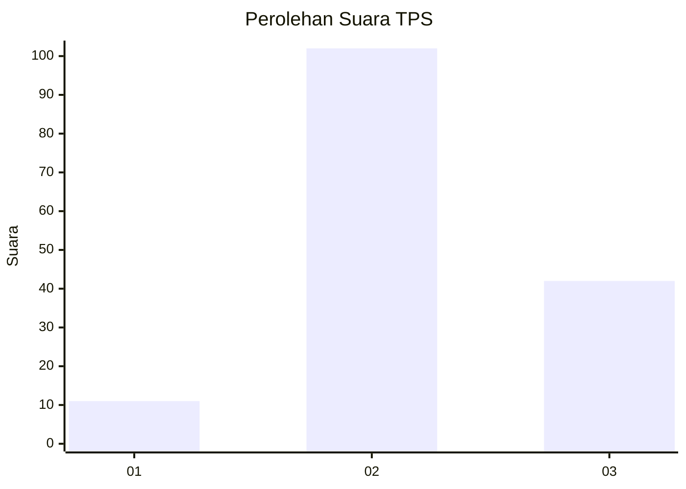

# Hasil

## Grafik

## Tabel

| No. | Nama Paslon    | Suara | Suara (raw) | Persentase |
|:--- |:-------------- | -----:| -----------:| ----------:|
| 1   | ANIES MUHAIMIN | 11    | [11][p-1]   | 7,10       |
| 2   | PRABOWO GIBRAN | 102   | [102][p-2]  | 65,81      |
| 3   | GANJAR MAHFUD  | 42    | [42][p-3]   | 27,10      |

[p-1]: https://github.com/gigit-pemilu/pemilu-2024-91-papua/blob/main/pilpres/hitung-suara/sub/91-papua/sub/06-biak-numfor/sub/03-biak-timur/sub/2004-woniki/sub/001-tps/sub/paslon-1.txt
[p-2]: https://github.com/gigit-pemilu/pemilu-2024-91-papua/blob/main/pilpres/hitung-suara/sub/91-papua/sub/06-biak-numfor/sub/03-biak-timur/sub/2004-woniki/sub/001-tps/sub/paslon-2.txt
[p-3]: https://github.com/gigit-pemilu/pemilu-2024-91-papua/blob/main/pilpres/hitung-suara/sub/91-papua/sub/06-biak-numfor/sub/03-biak-timur/sub/2004-woniki/sub/001-tps/sub/paslon-3.txt

## Foto C Plano

https://sirekap-obj-formc.kpu.go.id/5270/pemilu/ppwp/91/06/03/20/04/9106032004001-20240214-214351--cc284e7f-8cbb-4d32-b3f4-2eb7738c8dab.jpg

https://sirekap-obj-formc.kpu.go.id/5270/pemilu/ppwp/91/06/03/20/04/9106032004001-20240214-214406--e6d07d9d-1d1d-489e-83a1-b5416392a391.jpg

https://sirekap-obj-formc.kpu.go.id/5270/pemilu/ppwp/91/06/03/20/04/9106032004001-20240214-214422--bfa27e8b-c694-4d86-9531-e283953f2182.jpg

## Metadata

| Key        | Value               |
| ---------- | ------------------- |
| Time Stamp | 2024-02-25 12:00:00 |

