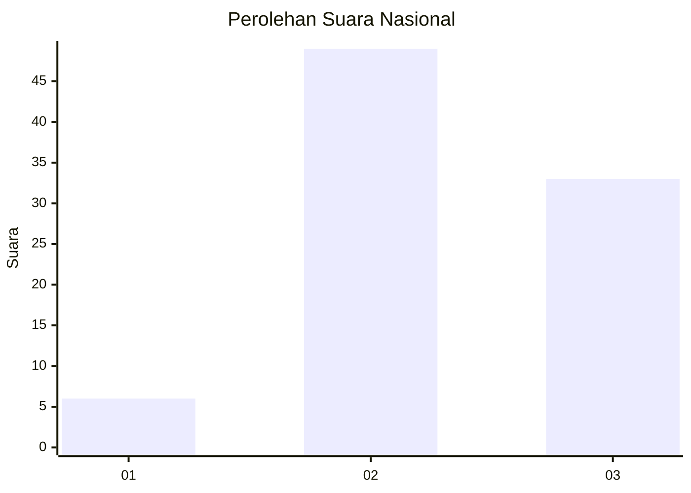
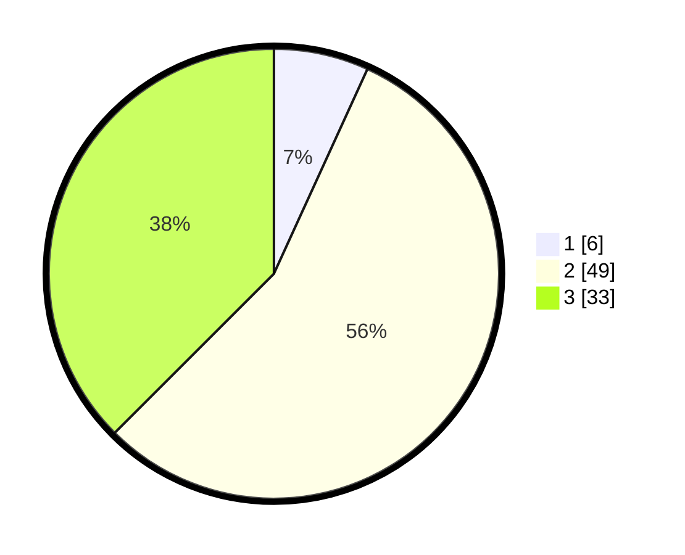

# Hasil

## Grafik

## Tabel

| No. | Nama Paslon    | Suara | Suara (raw) | Persentase |
|:--- |:-------------- | -----:| -----------:| ----------:|
| 1   | ANIES MUHAIMIN | 6     | [6][p-1]    | 6,82       |
| 2   | PRABOWO GIBRAN | 49    | [49][p-2]   | 55,68      |
| 3   | GANJAR MAHFUD  | 33    | [33][p-3]   | 37,50      |

[p-1]: https://github.com/gigit-pemilu/pemilu-2024/blob/main/pilpres/hitung-suara/sub/91-papua/sub/06-biak-numfor/sub/03-biak-timur/sub/2004-woniki/sub/002-tps/sub/paslon-1.txt
[p-2]: https://github.com/gigit-pemilu/pemilu-2024/blob/main/pilpres/hitung-suara/sub/91-papua/sub/06-biak-numfor/sub/03-biak-timur/sub/2004-woniki/sub/002-tps/sub/paslon-2.txt
[p-3]: https://github.com/gigit-pemilu/pemilu-2024/blob/main/pilpres/hitung-suara/sub/91-papua/sub/06-biak-numfor/sub/03-biak-timur/sub/2004-woniki/sub/002-tps/sub/paslon-3.txt

## Foto C Plano

https://sirekap-obj-formc.kpu.go.id/3f82/pemilu/ppwp/91/06/03/20/04/9106032004002-20240215-120725--9cd9d5b6-3fc4-4d07-9af2-1bcc9047c7d1.jpg

https://sirekap-obj-formc.kpu.go.id/3f82/pemilu/ppwp/91/06/03/20/04/9106032004002-20240215-120857--30c2ad0a-0f28-498f-85c5-fd198b7bbe22.jpg

https://sirekap-obj-formc.kpu.go.id/3f82/pemilu/ppwp/91/06/03/20/04/9106032004002-20240215-194419--300bd4f6-59ae-4ba3-a102-f8eacfd9eaf2.jpg

## Metadata

| Key        | Value               |
| ---------- | ------------------- |
| Time Stamp | 2024-02-24 22:31:28 |

