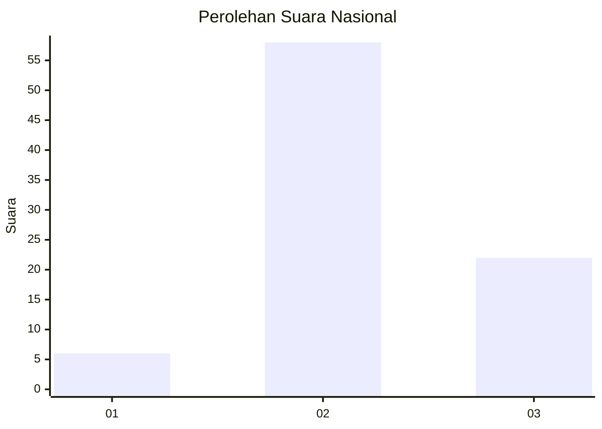
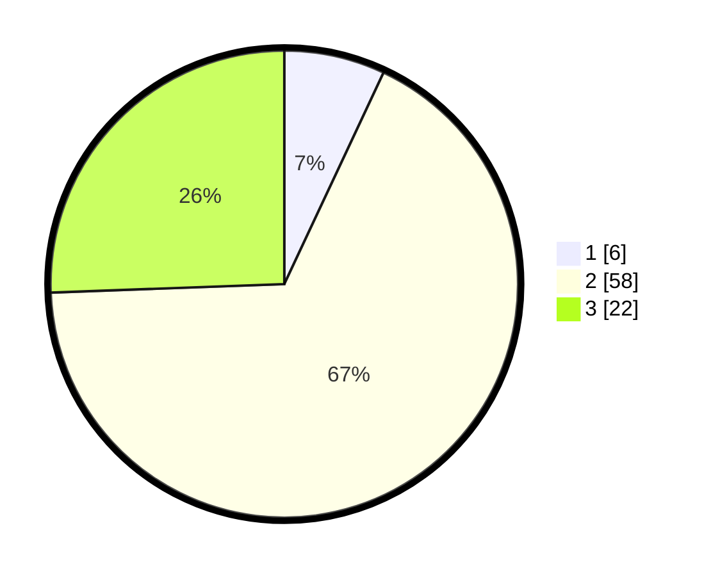

# Hasil

## Grafik

## Tabel

| No. | Nama Paslon    | Suara | Suara (raw) | Persentase |
|:--- |:-------------- | -----:| -----------:| ----------:|
| 1   | ANIES MUHAIMIN | 6     | [6][p-1]    | 6,98       |
| 2   | PRABOWO GIBRAN | 58    | [58][p-2]   | 67,44      |
| 3   | GANJAR MAHFUD  | 22    | [22][p-3]   | 25,58      |

[p-1]: https://github.com/gigit-pemilu/pemilu-2024/blob/main/pilpres/hitung-suara/sub/91-papua/sub/06-biak-numfor/sub/03-biak-timur/sub/2005-kajasi/sub/001-tps/sub/paslon-1.txt
[p-2]: https://github.com/gigit-pemilu/pemilu-2024/blob/main/pilpres/hitung-suara/sub/91-papua/sub/06-biak-numfor/sub/03-biak-timur/sub/2005-kajasi/sub/001-tps/sub/paslon-2.txt
[p-3]: https://github.com/gigit-pemilu/pemilu-2024/blob/main/pilpres/hitung-suara/sub/91-papua/sub/06-biak-numfor/sub/03-biak-timur/sub/2005-kajasi/sub/001-tps/sub/paslon-3.txt

## Foto C Plano

https://sirekap-obj-formc.kpu.go.id/2339/pemilu/ppwp/91/06/03/20/05/9106032005001-20240215-144238--e0ea41e2-06ec-4919-b525-98b44166c142.jpg

https://sirekap-obj-formc.kpu.go.id/2339/pemilu/ppwp/91/06/03/20/05/9106032005001-20240215-163320--0f0f0cc4-2928-4815-9493-8eb0d8e6632e.jpg

https://sirekap-obj-formc.kpu.go.id/2339/pemilu/ppwp/91/06/03/20/05/9106032005001-20240215-135729--6010104e-c90d-4177-9cef-567c1d3dfc06.jpg

## Metadata

| Key        | Value               |
| ---------- | ------------------- |
| Time Stamp | 2024-02-24 22:31:28 |

