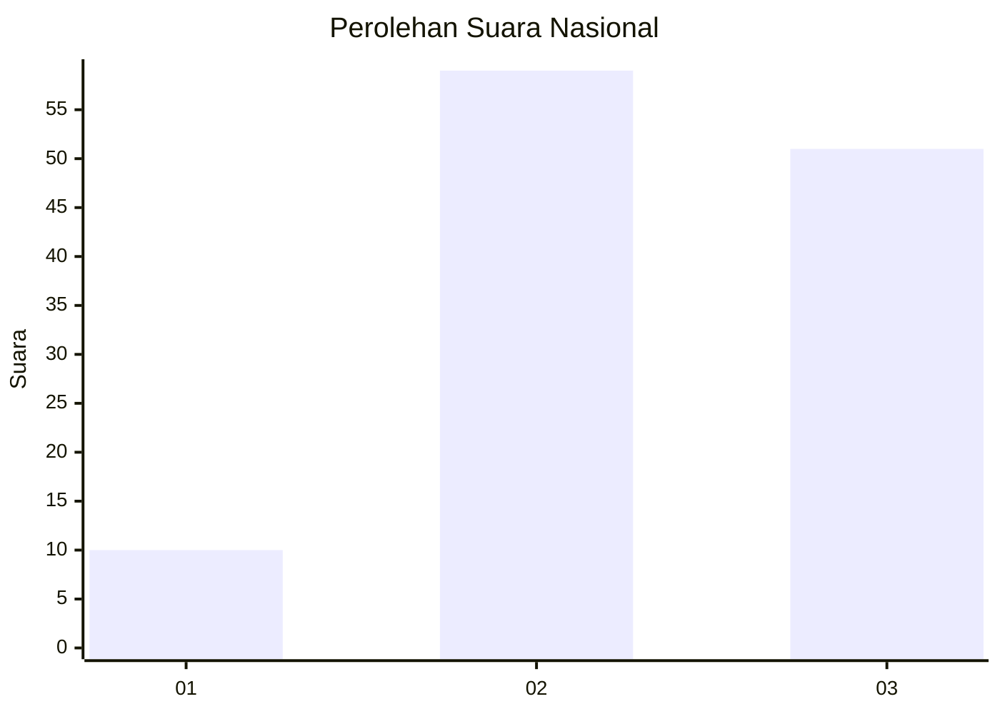
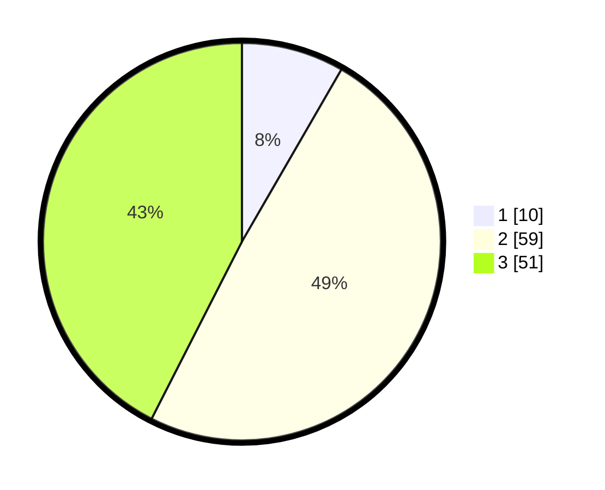

# Hasil

## Grafik

## Tabel

| No. | Nama Paslon    | Suara | Suara (raw) | Persentase |
|:--- |:-------------- | -----:| -----------:| ----------:|
| 1   | ANIES MUHAIMIN | 10    | [10][p-1]   | 8,33       |
| 2   | PRABOWO GIBRAN | 59    | [59][p-2]   | 49,17      |
| 3   | GANJAR MAHFUD  | 51    | [51][p-3]   | 42,50      |

[p-1]: https://github.com/gigit-pemilu/pemilu-2024/blob/main/pilpres/hitung-suara/sub/91-papua/sub/06-biak-numfor/sub/03-biak-timur/sub/2005-kajasi/sub/002-tps/sub/paslon-1.txt
[p-2]: https://github.com/gigit-pemilu/pemilu-2024/blob/main/pilpres/hitung-suara/sub/91-papua/sub/06-biak-numfor/sub/03-biak-timur/sub/2005-kajasi/sub/002-tps/sub/paslon-2.txt
[p-3]: https://github.com/gigit-pemilu/pemilu-2024/blob/main/pilpres/hitung-suara/sub/91-papua/sub/06-biak-numfor/sub/03-biak-timur/sub/2005-kajasi/sub/002-tps/sub/paslon-3.txt

## Foto C Plano

https://sirekap-obj-formc.kpu.go.id/5a86/pemilu/ppwp/91/06/03/20/05/9106032005002-20240215-135432--a9fd918f-c0c6-439a-a245-e25fa21b7a38.jpg

https://sirekap-obj-formc.kpu.go.id/5a86/pemilu/ppwp/91/06/03/20/05/9106032005002-20240215-135705--6f08c3ce-572c-4d2e-a60d-4aa1e94e03e6.jpg

## Metadata

| Key        | Value               |
| ---------- | ------------------- |
| Time Stamp | 2024-02-24 22:31:28 |

