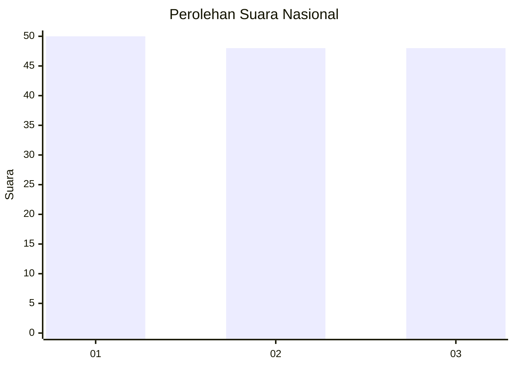
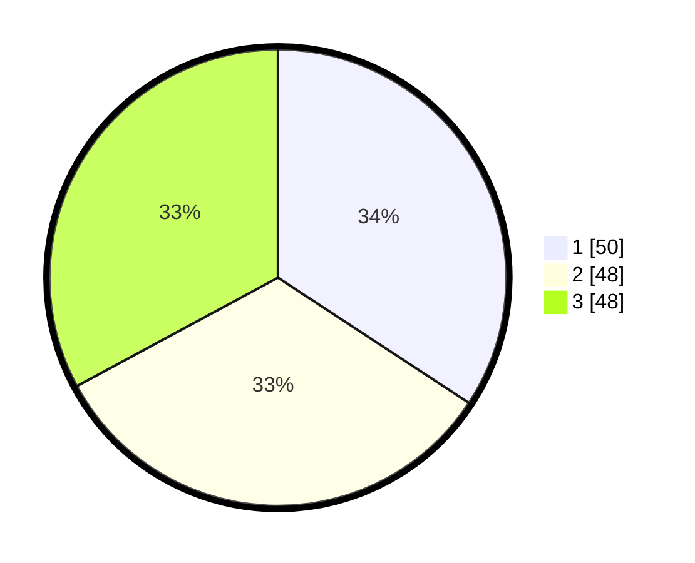

# Hasil

## Grafik

## Tabel

| No. | Nama Paslon    | Suara | Suara (raw) | Persentase |
|:--- |:-------------- | -----:| -----------:| ----------:|
| 1   | ANIES MUHAIMIN | 50    | [50][p-1]   | 34,25      |
| 2   | PRABOWO GIBRAN | 48    | [48][p-2]   | 32,88      |
| 3   | GANJAR MAHFUD  | 48    | [48][p-3]   | 32,88      |

[p-1]: https://github.com/gigit-pemilu/pemilu-2024/blob/main/pilpres/hitung-suara/sub/91-papua/sub/06-biak-numfor/sub/03-biak-timur/sub/2014-bindusi/sub/001-tps/sub/paslon-1.txt
[p-2]: https://github.com/gigit-pemilu/pemilu-2024/blob/main/pilpres/hitung-suara/sub/91-papua/sub/06-biak-numfor/sub/03-biak-timur/sub/2014-bindusi/sub/001-tps/sub/paslon-2.txt
[p-3]: https://github.com/gigit-pemilu/pemilu-2024/blob/main/pilpres/hitung-suara/sub/91-papua/sub/06-biak-numfor/sub/03-biak-timur/sub/2014-bindusi/sub/001-tps/sub/paslon-3.txt

## Foto C Plano

https://sirekap-obj-formc.kpu.go.id/7a46/pemilu/ppwp/91/06/03/20/14/9106032014001-20240215-045236--2e577401-0d3b-4348-ad4a-becc937936bb.jpg

https://sirekap-obj-formc.kpu.go.id/7a46/pemilu/ppwp/91/06/03/20/14/9106032014001-20240215-045338--0d5e5c83-2754-4faa-81f9-a17e792b480f.jpg

https://sirekap-obj-formc.kpu.go.id/7a46/pemilu/ppwp/91/06/03/20/14/9106032014001-20240215-045745--27030a55-f5ee-4b50-883a-418e6c5a1c8c.jpg

## Metadata

| Key        | Value               |
| ---------- | ------------------- |
| Time Stamp | 2024-02-15 15:00:29 |

