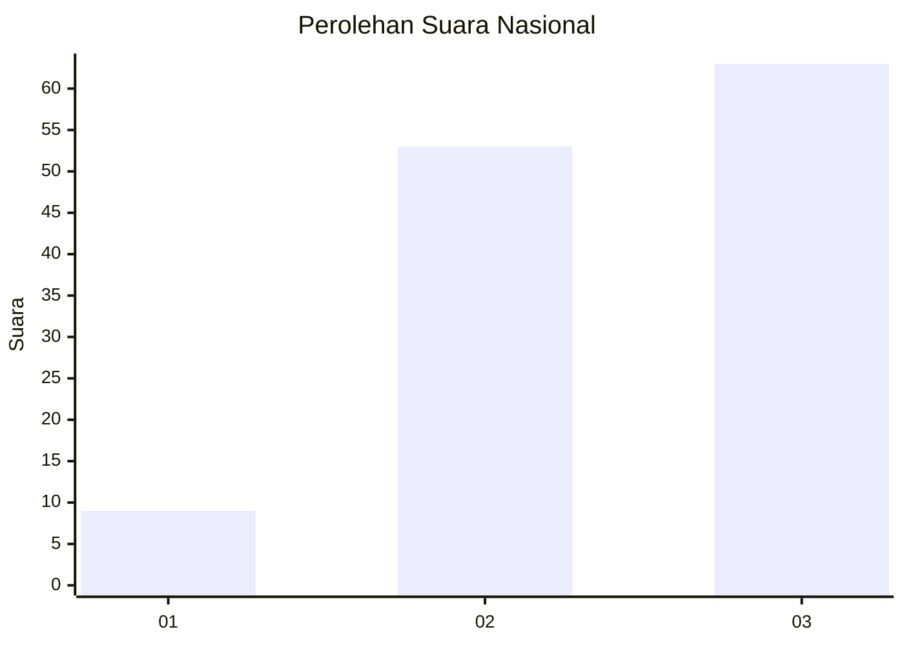
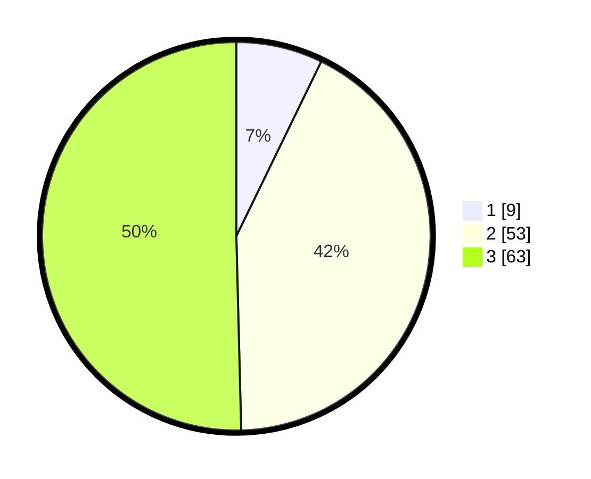

# Hasil

## Grafik

## Tabel

| No. | Nama Paslon    | Suara | Suara (raw) | Persentase |
|:--- |:-------------- | -----:| -----------:| ----------:|
| 1   | ANIES MUHAIMIN | 9     | [9][p-1]    | 7,20       |
| 2   | PRABOWO GIBRAN | 53    | [53][p-2]   | 42,40      |
| 3   | GANJAR MAHFUD  | 63    | [63][p-3]   | 50,40      |

[p-1]: https://github.com/gigit-pemilu/pemilu-2024/blob/main/pilpres/hitung-suara/sub/91-papua/sub/06-biak-numfor/sub/03-biak-timur/sub/2014-bindusi/sub/002-tps/sub/paslon-1.txt
[p-2]: https://github.com/gigit-pemilu/pemilu-2024/blob/main/pilpres/hitung-suara/sub/91-papua/sub/06-biak-numfor/sub/03-biak-timur/sub/2014-bindusi/sub/002-tps/sub/paslon-2.txt
[p-3]: https://github.com/gigit-pemilu/pemilu-2024/blob/main/pilpres/hitung-suara/sub/91-papua/sub/06-biak-numfor/sub/03-biak-timur/sub/2014-bindusi/sub/002-tps/sub/paslon-3.txt

## Foto C Plano

https://sirekap-obj-formc.kpu.go.id/56dd/pemilu/ppwp/91/06/03/20/14/9106032014002-20240215-133542--c667142b-18b0-4d7b-a0ff-6387dc46811f.jpg

https://sirekap-obj-formc.kpu.go.id/56dd/pemilu/ppwp/91/06/03/20/14/9106032014002-20240215-133637--a89a87f1-da16-4412-a8c5-17afb84f8a4d.jpg

https://sirekap-obj-formc.kpu.go.id/56dd/pemilu/ppwp/91/06/03/20/14/9106032014002-20240215-133818--196ac71b-9349-438b-a0bd-4062eb0e7166.jpg

## Metadata

| Key        | Value               |
| ---------- | ------------------- |
| Time Stamp | 2024-02-24 22:31:28 |

